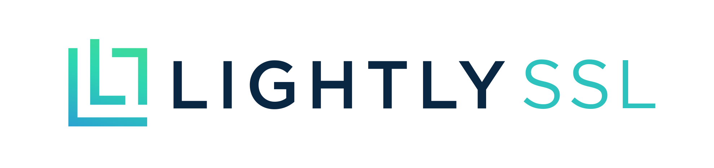

<a name="top"></a>



[](https://pypi.org/project/lightly/)
[](https://pepy.tech/project/lightly)
[](https://github.com/psf/black)
[](https://discord.gg/xvNJW94)


Lightly**SSL** is a computer vision framework for self-supervised learning.

- [Documentation](https://docs.lightly.ai/self-supervised-learning/)
- [Github](https://github.com/lightly-ai/lightly)
- [Discord](https://discord.gg/xvNJW94) (We have weekly paper sessions!)

For a commercial version with more features, including Docker support and pretraining
models for embedding, classification, detection, and segmentation tasks with
a single command, please contact sales@lightly.ai.

We've also built a whole platform on top, with additional features for active learning
and [data curation](https://docs.lightly.ai/docs/what-is-lightly). If you're interested in the
Lightly Worker Solution to easily process millions of samples and run [powerful algorithms](https://docs.lightly.ai/docs/customize-a-selection)
on your data, check out [lightly.ai](https://www.lightly.ai). It's free to get started!

## Features

This self-supervised learning framework offers the following features:

- Modular framework, which exposes low-level building blocks such as loss functions and
  model heads.
- Easy to use and written in a PyTorch-like style.
- Supports custom backbone models for self-supervised pre-training.
- Support for distributed training using PyTorch Lightning.

### Supported Models

You can [find sample code for all the supported models here.](https://docs.lightly.ai/self-supervised-learning/examples/models.html) We provide PyTorch, PyTorch Lightning,
and PyTorch Lightning distributed examples for all models to kickstart your project.

**Models**:

| Model          | Year | Paper | Docs | Colab (PyTorch) | Colab (PyTorch Lightning) |
|----------------|------|-------|------|-----------------|----------------------------|
| AIM            | 2024 | [paper](https://arxiv.org/abs/2401.08541) | [docs](https://docs.lightly.ai/self-supervised-learning/examples/aim.html) | [](https://colab.research.google.com/github/lightly-ai/lightly/blob/master/examples/notebooks/pytorch/aim.ipynb) | [](https://colab.research.google.com/github/lightly-ai/lightly/blob/master/examples/notebooks/pytorch_lightning/aim.ipynb) |
| Barlow Twins   | 2021 | [paper](https://arxiv.org/abs/2103.03230) | [docs](https://docs.lightly.ai/self-supervised-learning/examples/barlowtwins.html) | [](https://colab.research.google.com/github/lightly-ai/lightly/blob/master/examples/notebooks/pytorch/barlowtwins.ipynb) | [](https://colab.research.google.com/github/lightly-ai/lightly/blob/master/examples/notebooks/pytorch_lightning/barlowtwins.ipynb) |
| BYOL           | 2020 | [paper](https://arxiv.org/abs/2006.07733) | [docs](https://docs.lightly.ai/self-supervised-learning/examples/byol.html) | [](https://colab.research.google.com/github/lightly-ai/lightly/blob/master/examples/notebooks/pytorch/byol.ipynb) | [](https://colab.research.google.com/github/lightly-ai/lightly/blob/master/examples/notebooks/pytorch_lightning/byol.ipynb) |
| DCL & DCLW     | 2021 | [paper](https://arxiv.org/abs/2110.06848) | [docs](https://docs.lightly.ai/self-supervised-learning/examples/dcl.html) | [](https://colab.research.google.com/github/lightly-ai/lightly/blob/master/examples/notebooks/pytorch/dcl.ipynb) | [](https://colab.research.google.com/github/lightly-ai/lightly/blob/master/examples/notebooks/pytorch_lightning/dcl.ipynb) |
| DenseCL        | 2021 | [paper](https://arxiv.org/abs/2011.09157) | [docs](https://docs.lightly.ai/self-supervised-learning/examples/densecl.html) | [](https://colab.research.google.com/github/lightly-ai/lightly/blob/master/examples/notebooks/pytorch/densecl.ipynb) | [](https://colab.research.google.com/github/lightly-ai/lightly/blob/master/examples/notebooks/pytorch_lightning/densecl.ipynb) |
| DINO           | 2021 | [paper](https://arxiv.org/abs/2104.14294) | [docs](https://docs.lightly.ai/self-supervised-learning/examples/dino.html) | [](https://colab.research.google.com/github/lightly-ai/lightly/blob/master/examples/notebooks/pytorch/dino.ipynb) | [](https://colab.research.google.com/github/lightly-ai/lightly/blob/master/examples/notebooks/pytorch_lightning/dino.ipynb) |
| MAE            | 2021 | [paper](https://arxiv.org/abs/2111.06377) | [docs](https://docs.lightly.ai/self-supervised-learning/examples/mae.html) | [](https://colab.research.google.com/github/lightly-ai/lightly/blob/master/examples/notebooks/pytorch/mae.ipynb) | [](https://colab.research.google.com/github/lightly-ai/lightly/blob/master/examples/notebooks/pytorch_lightning/mae.ipynb) |
| MSN            | 2022 | [paper](https://arxiv.org/abs/2204.07141) | [docs](https://docs.lightly.ai/self-supervised-learning/examples/msn.html) | [](https://colab.research.google.com/github/lightly-ai/lightly/blob/master/examples/notebooks/pytorch/msn.ipynb) | [](https://colab.research.google.com/github/lightly-ai/lightly/blob/master/examples/notebooks/pytorch_lightning/msn.ipynb) |
| MoCo           | 2019 | [paper](https://arxiv.org/abs/1911.05722) | [docs](https://docs.lightly.ai/self-supervised-learning/examples/moco.html) | [](https://colab.research.google.com/github/lightly-ai/lightly/blob/master/examples/notebooks/pytorch/moco.ipynb) | [](https://colab.research.google.com/github/lightly-ai/lightly/blob/master/examples/notebooks/pytorch_lightning/moco.ipynb) |
| NNCLR          | 2021 | [paper](https://arxiv.org/abs/2104.14548) | [docs](https://docs.lightly.ai/self-supervised-learning/examples/nnclr.html) | [](https://colab.research.google.com/github/lightly-ai/lightly/blob/master/examples/notebooks/pytorch/nnclr.ipynb) | [](https://colab.research.google.com/github/lightly-ai/lightly/blob/master/examples/notebooks/pytorch_lightning/nnclr.ipynb) |
| PMSN           | 2022 | [paper](https://arxiv.org/abs/2210.07277) | [docs](https://docs.lightly.ai/self-supervised-learning/examples/pmsn.html) | [](https://colab.research.google.com/github/lightly-ai/lightly/blob/master/examples/notebooks/pytorch/pmsn.ipynb) | [](https://colab.research.google.com/github/lightly-ai/lightly/blob/master/examples/notebooks/pytorch_lightning/pmsn.ipynb) |
| SimCLR         | 2020 | [paper](https://arxiv.org/abs/2002.05709) | [docs](https://docs.lightly.ai/self-supervised-learning/examples/simclr.html) | [](https://colab.research.google.com/github/lightly-ai/lightly/blob/master/examples/notebooks/pytorch/simclr.ipynb) | [](https://colab.research.google.com/github/lightly-ai/lightly/blob/master/examples/notebooks/pytorch_lightning/simclr.ipynb) |
| SimMIM         | 2022 | [paper](https://arxiv.org/abs/2111.09886) | [docs](https://docs.lightly.ai/self-supervised-learning/examples/simmim.html) | [](https://colab.research.google.com/github/lightly-ai/lightly/blob/master/examples/notebooks/pytorch/simmim.ipynb) | [](https://colab.research.google.com/github/lightly-ai/lightly/blob/master/examples/notebooks/pytorch_lightning/simmim.ipynb) |
| SimSiam        | 2021 | [paper](https://arxiv.org/abs/2011.10566) | [docs](https://docs.lightly.ai/self-supervised-learning/examples/simsiam.html) | [](https://colab.research.google.com/github/lightly-ai/lightly/blob/master/examples/notebooks/pytorch/simsiam.ipynb) | [](https://colab.research.google.com/github/lightly-ai/lightly/blob/master/examples/notebooks/pytorch_lightning/simsiam.ipynb) |
| SwaV           | 2020 | [paper](https://arxiv.org/abs/2006.09882) | [docs](https://docs.lightly.ai/self-supervised-learning/examples/swav.html) | [](https://colab.research.google.com/github/lightly-ai/lightly/blob/master/examples/notebooks/pytorch/swav.ipynb) | [](https://colab.research.google.com/github/lightly-ai/lightly/blob/master/examples/notebooks/pytorch_lightning/swav.ipynb) |
| VICReg         | 2021 | [paper](https://arxiv.org/abs/2105.04906) | [docs](https://docs.lightly.ai/self-supervised-learning/examples/vicreg.html) | [](https://colab.research.google.com/github/lightly-ai/lightly/blob/master/examples/notebooks/pytorch/vicreg.ipynb) | [](https://colab.research.google.com/github/lightly-ai/lightly/blob/master/examples/notebooks/pytorch_lightning/vicreg.ipynb) |

## Tutorials

Want to jump to the tutorials and see Lightly in action?

- [Train MoCo on CIFAR-10](https://docs.lightly.ai/self-supervised-learning/tutorials/package/tutorial_moco_memory_bank.html)
- [Train SimCLR on Clothing Data](https://docs.lightly.ai/self-supervised-learning/tutorials/package/tutorial_simclr_clothing.html)
- [Train SimSiam on Satellite Images](https://docs.lightly.ai/self-supervised-learning/tutorials/package/tutorial_simsiam_esa.html)
- [Use Lightly with Custom Augmentations](https://docs.lightly.ai/self-supervised-learning/tutorials/package/tutorial_custom_augmentations.html)
- [Pre-train a Detectron2 Backbone with Lightly](https://docs.lightly.ai/self-supervised-learning/tutorials/package/tutorial_pretrain_detectron2.html)
- [Finetuning Lightly Checkpoints](https://docs.lightly.ai/self-supervised-learning/tutorials/package/tutorial_checkpoint_finetuning.html)
- [Using timm Models as Backbones](https://docs.lightly.ai/self-supervised-learning/tutorials/package/tutorial_timm_backbone.html)

Community and partner projects:

- [On-Device Deep Learning with Lightly on an ARM microcontroller](https://github.com/ARM-software/EndpointAI/tree/master/ProofOfConcepts/Vision/OpenMvMaskDefaults)

## Quick Start

Lightly requires **Python 3.7+**. We recommend installing Lightly in a **Linux** or **OSX** environment. Python 3.13 is not yet supported, as PyTorch itself lacks Python 3.13 compatibility.

### Dependencies

Due to the modular nature of the Lightly package some modules can be used with older versions of dependencies. However, to use all features as of today lightly requires the following dependencies:

- [PyTorch](https://pytorch.org/)>=1.11.0
- [Torchvision](https://pytorch.org/vision/stable/index.html)>=0.12.0
- [PyTorch Lightning](https://www.pytorchlightning.ai/index.html)>=1.7.1

Lightly is compatible with PyTorch and PyTorch Lightning v2.0+!

### Installation

You can install Lightly and its dependencies from PyPI with:

```
pip3 install lightly
```

We strongly recommend installing Lightly in a dedicated virtualenv to avoid conflicts with your system packages.

### Lightly in Action

With Lightly, you can use the latest self-supervised learning methods in a modular
way using the full power of PyTorch. Experiment with various backbones,
models, and loss functions. The framework has been designed to be easy to use
from the ground up. [Find more examples in our docs](https://docs.lightly.ai/self-supervised-learning/examples/models.html).

```python
import torch
import torchvision

from lightly import loss
from lightly import transforms
from lightly.data import LightlyDataset
from lightly.models.modules import heads


# Create a PyTorch module for the SimCLR model.
class SimCLR(torch.nn.Module):
    def __init__(self, backbone):
        super().__init__()
        self.backbone = backbone
        self.projection_head = heads.SimCLRProjectionHead(
            input_dim=512,  # Resnet18 features have 512 dimensions.
            hidden_dim=512,
            output_dim=128,
        )

    def forward(self, x):
        features = self.backbone(x).flatten(start_dim=1)
        z = self.projection_head(features)
        return z


# Use a resnet backbone from torchvision.
backbone = torchvision.models.resnet18()
# Ignore the classification head as we only want the features.
backbone.fc = torch.nn.Identity()

# Build the SimCLR model.
model = SimCLR(backbone)

# Prepare transform that creates multiple random views for every image.
transform = transforms.SimCLRTransform(input_size=32, cj_prob=0.5)


# Create a dataset from your image folder.
dataset = LightlyDataset(input_dir="./my/cute/cats/dataset/", transform=transform)

# Build a PyTorch dataloader.
dataloader = torch.utils.data.DataLoader(
    dataset,  # Pass the dataset to the dataloader.
    batch_size=128,  # A large batch size helps with the learning.
    shuffle=True,  # Shuffling is important!
)

# Lightly exposes building blocks such as loss functions.
criterion = loss.NTXentLoss(temperature=0.5)

# Get a PyTorch optimizer.
optimizer = torch.optim.SGD(model.parameters(), lr=0.1, weight_decay=1e-6)

# Train the model.
for epoch in range(10):
    for (view0, view1), targets, filenames in dataloader:
        z0 = model(view0)
        z1 = model(view1)
        loss = criterion(z0, z1)
        loss.backward()
        optimizer.step()
        optimizer.zero_grad()
        print(f"loss: {loss.item():.5f}")
```

You can easily use another model like SimSiam by swapping the model and the
loss function.

```python
# PyTorch module for the SimSiam model.
class SimSiam(torch.nn.Module):
    def __init__(self, backbone):
        super().__init__()
        self.backbone = backbone
        self.projection_head = heads.SimSiamProjectionHead(512, 512, 128)
        self.prediction_head = heads.SimSiamPredictionHead(128, 64, 128)

    def forward(self, x):
        features = self.backbone(x).flatten(start_dim=1)
        z = self.projection_head(features)
        p = self.prediction_head(z)
        z = z.detach()
        return z, p


model = SimSiam(backbone)

# Use the SimSiam loss function.
criterion = loss.NegativeCosineSimilarity()
```

You can [find a more complete example for SimSiam here.](https://docs.lightly.ai/self-supervised-learning/examples/simsiam.html)

Use PyTorch Lightning to train the model:

```python
from pytorch_lightning import LightningModule, Trainer

class SimCLR(LightningModule):
    def __init__(self):
        super().__init__()
        resnet = torchvision.models.resnet18()
        resnet.fc = torch.nn.Identity()
        self.backbone = resnet
        self.projection_head = heads.SimCLRProjectionHead(512, 512, 128)
        self.criterion = loss.NTXentLoss()

    def forward(self, x):
        features = self.backbone(x).flatten(start_dim=1)
        z = self.projection_head(features)
        return z

    def training_step(self, batch, batch_index):
        (view0, view1), _, _ = batch
        z0 = self.forward(view0)
        z1 = self.forward(view1)
        loss = self.criterion(z0, z1)
        return loss

    def configure_optimizers(self):
        optim = torch.optim.SGD(self.parameters(), lr=0.06)
        return optim


model = SimCLR()
trainer = Trainer(max_epochs=10, devices=1, accelerator="gpu")
trainer.fit(model, dataloader)
```

See [our docs for a full PyTorch Lightning example.](https://docs.lightly.ai/self-supervised-learning/examples/simclr.html)

Or train the model on 4 GPUs:

```python

# Use distributed version of loss functions.
criterion = loss.NTXentLoss(gather_distributed=True)

trainer = Trainer(
    max_epochs=10,
    devices=4,
    accelerator="gpu",
    strategy="ddp",
    sync_batchnorm=True,
    use_distributed_sampler=True,  # or replace_sampler_ddp=True for PyTorch Lightning <2.0
)
trainer.fit(model, dataloader)
```

We provide multi-GPU training examples with distributed gather and synchronized BatchNorm.
[Have a look at our docs regarding distributed training.](https://docs.lightly.ai/self-supervised-learning/getting_started/distributed_training.html)

## Benchmarks

Implemented models and their performance on various datasets. Hyperparameters are not
tuned for maximum accuracy. For detailed results and more information about the benchmarks click
[here](https://docs.lightly.ai/self-supervised-learning/getting_started/benchmarks.html).

### ImageNet1k

[ImageNet1k benchmarks](https://docs.lightly.ai/self-supervised-learning/getting_started/benchmarks.html#imagenet1k)

**Note**: Evaluation settings are based on these papers:

- Linear: [SimCLR](https://arxiv.org/abs/2002.05709)
- Finetune: [SimCLR](https://arxiv.org/abs/2002.05709)
- KNN: [InstDisc](https://arxiv.org/abs/1805.01978)

See the [benchmarking scripts](./benchmarks/imagenet/resnet50/) for details.

| Model           | Backbone | Batch Size | Epochs | Linear Top1 | Finetune Top1 | kNN Top1 | Tensorboard                                                                                                                                                                    | Checkpoint                                                                                                                                                              |
| --------------- | -------- | ---------- | ------ | ----------- | ------------- | -------- | ------------------------------------------------------------------------------------------------------------------------------------------------------------------------------ | ----------------------------------------------------------------------------------------------------------------------------------------------------------------------- |
| BarlowTwins     | Res50    | 256        | 100    | 62.9        | 72.6          | 45.6     | [link](https://lightly-ssl-checkpoints.s3.amazonaws.com/imagenet_resnet50_barlowtwins_2023-08-18_00-11-03/pretrain/version_0/events.out.tfevents.1692310273.Machine2.569794.0) | [link](https://lightly-ssl-checkpoints.s3.amazonaws.com/imagenet_resnet50_barlowtwins_2023-08-18_00-11-03/pretrain/version_0/checkpoints/epoch%3D99-step%3D500400.ckpt) |
| BYOL            | Res50    | 256        | 100    | 62.5        | 74.5          | 46.0     | [link](https://lightly-ssl-checkpoints.s3.amazonaws.com/imagenet_resnet50_byol_2024-02-14_16-10-09/pretrain/version_0/events.out.tfevents.1707923418.Machine2.3205.0)          | [link](https://lightly-ssl-checkpoints.s3.amazonaws.com/imagenet_resnet50_byol_2024-02-14_16-10-09/pretrain/version_0/checkpoints/epoch%3D99-step%3D500400.ckpt)        |
| DINO            | Res50    | 128        | 100    | 68.2        | 72.5          | 49.9     | [link](https://lightly-ssl-checkpoints.s3.amazonaws.com/imagenet_resnet50_dino_2023-06-06_13-59-48/pretrain/version_0/events.out.tfevents.1686052799.Machine2.482599.0)        | [link](https://lightly-ssl-checkpoints.s3.amazonaws.com/imagenet_resnet50_dino_2023-06-06_13-59-48/pretrain/version_0/checkpoints/epoch%3D99-step%3D1000900.ckpt)       |
| MAE             | ViT-B/16 | 256        | 100    | 46.0        | 81.3          | 11.2     | [link](https://lightly-ssl-checkpoints.s3.amazonaws.com/imagenet_vitb16_mae_2024-02-25_19-57-30/pretrain/version_0/events.out.tfevents.1708887459.Machine2.1092409.0)          | [link](https://lightly-ssl-checkpoints.s3.amazonaws.com/imagenet_vitb16_mae_2024-02-25_19-57-30/pretrain/version_0/checkpoints/epoch%3D99-step%3D500400.ckpt)           |
| MoCoV2          | Res50    | 256        | 100    | 61.5        | 74.3          | 41.8     | [link](https://lightly-ssl-checkpoints.s3.amazonaws.com/imagenet_resnet50_mocov2_2024-02-18_10-29-14/pretrain/version_0/events.out.tfevents.1708248562.Machine2.439033.0)      | [link](https://lightly-ssl-checkpoints.s3.amazonaws.com/imagenet_resnet50_mocov2_2024-02-18_10-29-14/pretrain/version_0/checkpoints/epoch%3D99-step%3D500400.ckpt)      |
| SimCLR\*        | Res50    | 256        | 100    | 63.2        | 73.9          | 44.8     | [link](https://lightly-ssl-checkpoints.s3.amazonaws.com/imagenet_resnet50_simclr_2023-06-22_09-11-13/pretrain/version_0/events.out.tfevents.1687417883.Machine2.33270.0)       | [link](https://lightly-ssl-checkpoints.s3.amazonaws.com/imagenet_resnet50_simclr_2023-06-22_09-11-13/pretrain/version_0/checkpoints/epoch%3D99-step%3D500400.ckpt)      |
| SimCLR\* + DCL  | Res50    | 256        | 100    | 65.1        | 73.5          | 49.6     | [link](https://lightly-ssl-checkpoints.s3.amazonaws.com/imagenet_resnet50_dcl_2023-07-04_16-51-40/pretrain/version_0/events.out.tfevents.1688482310.Machine2.247807.0)         | [link](https://lightly-ssl-checkpoints.s3.amazonaws.com/imagenet_resnet50_dcl_2023-07-04_16-51-40/pretrain/version_0/checkpoints/epoch%3D99-step%3D500400.ckpt)         |
| SimCLR\* + DCLW | Res50    | 256        | 100    | 64.5        | 73.2          | 48.5     | [link](https://lightly-ssl-checkpoints.s3.amazonaws.com/imagenet_resnet50_dclw_2023-07-07_14-57-13/pretrain/version_0/events.out.tfevents.1688734645.Machine2.3176.0)          | [link](https://lightly-ssl-checkpoints.s3.amazonaws.com/imagenet_resnet50_dclw_2023-07-07_14-57-13/pretrain/version_0/checkpoints/epoch%3D99-step%3D500400.ckpt)        |
| SwAV            | Res50    | 256        | 100    | 67.2        | 75.4          | 49.5     | [link](https://lightly-ssl-checkpoints.s3.amazonaws.com/imagenet_resnet50_swav_2023-05-25_08-29-14/pretrain/version_0/events.out.tfevents.1684996168.Machine2.1445108.0)       | [link](https://lightly-ssl-checkpoints.s3.amazonaws.com/imagenet_resnet50_swav_2023-05-25_08-29-14/pretrain/version_0/checkpoints/epoch%3D99-step%3D500400.ckpt)        |
| TiCo            | Res50    | 256        | 100    | 49.7        | 72.7          | 26.6     | [link](https://lightly-ssl-checkpoints.s3.amazonaws.com/imagenet_resnet50_tico_2024-01-07_18-40-57/pretrain/version_0/events.out.tfevents.1704649265.Machine2.1604956.0)       | [link](https://lightly-ssl-checkpoints.s3.amazonaws.com/imagenet_resnet50_tico_2024-01-07_18-40-57/pretrain/version_0/checkpoints/epoch%3D99-step%3D250200.ckpt)        |
| VICReg          | Res50    | 256        | 100    | 63.0        | 73.7          | 46.3     | [link](https://lightly-ssl-checkpoints.s3.amazonaws.com/imagenet_resnet50_vicreg_2023-09-11_10-53-08/pretrain/version_0/events.out.tfevents.1694422401.Machine2.556563.0)      | [link](https://lightly-ssl-checkpoints.s3.amazonaws.com/imagenet_resnet50_vicreg_2023-09-11_10-53-08/pretrain/version_0/checkpoints/epoch%3D99-step%3D500400.ckpt)      |

_\*We use square root learning rate scaling instead of linear scaling as it yields
better results for smaller batch sizes. See Appendix B.1 in the [SimCLR paper](https://arxiv.org/abs/2002.05709)._

### ImageNet100

[ImageNet100 benchmarks detailed results](https://docs.lightly.ai/self-supervised-learning/getting_started/benchmarks.html#imagenet100)

### Imagenette

[Imagenette benchmarks detailed results](https://docs.lightly.ai/self-supervised-learning/getting_started/benchmarks.html#imagenette)

### CIFAR-10

[CIFAR-10 benchmarks detailed results](https://docs.lightly.ai/self-supervised-learning/getting_started/benchmarks.html#cifar-10)

## Terminology

Below you can see a schematic overview of the different concepts in the package.
The terms in bold are explained in more detail in our [documentation](https://docs.lightly.ai/self-supervised-learning/).

</a>

### Next Steps

Head to the [documentation](https://docs.lightly.ai/self-supervised-learning/) and see the things you can achieve with Lightly!

## Development

To install dev dependencies (for example to contribute to the framework) you can use the following command:

```
pip3 install -e ".[dev]"
```

For more information about how to contribute have a look [here](CONTRIBUTING.md).

### Running Tests

Unit tests are within the [tests directory](tests/) and we recommend running them using
[pytest](https://docs.pytest.org/en/stable/). There are two test configurations
available. By default, only a subset will be run:

```
make test-fast
```

To run all tests (including the slow ones) you can use the following command:

```
make test
```

To test a specific file or directory use:

```
pytest <path to file or directory>
```

### Code Formatting

To format code with [black](https://black.readthedocs.io/en/stable/) and [isort](https://docs.pytest.org) run:

```
make format
```

## Further Reading

**Self-Supervised Learning**:

- Have a look at our [#papers channel on discord](https://discord.com/channels/752876370337726585/815153188487299083)
  for the newest self-supervised learning papers.
- [A Cookbook of Self-Supervised Learning, 2023](https://arxiv.org/abs/2304.12210)
- [Masked Autoencoders Are Scalable Vision Learners, 2021](https://arxiv.org/abs/2111.06377)
- [Emerging Properties in Self-Supervised Vision Transformers, 2021](https://arxiv.org/abs/2104.14294)
- [Unsupervised Learning of Visual Features by Contrasting Cluster Assignments, 2021](https://arxiv.org/abs/2006.09882)
- [What Should Not Be Contrastive in Contrastive Learning, 2020](https://arxiv.org/abs/2008.05659)
- [A Simple Framework for Contrastive Learning of Visual Representations, 2020](https://arxiv.org/abs/2002.05709)
- [Momentum Contrast for Unsupervised Visual Representation Learning, 2020](https://arxiv.org/abs/1911.05722)

## FAQ

- Why should I care about self-supervised learning? Aren't pre-trained models from ImageNet much better for transfer learning?

  - Self-supervised learning has become increasingly popular among scientists over the last years because the learned representations perform extraordinarily well on downstream tasks. This means that they capture the important information in an image better than other types of pre-trained models. By training a self-supervised model on _your_ dataset, you can make sure that the representations have all the necessary information about your images.

- How can I contribute?

  - Create an issue if you encounter bugs or have ideas for features we should implement. You can also add your own code by forking this repository and creating a PR. More details about how to contribute with code is in our [contribution guide](CONTRIBUTING.md).

- Is this framework for free?

  - Yes, this framework is completely free to use and we provide the source code. We believe that we need to make training deep learning models more data efficient to achieve widespread adoption. One step to achieve this goal is by leveraging self-supervised learning. The company behind Lightly is committed to keep this framework open-source.

- If this framework is free, how is the company behind Lightly making money?
  - Training self-supervised models is only one part of our solution.
    [The company behind Lightly](https://lightly.ai/) focuses on processing and analyzing embeddings created by self-supervised models.
    By building, what we call a self-supervised active learning loop we help companies understand and work with their data more efficiently.
    As the [Lightly Solution](https://docs.lightly.ai) is a freemium product, you can try it out for free. However, we will charge for some features.
  - In any case this framework will always be free to use, even for commercial purposes.

## Lightly in Research

- [Reverse Engineering Self-Supervised Learning, 2023](https://arxiv.org/abs/2305.15614)
- [Learning Visual Representations via Language-Guided Sampling, 2023](https://arxiv.org/pdf/2302.12248.pdf)
- [Self-Supervised Learning Methods for Label-Efficient Dental Caries Classification, 2022](https://www.mdpi.com/2075-4418/12/5/1237)
- [DPCL: Contrastive representation learning with differential privacy, 2022](https://assets.researchsquare.com/files/rs-1516950/v1_covered.pdf?c=1654486158)
- [Decoupled Contrastive Learning, 2021](https://arxiv.org/abs/2110.06848)
- [solo-learn: A Library of Self-supervised Methods for Visual Representation Learning, 2021](https://www.jmlr.org/papers/volume23/21-1155/21-1155.pdf)

## Company behind this Open Source Framework

[Lightly](https://www.lightly.ai) is a spin-off from ETH Zurich that helps companies
build efficient active learning pipelines to select the most relevant data for their models.

You can find out more about the company and it's services by following the links below:

- [Homepage](https://www.lightly.ai)
- [Web-App](https://app.lightly.ai)
- [Lightly Solution Documentation (Lightly Worker & API)](https://docs.lightly.ai/)

[Back to top🚀](#top)
