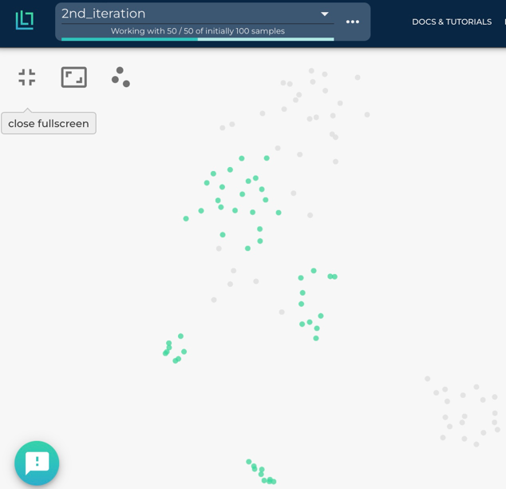

Datapool
=================

Lightly has been designed in a way that you can incrementally build up a 
dataset for your project. The software automatically keeps track of the 
representations of previously selected samples and uses this information 
to pick new samples in order to maximize the quality of the final dataset. 
It also allows for combining two different datasets into one.

For example, let's imagine we have a dataset of street videos. After running
the Lightly worker once we added 4 more street videos to the bucket.
The new raw data might include samples which should be added to your dataset
in the Lightly Platform, so you want to add a subset of them to your dataset.

This workflow is supported by the Lightly Platform using a datapool.
It remembers which raw data in your bucket has already been processed
and will ignore it in future docker runs.

Thus you can run the docker with the same command again. It will find
your new raw data in the bucket, stream, embed and subsample it and then add it to
your existing dataset. The selection strategy will take the existing data in your dataset
into account when selecting new data to be added to your dataset.

After the docker run we can go to the embedding view of the Lightly Platform
to see the newly added samples there in a new tag. We see that the new samples
(in green) fill some gaps left by the images in the first iteration (in grey).
However, there are still some gaps left, which could be filled by adding more videos
to the bucket and running the docker again.

This workflow of iteratively growing your dataset with the Lightly Docker
has the following advantages:

- You can learn from your findings after each iteration
  to know which raw data you need to collect next.
- Only your new data is processed, saving you time and compute cost.
- You don't need to configure anything, just run the same command again.
- Only samples which are different to the existing ones are added to the dataset.

If you want to search all data in your bucket for new samples
instead of only newly added data,
then set `datasource.process_all=True` in your docker run command. This has the
same effect as creating a new Lightly dataset and running the worker from scratch
on the full dataset. We sort of process all data instead of only the newly added ones.

How It Works
---------------

The Lightly Datapool keeps track of the selected samples in a csv file called
`datapool_latest.csv`. It contains the filenames of the selected images and their
embeddings. This feature is currently only supported without training of a custom
model. Please make sure `enable_training=False` is set in your worker config.
