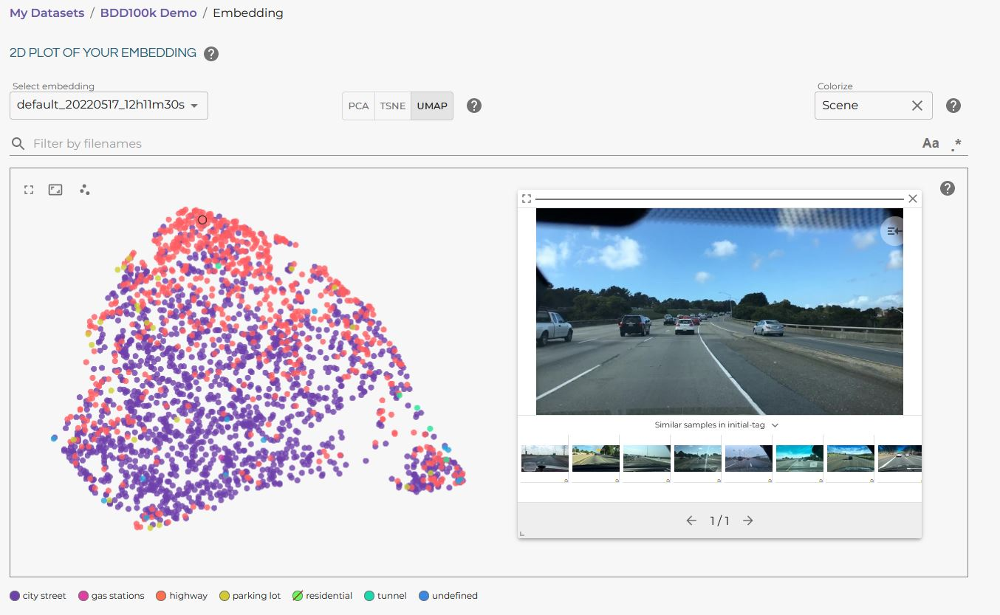

.. _docker-datasource-metadata:

Add Metadata to a Datasource
===============================

Lightly can make use of metadata collected alongside your images or videos. Provided,
metadata can be used to steer the selection process and to analyze the selected dataset
in the Lightly Platform.

Metadata Folder Structure
----------------------------

Following, we outline the format in which metadata can be added to a
Lightly datasource. Everything regarding metadata will take place in a subdirectory
of your configured **output datasource** called `.lightly/metadata`. The general structure
your input and output bucket will look like this:

.. code-block:: bash

    input/bucket/
        + image_0.png
        + subdir/
            + image_1.png
            + image_2.png
            + ...
            + image_N.png

    output/bucket/
        + .lightly/metadata
            + schema.json
            + image_0.json
            + subdir/
                + image_1.json
                ...
                + image_N.json

All of the `.json` files are explained in the next sections.

Metadata Schema
---------------
The schema defines the format of the metadata and helps the Lightly Platform to correctly identify 
and display different types of metadata.

You can provide this information to Lightly by adding a `schema.json` to the 
`.lightly/metadata` directory. The `schema.json` file must contain a list of
configuration entries. Each of the entries is a dictionary with the following keys:

 - `name`: Identifier of the metadata in the UI.
 - `path`: Concatenation of the keys to access the metadata in a dictionary.
 - `defaultValue`: The fallback value if there is no metadata available.
 - `valueDataType`: One of

   - `NUMERIC_INT`
   - `NUMERIC_FLOAT`
   - `CATEGORICAL_INT`
   - `CATEGORICAL_STRING`
   - `CATEGORICAL_BOOLEAN`

For example, let's say we have additional information about the scene and weather for each
of the images we have collected. A possible schema could look like this:

.. code-block:: javascript
    :caption: .lightly/metadata/schema.json

    [
        {
            "name": "Scene",
            "path": "scene",
            "defaultValue": "undefined",
            "valueDataType": "CATEGORICAL_STRING"
        }
        {
            "name": "Weather description",
            "path": "weather.description",
            "defaultValue": "nothing",
            "valueDataType": "CATEGORICAL_STRING"
        },
        {
            "name": "Temperature",
            "path": "weather.temperature",
            "defaultValue": 0.0,
            "valueDataType": "NUMERIC_FLOAT"
        },
        {
            "name": "Air pressure",
            "path": "weather.air_pressure",
            "defaultValue": 0,
            "valueDataType": "NUMERIC_INT"
        },
        {
            "name": "Vehicle ID",
            "path": "vehicle_id",
            "defaultValue": 0,
            "valueDataType": "CATEGORICAL_INT"
        }
    ]

Metadata Files
--------------
Lightly requires a single metadata file per image or video. If an image or video has no corresponding metadata file,
Lightly assumes the default value from the `schema.json`. If a metadata file is provided for a full video,
Lightly assumes that the metadata is valid for all frames in that video.

To provide metadata for an image or a video, place a metadata file with the same name
as the image or video in the `.lightly/metadata` directory but change the file extension to
`.json`. The file should contain the metadata in the format defined under :ref:`metadata-format`.

.. code-block:: bash

    # filename of the metadata for file input/bucket/FILENAME.EXT
    .lightly/metadata/${FILENAME}.json

    # example: input/bucket/subdir/image_1.png
    .lightly/metadata/subdir/image_1.json

    # example: input/bucket/image_0.png
    .lightly/metadata/image_0.json

    # example: input/bucket/subdir/video_1.mp4
    .lightly/metadata/subdir/video_1.json

When working with videos it's also possible to provide metadata on a per-frame basis.
Then, Lightly requires a metadata file per frame. If a frame has no corresponding metadata file,
Lightly assumes the default value from the `schema.json`. Lightly uses a naming convention to
identify frames: The filename of a frame consists of the video filename, the frame number 
(padded to the length of the number of frames in the video), the video format separated
by hyphens. For example, for a video with 200 frames, the frame number will be padded
to length three. For a video with 1000 frames, the frame number will be padded to length four (99 becomes 0099).

.. code-block:: bash

    # filename of the metadata of the Xth frame of video input/bucket/FILENAME.EXT
    # with 200 frames (padding: len(str(200)) = 3)
    .lightly/metadata/${FILENAME}-${X:03d}-${EXT}.json

    # example: input/bucket/subdir/video_1.mp4, frame 99/200
    .lightly/metadata/subdir/video_1-099-mp4.json

    # example: input/bucket/video_0.mp4, frame 99/200
    .lightly/metadata/video_0-099-mp4.json

.. _metadata-format:

Metadata Format
---------------

The metadata json files for images and videos require the keys `file_name`, `type`, and `metadata` key.
Here, `file_name` serves as a unique identifier to retrieve the original file for which the metadata was collected,
`type` indicates whether the metadata is per "video", "frame", or "image", and `metadata` contains the actual metadata.

For our example from above, a metadata file corresponding to a image/video/frame should look like this:

.. tabs::

    .. tab:: Video
    
        .. code-block:: javascript
            :caption: .lightly/metadata/subdir/video_1.json

            {
                "file_name": "subdir/video_1.mp4",
                "type": "video",
                "metadata": {
                    "scene": "city street",
                    "weather": {
                        "description": "sunny",
                        "temperature": 23.2,
                        "air_pressure": 1
                    },
                    "vehicle_id": 321,
                }
            }

    .. tab:: Frame
    
        .. code-block:: javascript
            :caption: .lightly/metadata/subdir/video_1-099-mp4.json

            {
                "file_name": "subdir/video_1-099-mp4.png",
                "type": "frame",
                "metadata": {
                    "scene": "city street",
                    "weather": {
                        "description": "sunny",
                        "temperature": 23.2,
                        "air_pressure": 1
                    },
                    "vehicle_id": 321,
                }
            }

    .. tab:: Image
    
        .. code-block:: javascript
            :caption: .lightly/metadata/subdir/image_1.json

            {
                "file_name": "subdir/image_1.png",
                "type": "image",
                "metadata": {
                    "scene": "highway",
                    "weather": {
                        "description": "rainy",
                        "temperature": 10.5,
                        "air_pressure": 1
                    },
                    "vehicle_id": 321,
                }
            }

Next Steps
----------

If metadata is provided, the Lightly Worker will automatically detect and load it into
the Lightly Platform where it can be visualized and analyzed after running a selection.

For example, it's possible to visualize the different categories of metadata in the Lightly
Platform scatter plot. In the following example we visualized the categorical metadata "Scene"
from the BDD100k dataset.

