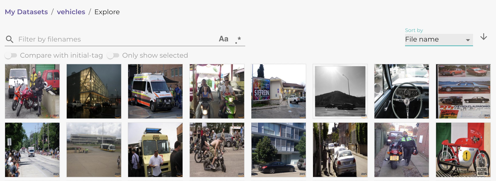

.. _ref-docker-object-level:

Object Level
============
Lightly does not only work on full images but also on an object level. This
workflow is especially useful for datasets containing small objects or multiple
objects in each image and provides the following benefits over the full image
workflow:

- Analyze a dataset based on individual objects
- Find a diverse set of objects in the dataset
- Find images that contain objects of interest
- Full control over type of objects to process
- Ignore uninteresting background regions in images
- Automatic cropping of objects from the original image

.. note:: Note that the object level features require a minimum 
    Lightly Worker of version 2.2. You can check your installed version of the 
    Lightly Worker by running the :ref:`docker-setup-sanity-check`.

Prerequisites
-------------
In order to use the object level workflow with Lightly, you will need the
following things:

- The installed Lightly Worker (see :ref:`docker-setup`)
- A dataset with a configured datasource (see :ref:`ref-docker-with-datasource-datapool`)
- Object detection predictions uploaded to the datasource (see next section)

.. note::

    If you don't have any predictions available, you can use the Lightly pretagging
    model. See :ref:`Pretagging <object-level-pretagging>` for more information.

Predictions
-----------
Lightly needs to know which objects to process. This information is provided
by uploading a set of object predictions to the datasource (see :ref:`ref-docker-datasource-predictions`).
Let's say we are working with a dataset containing different types of vehicles
and used an object detection model to find possible vehicle objects in the
dataset. Then the file structure of the datasource should look like this:

.. code-block:: bash

    datasource/vehicles_dataset/
        + .lightly/predictions/
            + tasks.json
            + vehicles_object_detections/
                 + schema.json
                 + image_1.json
                 ...
                 + image_N.json
        + image_1.png
        + image_2.png
        ...
        + image_N.png

The following files should be added to the *.lightly/predictions*
directory in the datasource:

- A *tasks.json* file that contains the name of the subdirectory in which the
  prediction files are stored.

    .. code-block::
        :caption: .lightly/predictions/tasks.json

        [
            "vehicles_object_detections"
        ]

- A *schema.json* file that specifies that the predictions are from an 
  *object-detection* task and a list of all possible object categories.

    .. code-block:: javascript
        :caption: .lightly/predictions/vehicles_object_detections/schema.json

        {
            "task_type": "object-detection",
            "categories": [
                {
                    "id": 0,
                    "name": "car",
                },
                {
                    "id": 1,
                    "name": "truck",
                },
                {
                    "id": 2,
                    "name": "motorbike",
                }
            ]
        }

- And for each image, or video frame, in the dataset an *IMAGE_NAME.json* file
  which holds the predictions the object detection model made for the given image:

    .. code-block:: javascript
        :caption: .lightly/predictions/vehicles_object_detections/image_1.json

        {
            "file_name": "image_1.png",
            "predictions": [
                {
                    "category_id": 1,
                    "bbox": [...],
                    "score": 0.8
                },
                {
                    "category_id": 0,
                    "bbox": [...],
                    "score": 0.9
                },
                {
                    "category_id": 2,
                    "bbox": [...],
                    "score": 0.5
                }
            ]
        }

For more information regarding the predictions format please see :ref:`ref-docker-datasource-predictions`.

Selection on Object Level
-------------------------
Once you have everything set up as described above, you can run selection on
object level by setting the `object_level.task_name` argument in the :ref:`docker configuration <ref-docker-configuration>`. 
The argument should be set to the task name you used for your predictions. 
If you uploaded the predictions to e.g. `.lightly/predictions/vehicles_object_detections`
then you should set `object_level.task_name` to `vehicles_object_detections`.

The object level job can be scheduled from from Python code. 

.. literalinclude:: code_examples/python_run_object_level.py

After running the Python script to create the job we need to make sure we have
a running Lightly Worker to process the job. We can use the following
code to sping up a Lightly Worker

.. code-block:: console

  docker run --rm --gpus all -it \
    -v /docker-output:/home/output_dir lightly/worker:latest \
    token=YOUR_TOKEN  worker.worker_id=YOUR_WORKER_ID

.. _object-level-pretagging:

Lightly Pretagging
------------------
Instead of providing your own predictions, it's also possible to use the built-in pretagging model from Lightly. To do so,
set `pretagging=True` in your config and use the `object_level.task_name="lightly_pretagging"`. For more information
about the prediction model and classes, go to :ref:`Lightly Pretagging Model <ref-docker-pretagging>`

.. literalinclude:: code_examples/python_run_object_level_pretagging.py

After running the Python script to create the job we need to make sure we have
a running Lightly Worker to process the job. We can use the following
code to sping up a Lightly Worker

.. code-block:: console

  docker run --rm --gpus all -it \
    -v /docker-output:/home/output_dir lightly/worker:latest \
    token=YOUR_TOKEN  worker.worker_id=YOUR_WORKER_ID

Padding
-------
Lightly makes it possible to add a padding around your bounding boxes. This allows
for better visualization of the cropped images in the web-app and can improve the
embeddings of the objects as the embedding model sees the objects in context. To add
padding, simply specify `object_level.padding=X` where `X` is the padding relative
to the bounding box size. For example, a padding of `X=0.1` will extend both width and
height of all bounding boxes by 10 percent.

Object Crops Dataset
--------------------
Once the Lightly Worker job is started it fetches all images and predictions from the
remote datasource and processes them. For each prediction, the Lightly Worker crops
the object from the full image and creates an embedding for it. Then it selects
a subset of the objects and uploads **two** datasets to the Lightly Platform:

1. The crops and embeddings of the selected objects are uploaded to an object 
   *crops* dataset on the platform. By default, the dataset has the same name as 
   the original image dataset but with a "-crops" suffix appended to it. 
   Alternatively, you can also choose a custom dataset name by setting 
   the `object_level.crop_dataset_name` config option.
2. If an object is selected, then the full image containing that object is
   also uploaded. You can find these images in the original dataset from which
   you started the selection job.

You can see example images of the two datasets below.

Object Crop Dataset:

.. figure:: images/object_level_vehicle_crops_examples.jpg

Original Full Image Dataset:

Analyzing the Crop Dataset
--------------------------
The crop dataset allows you to analyze your data on an object level. In our
vehicles dataset we could, for example, be interested in the diversity of the
vehicles. If we go to our crops dataset and select the *Embedding* view in the
menu, we can see that crops are roughly grouped by vehicle type:

Cars:

.. figure:: images/object_level_vehicle_car_cluster.jpg

Trucks:

.. figure:: images/object_level_vehicle_truck_cluster.jpg

Motorbikes:

.. figure:: images/object_level_vehicle_motorbike_cluster.jpg

This can be a very efficient way to get insights into your data without the need
for human annotations. The embedding view allows you dig deeper into the
properties of your dataset and reveal things like:

- Q: What sort of special trucks do we have?
  A: There are a lot of ambulances and school buses.
- Q: Are there also vans in the dataset?
  A: There are only few of them, we should try to get more images containing vans.
- Q: Are there images of cars in different weather conditions?
  A: Most images seem to be taken in sunny weather with good lightning conditions.

These hidden biases are hard to find in a dataset if you only rely on full
images or the coarse vehicle type predicted by the object detection model.
Lightly helps you to identify them quickly and assists you in monitoring and
improving the quality of your dataset. After an initial exploration you can now
take further steps to enhance the dataset using one of the workflows Lightly
provides:

- Select a subset of your data using our :ref:`Sampling Algorithms <plaform-sampling>`
- Select new samples to add to your dataset using :ref:`Active Learning <ref-docker-active-learning>`
- Prepare images for labelling by :ref:`exporting them to LabelStudio <lightly-tutorial-export-labelstudio>`

Multiple Object Level Runs
--------------------------
You can run multiple object level workflows using the same dataset. To start a
new run, please select your original full image dataset in the Lightly Web App
and schedule a new run from there. If you are running the Lightly Worker from Python or
over the API, you have to set the `dataset_id` configuration option to the id of 
the original full image dataset. In both cases make sure that the run is *not*
started from the crops dataset as this is not supported!

You can control to which crops dataset the newly selected object crops are
uploaded by setting the `object_level.crop_dataset_name` configuration option.
By default this option is not set and if you did not specify it in the first run,
you can also omit it in future runs. In this case Lightly will automatically 
find the existing crops dataset and add the new crops to it. If you want to
upload the crops to a new dataset or have set a custom crop dataset name in a
previous run, then set the `object_level.crop_dataset_name` option to a new
or existing dataset name, respectively.
