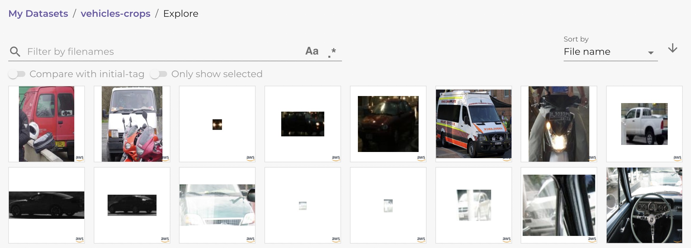
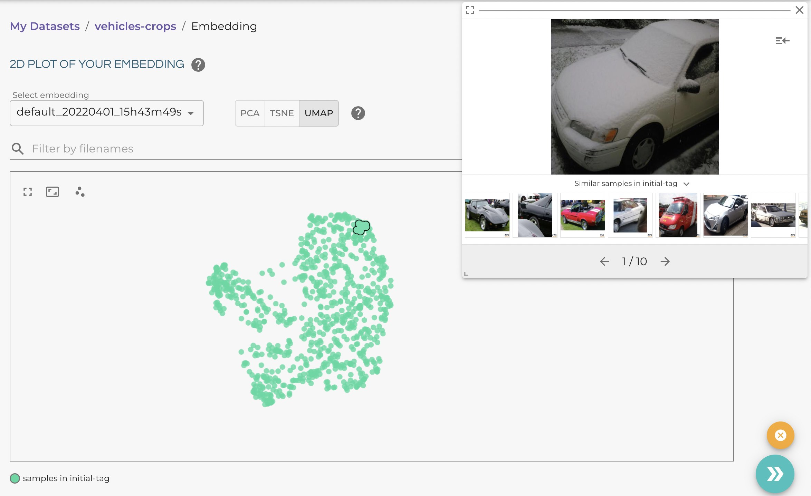
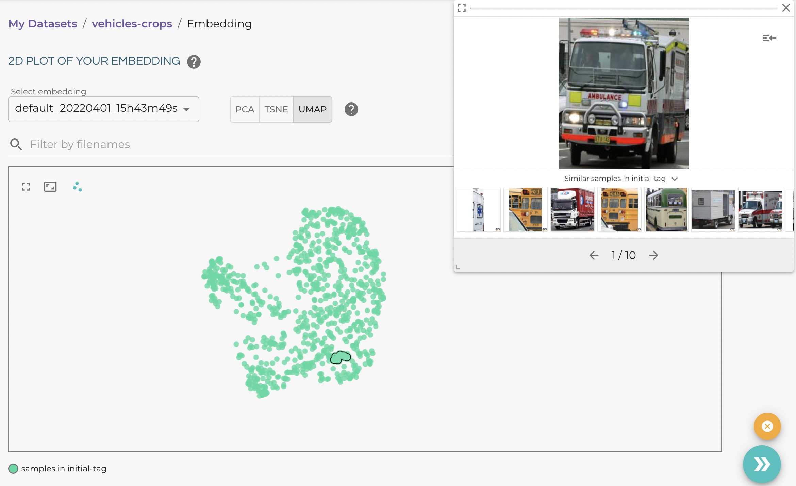

.. _ref-docker-object-level:

Object Level
============
Lightly does not only work on full images but also on an object level. This 
workflow is especially useful for datasets containing small objects or multiple
objects in each image and provides the following benefits over the full image 
workflow:

- Analyze a dataset based on individual objects
- Find a diverse set of objects in the dataset
- Find images that contain objects of interest
- Full control over type of objects to process
- Ignore uninteresting background regions in images
- Automatic cropping of objects from the original image

Prerequisites
-------------
In order to use the object level workflow with Lightly, you will need the
following things:

- The installed Lightly docker (see :ref:`ref-docker-setup`)
- A dataset with a configured datasource (see :ref:`ref-docker-with-datasource-datapool`)

Lightly also needs to know which objects it should process. You can provide
this information by uploading a set of object predictions to your datasource.
Please follow the instructions here (TODO INSERT REFERENCE) on how to upload 
predictions. Make sure that you upload object detection predictions and register
them in the `tasks.json` file.

Selection on Object Level
-------------------------
Once you have everything set up as described above, you can run selection on
object level by setting the `object_level.task_name` argument in the Lightly
docker config. The argument should be set to the task name you used for your 
predictions. If you uploaded the predictions to `.lightly/predictions/vehicles_object_detections`
then you should set `object_level.task_name` to `vehicles_object_detections`.

Here are examples on how you can schedule an object level job, either in the 
Lightly Web App or from python code.

.. tabs::

    .. tab:: Web App

        **Trigger the Job**

        To trigger a new job you can click on the schedule run button on the dataset
        overview as shown in the screenshot below:

        .. figure:: ../integration/images/schedule-compute-run.png

        After clicking on the button you will see a wizard to configure the parameters
        for the job.

        .. figure:: ../integration/images/schedule-compute-run-config.png

        In this example we have to set the `object_level.task_name` parameter 
        in the docker config, all other settings are default values. The 
        resulting docker config should look like this:

        .. literalinclude:: code_examples/object_level_worker_config.txt
            :caption: Docker Config
            :language: javascript

        The Lightly config remains unchanged.

    .. tab:: Python Code

        .. literalinclude:: code_examples/python_run_object_level.py

Object Crops Dataset
--------------------
Once the docker job is started it fetches all images and predictions from the 
remote datasource and processes them. For each prediction, the docker crops
the object from the full image and creates an embedding for it. Then it selects
a subset of the objects and uploads **two** datasets to the Lightly Platform:

1. The crops and embeddings of the selected objects are uploaded to a new
   object *crops* dataset on the platform. The dataset has the same name as the
   original image dataset but with a "-crops" suffix appended to it.
2. If an object is selected, then the full image containing that object is 
   also uploaded. You can find these images in the original dataset from which
   you started the selection job.

You can see example images of the two datasets below.

Object Crop Dataset:

    
    
Original Full Image Dataset:

.. figure:: images/object_level_vehicle_examples.jpg

Analyzing the Crop Dataset
--------------------------

The crop dataset allows you to analyze your data on an object level. If we go
to our crops dataset and select the *Embedding* view in the menu we can see that
different types of vehicles are grouped together.

Cars:

Trucks:

Motorbikes:

.. figure:: images/object_level_vehicle_motorbike_cluster.jpg

This can be a very efficient way to get insights into your data without the need
for human annotations. After an initial exploration you can continue improving
your dataset using one of the workflows Lightly provides:

- Select a subset of your data using our :ref:`Sampling Algorithms <plaform-sampling>`
- Select new samples to add to your dataset using :ref:`Active Learning <ref-docker-active-learning>`
- Prepare images for labelling by :ref:`exporting them to LabelStudio <lightly-tutorial-export-labelstudio>`
