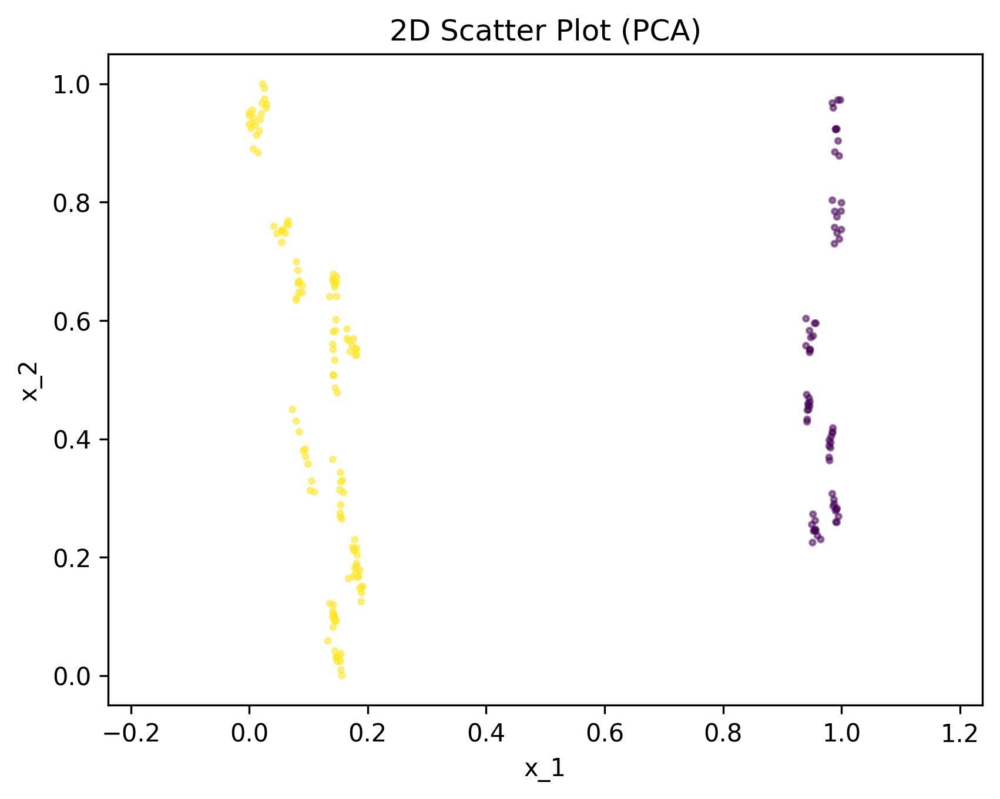

Sequence Selection
==================

Sequence selection allows users to select sequences of a video instead of single frames.
The key concept is the parameter `selected_sequence_length`. If its value is one (default),
the docker selects single frames. If it is larger than one, each video is split into 
sequences of that length and the frame representations are aggregated into a sequence
representation. The selection then happens on these sequence representations.

.. note:: Sequence selection works on videos or on folders of alphabetically sorted
    frames.

How It Works
-------------
Sequence selection consists of the following steps:

1. Each input video is split into sequences of length `selected_sequence_length`.
2. Next, the embeddings of all frames in a sequence are aggregated (averaged).
3. The selection is performed on sequence level.
4. Finally, the indices of the selected sequence frames are reconstructed.
5. The report is generated and (if requested) the selected frames are saved.
  

Usage
-----------

To select sequences of length **X** simply add the argument **selected_sequence_length=X**
to your docker run command. Hereby, **X** must be an integer number which evenly divides
the **stopping_condition.n_samples**. If **stopping_condition.n_samples** is a fraction,
the Lightly docker will automatically round it to the next multiple of of **X**.

For example, let's say we have a folder with two videos
which we randomly downloaded from `Pexels <https://www.pexels.com/>`_: 

.. code-block:: console

    ls /datasets/pexels/
    > Pexels Videos 1409899.mp4  Pexels Videos 2495382.mp4

Now, we want to select sequences of length ten. We use:

.. code-block:: console

    docker run --gpus all --rm -it \
        -v /datasets/pexels:/home/input_dir:ro \
        -v /outputs/:/home/output_dir \
        lightly/sampling:latest \
        token=MYAWESOMETOKEN \
        stopping_condition.n_samples=200 \
        enable_corruptness_check=False \
        remove_exact_duplicates=False \
        dump_dataset=True \
        selected_sequence_length=10

The above command will select 20 sequences each consisting of ten frames. The selected
frames are then saved in the output directory for further processing. Note that Lightly
docker currently doesn't support the corruptness check and removing exact duplicates for
sequence selection. Hence we have to deactivate them in the command above.

.. warning:: The stopping condition `n_samples` must be equal to to the number of
    desired sequences times the `selected_sequence_length`, i.e. **n_samples = n_sequences x selected_sequence_length**.
    In the example above 20 sequences times ten frames is exactly 200.

In our example, a look at a PCA of the embeddings of the selected frames nicely shows
the 20 selected sequences. The following image is taken from the output of the Lightly
docker:

    PCA of the embeddings of the frames in the selected sequences from the two
    input videos (yellow and purple).