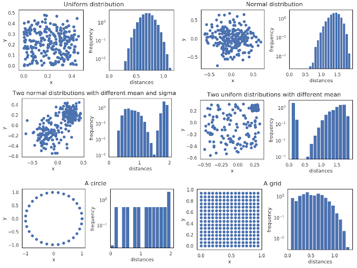

.. _docker-configuration:

Configuration
===================================

Similar to the 
`lightly open-source framework <https://github.com/lightly-ai/lightly>`_, the Lightly Worker solution 
can be configured using Hydra as well.

The following example shows how the `token` parameter is set.

.. code-block:: console

    docker run --shm-size="1024m" --rm -it \
        -v {OUTPUT_DIR}:/home/shared_dir \
        lightly/worker:latest \
        token=MYAWESOMETOKEN

Note that `token` can optionally be passed as a `LIGHTLY_TOKEN` environment variable to keep it hidden from logs:

.. code-block:: console

    docker run --shm-size="1024m" --rm -it \
        -e LIGHTLY_TOKEN=MYAWESOMETOKEN
        -v {OUTPUT_DIR}:/home/shared_dir \
        lightly/worker:latest

.. _rst-docker-parameters:

List of Parameters
-----------------------------------

The following are parameters which can be passed to the container:

.. code-block:: yaml

  # Access token, get it from app.lightly.ai.
  token: ''

  worker:
    # If specified, the docker is started as a worker on the Lightly platform.
    worker_id: ''
    # If True, the worker notifies that it is online even though another worker
    # with the same worker_id is already online.
    # This can be useful if that worker is actually offline but was not able to properly shutdown due to it crashing.
    # If False and already a worker exists, the docker aborts.
    force_start: True

  # Set to True to check whether installation was successful.
  sanity_check: False 

  # Path to a file containing filenames to run the Lightly Worker on a subset of the
  # files in the input directory (local folder or datasource path). 
  # The Lightly Worker will ignore all files in the input 
  # directory not listed here. Each filename must be on a separate line and
  # relative to the input directory.
  # If you use a cloud bucket as datasource, the path is relative
  # to the root of your input datasource. If you specified a 2nd output datasource,
  # and the path contains `.lightly`, then the path is relative to the output datasource.
  # If you have a local input directory, the path is relative to the shared directory,
  # so if the file is in 'shared_dir/directory/relevant_filenames.txt'
  # the path should be set to 'directory/relevant_filenames.txt'
  relevant_filenames_file: ''

  # Set to False to disable check for corrupted images.
  enable_corruptness_check: True
  corruptness_check:
    # Threshold in [0, 1] which determines the sensibility of the corruptness check
    # for video frames. Every frame which has an internally computed corruptness
    # score larger than the specified threshold will be classified as corrupted.
    corruption_threshold: 0.1

  # Remove exact duplicates.
  remove_exact_duplicates: True

  # Path to the checkpoint relative to the shared directory.
  checkpoint: ''

  # Path to the embeddings file relative to the shared directory.
  embeddings: ''

  # Enable training, only possible when no embeddings are passed.
  enable_training: False

  # Dump the final dataset to the output directory.
  dump_dataset: False
  dump_sampled_embeddings: True
  # Set the size of the dumped images, use =x or =[height,width] to match the 
  # shortest edge to x or to resize the image to (height, width), use =-1 for no 
  # resizing (default). This only affects the output size of the images dumped to 
  # the output folder with dump_dataset=True. To change the size of images 
  # uploaded to the lightly platform or your cloud bucket please use the 
  # lightly.resize option instead.
  output_image_size: -1
  output_image_format: 'png'

  # Upload the dataset to the Lightly platform.
  upload_dataset: False

  # pretagging
  pretagging: False
  pretagging_debug: False
  pretagging_config: ''
  pretagging_upload: False

  # Append weak labels.
  append_weak_labels: False

  # Normalize the embeddings to unit length.
  normalize_embeddings: True

  # active learning scorer
  scorer: 'object-frequency'
  scorer_config:
    frequency_penalty: 0.25
    min_score: 0.9

  # Selection
  # Choose from ['coreset', 'random'].
  method: 'coreset'
  # Choose when to stop the selection
  stopping_condition:
    # The maximum number of samples selected
    # Float in [0., 1.] for percentage, int for number of samples, -1 means inactive.
    n_samples: -1    
    # Float, minimum distance between two selected images. -1 means inactive.
    min_distance: -1.
  selected_sequence_length: 1

  # datapool
  datapool:
    # Name of the datapool. This will create a local datapool.
    name:
    # If True keeps backup of all previous data pool states.
    keep_history: True
    # Dataset id from Lightly platform where the datapool should be hosted.
    dataset_id:

  # datasource
  # By default only new samples in the datasource are processed. Set process_all 
  # to True to reprocess all samples in the datasource.
  datasource:
    # Dataset id from the Lightly platform.
    dataset_id:
    # Set to True to reprocess all samples in the datasource.
    process_all: False
    # Update datapool with the selected samples.
    enable_datapool_update: True
    # Use video metadata to determine the number of frames in each video. Set to
    # True for faster processing. Set to False if you get video related errors.
    use_frame_count_metadata: False
    # This feature flag enables runs which take longer than 7 days by bypassing
    # the limitation of signed read URLs of S3, GCS and Azure.
    # The tradeoff is that it will take longer to fully read and process all the
    # data which is stored in the bucket configured as your datasource resulting
    # in a longer total duration.
    # Only enable this if you are certain that your run will take longer than
    # 7 days to complete.
    # This feature is always enabled when a S3 datasource with delegated access
    # is configured. 
    use_redirected_read_url: False
    # Bypass the verification of read/write access to the datasource
    bypass_verify: False

  # active learning
  active_learning:
    task_name: ''
    score_name: 'uncertainty_margin'

  # object level
  object_level:
    # Name of the object prediction task which contains all the object annotations.
    task_name: ''
    # Name of the additional crop dataset on the Lightly Platform. A new dataset
    # is created if no dataset with this name exists.
    crop_dataset_name: ''
    # Padding relative to the bbox size
    padding: 0.0

  # Upload report to the Ligthly platform.
  upload_report: True
  # The number of retained/removed image pairs shown in the report.
  n_example_images: 6
  # Maximum size of the distance matrix allowed for report statistics in GB. 
  memory_requirement_in_GB: 2
  # Show timestamps of the selected frames for each video in the report. Set this
  # to False if you observe slow report generation or work with many videos (>20).
  show_video_sampling_timeline: True

  # optional deterministic unique output subdirectory for run, in place of timestamp
  run_directory:

To get an overview of all possible configuration parameters of Lightly, 
please check out :ref:`ref-cli-config-default`

Choosing the Right Parameters
-----------------------------------

Below you find some distributions and the resulting histogram of the pairwise
distances. Typically, datasets consist of multiple normal or uniform 
distributions (second row). This makes sense. In autonomous driving, we collect
data in various cities, different weather conditions, or other factors. When 
working with video data from multiple cameras each camera might form a cluster
since images from the same static camera have lots of perceptual similarity.

The more interesting question is what kind of distribution you're aiming for.

**If we want to diversify the dataset** (e.g. create a really hard test set
covering all the special cases) we might want to aim for what looks like a grid.
The log histogram (yes, we plot the histograms in log scale!) for a grid pattern with
equal distance between two neighboring samples looks like a D.

**If you want to remove nearby duplicates** (e.g. reduce overfitting and bias)
we see good results when trying to sample using the *min_distance* stop condition.
E.g. set the *min_distance* to 0.1 to get rid of the small peak (if there is any)
close to 0 pairwise distance. 

