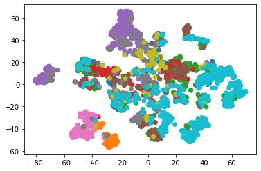

.. _docker-first-steps:

First Steps
===================================

The Lightly worker follows a train, embed, select workflow:

.. code-block:: console

    +--------+      +---------+      +--------+
    | Train  +----->+  Embed  +----->+ Select |
    +--------+      +---------+      +--------+

#. You can either use a pre-trained model from the model zoo or fine-tune
   a model on your unlabeled dataset using self-supervised learning. The output
   of the train step is a model checkpoint.

#. The embed step creates embeddings of the input dataset. Each sample gets
   represented using a low-dimensional vector. The output of the embed step is
   a .csv file.

#. Finally, based on the embeddings and additional information, such as predictions or
   metadata, we can use  one of the selection strategies to pick the relevant data for you.
   The output of the selection is a list of selected input samples as well as analytics in
   the form of a pdf report with plots.

The Lightly worker can be easily triggered from your Python code. There are various parameters you can
configure and we also expose the full configuration of the lightly self-supervised learning framework.
You can use the Lightly worker to train a self-supervised model instead of using the Lightly Python framework.

Using Docker
-------------

We use docker containers to ship the Lightly Worker. Docker allows us to run the
same worker on various operating systems with different setups. 

`To learn more about docker please head over to the official docs! <https://docs.docker.com/>`_

Here, we quickly explain the most important parts of the typical **docker run** command.

.. code-block:: console

    docker run --shm-size="1024m" --gpus all --rm -it lightly/worker:latest

- :code:`docker run` this is the command to run/start a container
- :code:`--shm-size="1024m"` because we do lots of parallel computations we
  want to give our container some extra shared memory for inter process communication
- :code:`--gpus all` passes all the host GPUs to the container and makes them accessible
- :code:`--rm` makes sure we remove the container after running
- :code:`-it` enables interactive mode (user input gets passed to container).
  This allows you to use `ctrl-c` to stop the container
- :code:`lightly/worker:latest` is the docker image we want to run

Volume Mapping
--------------

Before we jump into the details of how to submit jobs, we need to start the Lightly image in
worker mode (as outlined in :ref:`docker-setup`).

.. code-block:: console

    docker run --shm-size="1024m" --gpus all --rm -it \
        -v {OUTPUT_DIR}:/home/output_dir \
        lightly/worker:latest \
        token=MY_AWESOME_TOKEN \
        worker.worker_id=MY_WORKER_ID

Here, we use volume mapping provided by the docker run command to provide an output directory.
A docker container itself is not considered to be a good place to store data. 
Volume mapping allows the worker to interact with the filesystem of the host system.

The Lightly worker requires that an `{OUTPUT_DIR}` is specified where it can store
the results of all the computations. See `Reporting`_ and `Worker Output`_ for additional information.
The worker requires **read and write access** to this directory.

.. warning:: Docker volume or port mappings always follow the scheme that you first
          specify the host systems port followed by the internal port of the
          container. E.g. **-v /outputs:/home/outputs** would mount /outputs
          from your system to /home/outputs in the docker container.

.. note:: Learn how to obtain your :ref:`ref-authentication-token`.

Now, let's see how this will look in action!

.. _worker-creating-a-dataset:

Creating a Dataset
------------------

To set up inputs and outputs for your job you will need a `dataset_id`. You can either create
a new dataset from Python or re-use an existing one (see :ref:`datapool`).

.. code-block:: python
    :caption: Creating a new dataset from Python

    from lightly.api import ApiWorkflowClient
    from lightly.openapi_generated.swagger_client.models.dataset_type import DatasetType

    # Create the Lightly client to connect to the API.
    client = ApiWorkflowClient(token="MY_AWESOME_TOKEN")

    # Create a new dataset on the Lightly Platform.
    client.create_dataset(
        'dataset-name',
        DatasetType.IMAGES  # can be DatasetType.VIDEOS when working with videos
    )
    dataset_id = client.dataset_id

You can see the dataset under https://app.lightly.ai/datasets

The Lightly worker reads input data from a cloud storage folder and will upload selection results
to cloud storage as well. You therefore need to provide read and write access to your storage bucket.
You can re-use the `client` from the previous step. If you create a new `ApiWorkflowClient`
make sure to specify the `dataset_id` in the constructor.

.. tabs::

    .. tab:: S3

        .. code-block:: python
            :caption: Giving access to storage buckets from Python

            from lightly.openapi_generated.swagger_client.models.datasource_purpose import DatasourcePurpose

            ## AWS S3
            # Input bucket
            client.set_s3_config(
                resource_path="s3://bucket/input/",
                region='eu-central-1',
                access_key='S3-ACCESS-KEY',
                secret_access_key='S3-SECRET-ACCESS-KEY',
                purpose=DatasourcePurpose.INPUT
            )
            # Output bucket
            client.set_s3_config(
                resource_path="s3://bucket/output/",
                region='eu-central-1',
                access_key='S3-ACCESS-KEY',
                secret_access_key='S3-SECRET-ACCESS-KEY',
                purpose=DatasourcePurpose.LIGHTLY
            )

    .. tab:: S3 Delegated Access

        .. code-block:: python
            :caption: Giving access to storage buckets from Python

            from lightly.openapi_generated.swagger_client.models.datasource_purpose import DatasourcePurpose

            ## AWS S3
            # Input bucket
            client.set_s3_delegated_access_config(
                resource_path="s3://bucket/input/",
                region='eu-central-1',
                role_arn='S3-ROLE-ARN',
                external_id='S3-EXTERNAL-ID'
                purpose=DatasourcePurpose.INPUT
            )
            # Output bucket
            client.set_s3_delegated_access_config(
                resource_path="s3://bucket/output/",
                region='eu-central-1',
                role_arn='S3-ROLE-ARN',
                external_id='S3-EXTERNAL-ID'
                purpose=DatasourcePurpose.LIGHTLY
            )

    .. tab:: GCS

        .. code-block:: python
            :caption: Giving access to storage buckets from Python

            import json
            from lightly.openapi_generated.swagger_client.models.datasource_purpose import DatasourcePurpose

            ## Google Cloud Storage
            # Input bucket
            client.set_gcs_config(
                resource_path="gs://bucket/input/",
                project_id="PROJECT-ID",
                credentials=json.dumps(json.load(open('credentials_read.json'))),
                purpose=DatasourcePurpose.INPUT
            )
            # Output bucket
            client.set_gcs_config(
                resource_path="gs://bucket/output/",
                project_id="PROJECT-ID",
                credentials=json.dumps(json.load(open('credentials_write.json'))),
                purpose=DatasourcePurpose.LIGHTLY
            )

    .. tab:: Azure

        .. code-block:: python
            :caption: Giving access to storage buckets from Python

            from lightly.openapi_generated.swagger_client.models.datasource_purpose import DatasourcePurpose

            ## Azure
            # Input bucket
            client.set_azure_config(
                container_name='my-container/input/',
                account_name='ACCOUNT-NAME',
                sas_token='SAS-TOKEN',
                purpose=DatasourcePurpose.INPUT
            )
            # Output bucket
            client.set_azure_config(
                container_name='my-container/output/',
                account_name='ACCOUNT-NAME',
                sas_token='SAS-TOKEN',
                purpose=DatasourcePurpose.LIGHTLY
            )

.. warning::
    The credentials passed above need to provide Lightly with `LIST` and `READ` access to the input bucket and
    with `LIST`, `READ`, and `WRITE` access to the output bucket. See :ref:`dataset-creation-gcloud-bucket`, 
    :ref:`dataset-creation-aws-bucket`, and :ref:`dataset-creation-azure-storage` for help
    with configuring the different roles.

.. _worker-scheduling-a-job:

Scheduling a Simple Job
-----------------------

Now that everything is in place, let's configure and run a simple job.

.. code-block:: python
    :caption: Scheduling a job from Python

    client.schedule_compute_worker_run(
        worker_config={
            "enable_corruptness_check": True,
            "remove_exact_duplicates": True,
        }
        selection_config=DockerWorkerSelectionConfig(
            n_samples=50,
            strategies=[
                DockerWorkerSelectionConfigEntry(
                    input=DockerWorkerSelectionConfigEntry(type=DockerWorkerSelectionInputType.EMBEDDINGS),
                    strategy=DockerWorkerSelectionConfigEntry(type=DockerWorkerSelectionStrategyType.DIVERSIFY)
                )
            ]
        )
    )

The command schedules a job with the following configurations:

- :code:`enable_corruptness_check` Checks your dataset for corrupt images if **True**.

- :code:`remove_exact_duplicates` Removes exact duplicates if **True**.

- The :code:`selection_config` will make the Lightly Worker choose 50 samples 
  from the initial dataset that are as diverse as possible. This is done using the
  embeddings which are automatically created during the run.

For more details and options regarding the worker config, head to :ref:`docker-configuration`.
For more details and options regarding the selection config, head to :ref:`worker-selection`.

The worker should pick up the job after a few seconds and start working on it. The
status of the current run and scheduled jobs can be seen under https://app.lightly.ai/compute/runs

After the job was processed, the selected data will be accessible in the configured dataset. The
report can be accessed from the compute worker runs page mentioned just above.

.. _training-a-self-supervised-model:

Training a Self-Supervised Model
--------------------------------

Sometimes it may be beneficial to finetune a self-supervised model on your 
dataset before embedding the images. This may be the case when the dataset is 
from a specific domain (e.g. for medical images).

The command below will **train a self-supervised model** for (default: 100) 
epochs on the input images before embedding the images and selecting from them.

.. code-block:: python
    :emphasize-lines: 5
    :caption: Scheduling a job with self-supervised training from Python

    client.schedule_compute_worker_run(
        worker_config={
            "enable_corruptness_check": True,
            "remove_exact_duplicates": True,
            "enable_training": True,
            "pretagging": False,
            "pretagging_debug": False,
        },
        selection_config=DockerWorkerSelectionConfig(
            n_samples=50,
            strategies=[
                DockerWorkerSelectionConfigEntry(
                    input=DockerWorkerSelectionConfigEntry(type=DockerWorkerSelectionInputType.EMBEDDINGS),
                    strategy=DockerWorkerSelectionConfigEntry(type=DockerWorkerSelectionStrategyType.DIVERSIFY)
                )
            ]
        )
    )

You may not always want to train for exactly 100 epochs with the default settings.
The Lightly worker is a wrapper around the lightly Python package.
Hence, for training and embedding the user can access all the settings from the lightly command-line tool.

Here are some of the most common parameters for the **lightly_config**
you might want to change:

- :code:`loader.num_workers` specifies the number of background workers for data processing.
  -1 uses the number of available CPU cores. 
- :code:`trainer.max_epochs` determines the number of epochs your SSL model should be trained for.

.. code-block:: python
    :emphasize-lines: 13, 24
    :caption: Accessing the lightly parameters from Python

    client.schedule_compute_worker_run(
        worker_config={
            "enable_corruptness_check": True,
            "remove_exact_duplicates": True,
            "enable_training": True,
            "pretagging": False,
            "pretagging_debug": False,
        },
        lightly_config={
            'loader': {
                'batch_size': 16,
                'shuffle': True,
                'num_workers': -1,
                'drop_last': True
            },
            'model': {
                'name': 'resnet-18',
                'out_dim': 128,
                'num_ftrs': 32,
                'width': 1
            },
            'trainer': {
                'gpus': 1,
                'max_epochs': 100,
                'precision': 32
            },
            'criterion': {
                'temperature': 0.5
            },
            'optimizer': {
                'lr': 1,
                'weight_decay': 0.00001
            },
            'collate': {
                'input_size': 64,
                'cj_prob': 0.8,
                'cj_bright': 0.7,
                'cj_contrast': 0.7,
                'cj_sat': 0.7,
                'cj_hue': 0.2,
                'min_scale': 0.15,
                'random_gray_scale': 0.2,
                'gaussian_blur': 0.5,
                'kernel_size': 0.1,
                'vf_prob': 0,
                'hf_prob': 0.5,
                'rr_prob': 0
            }
        }
    )

**Checkpoints** from your training process will be stored in the output directory.
You can use such a checkpoint in future worker runs by copying the checkpoint to
a `shared directory` and then passing the checkpoint filename to the container.

.. code-block:: console
    :emphasize-lines: 3
    :caption: Starting the worker with a `shared directory`

    docker run --shm-size="1024m" --gpus all --rm -it \
        -v {OUTPUT_DIR}:/home/output_dir \
        -v {SHARED_DIR}:/home/shared_dir \
        lightly/worker:latest \
        token=MY_AWESOME_TOKEN \
        worker.worker_id=MY_WORKER_ID

.. code-block:: python
    :caption: Scheduling a job with a pre-trained checkpoint
    :emphasize-lines: 8

    client.schedule_compute_worker_run(
        worker_config={
            "enable_corruptness_check": True,
            "remove_exact_duplicates": True,
            "enable_training": False, # set to True if you want to continue training
            "pretagging": False,
            "pretagging_debug": False,
            "checkpoint": "lightly_epoch_X.ckpt"
        },
        selection_config=DockerWorkerSelectionConfig(
            n_samples=50,
            strategies=[
                DockerWorkerSelectionConfigEntry(
                    input=DockerWorkerSelectionConfigEntry(type=DockerWorkerSelectionInputType.EMBEDDINGS),
                    strategy=DockerWorkerSelectionConfigEntry(type=DockerWorkerSelectionStrategyType.DIVERSIFY)
                )
            ]
        )
    )

For example, if the :code:`{OUTPUT_DIR}` is :code:`/home/ubuntu/outputs`, the checkpoint will
be called :code:`/home/ubuntu/outputs/{DATE}/{TIME}/lightly_epoch_X.ckpt`. Now you can create a new directory
:code:`home/ubuntu/shared` and copy the checkpoint there. Finally, when running the worker
you need to specify the newly created directory as the :code:`{SHARED_DIR}` and checkpoint as
:code:`lightly_epoch_X.ckpt`.

Specifying Relevant Files
-------------------------
Oftentimes not all files in a bucket are relevant. In that case, it's possible
to pass a list of filenames to the worker using the `relevant_filenames_file` configuration option.
It will then only consider the listed filenames and ignore all others. To do so, you can create a text file which
contains one relevant filename per line and then pass the path to the text file when scheduling the job. This works for videos and images.

.. warning:: The `relevant_filenames_file` is expected to be in the **output bucket** as specified above (see `Creating a Dataset`_). And must always be
    located in a subdirectory called `.lightly`.

For example, let's say you're working with the following file structure in an S3 bucket where
you are only interested in `image_1.png` and `subdir/image_3.png`

.. code-block:: console

    s3://my-input-bucket/
        L image_1.png
        L subdir/
            L image_2.png
            L image_3.png

Then you can add a file called `relevant_filenames.txt` to your output bucket with the following content

.. code-block:: text
    :caption: relevant_filenames.txt

    image_1.png
    subdir/image_3.png

The output bucket should then look like this:

.. code-block:: console

    s3://my-output-bucket/
        L .lightly/
            L relevant_filenames.txt

The corresponding Python command to submit a job would then be as follows:

.. code-block:: python
    :emphasize-lines: 3
    :caption: Scheduling a job with relevant filenames from Python

    client.schedule_compute_worker_run(
        worker_config={
            "relevant_filenames_file": ".lightly/relevant_filenames.txt",
            "enable_corruptness_check": True,
            "remove_exact_duplicates": True,
            "enable_training": False,
            "pretagging": False,
            "pretagging_debug": False,
        },
        selection_config=DockerWorkerSelectionConfig(
            n_samples=50,
            strategies=[
                DockerWorkerSelectionConfigEntry(
                    input=DockerWorkerSelectionConfigEntry(type=DockerWorkerSelectionInputType.EMBEDDINGS),
                    strategy=DockerWorkerSelectionConfigEntry(type=DockerWorkerSelectionStrategyType.DIVERSIFY)
                )
            ]
        )
    )

Downloading
-----------

After a job has successfully run, a dataset with the selected samples
and a tag with the name `initial-tag` are created. From there you can easily
export and download the filenames for further processing:

.. code-block:: python
    :caption: Download the filenames for further processing

    from lightly.api.api_workflow_client import ApiWorkflowClient

    client = ApiWorkflowClient(token='MY_AWESOME_TOKEN', dataset_id='xyz') # replace this with your token
    filenames = client.export_filenames_by_tag_name(
        'initial-tag' # name of the datasets tag 
    )
    with open('filenames-of-initial-tag.txt', 'w') as f:
        f.write(filenames)

We also support multiple `additional export formats <https://docs.lightly.ai/lightly.api.html#module-lightly.api.api_workflow_client>`_
with which you can e.g. export to Label Studio or Label Box.

It is also possible to directly download the actual files themselves as follows:

.. code-block:: python
    :caption: Directly download the files

    from lightly.api.api_workflow_client import ApiWorkflowClient

    client = ApiWorkflowClient(token='MY_AWESOME_TOKEN', dataset_id='xyz') # replace this with your token
    client.download_dataset(
        './my/output/path/', # path to where the files should be saved 
        'initial-tag'        # name of the datasets tag
    )

Reporting
---------

To facilitate sustainability and reproducibility in ML, the Lightly worker
has an integrated reporting component. For every dataset, you run through the container
an output directory gets created with the exact configuration used for the experiment. 
Additionally, plots, statistics, and more information collected
during the various processing steps are provided.
E.g. there is information about the corruptness check, embedding process and selection process.

To make it easier for you to understand and discuss the dataset we put the essential information into
an automatically generated PDF report.
Sample reports can be found on the `Lightly website <https://lightly.ai/analytics>`_.

Worker Output
^^^^^^^^^^^^^

The output directory is structured in the following way:

* config:
   A directory containing copies of the configuration files and overwrites.
* data:
   The data directory contains everything to do with data. 
   
    * If `enable_corruptness_check=True`, it will contain a "clean" version of the dataset. 
    * If `remove_exact_duplicates=True`, it will contain a copy of the `embeddings.csv` 
      where all duplicates are removed. Otherwise, it will simply store the 
      embeddings computed by the model.
    * If `selected_sequence_length > 1`, it will contain a `sequence_information.json`
      file with information about the selected sequences (filenames, video frame timestamps, ...).
      Head to :ref:`sequence-selection` for more details on sequence selection.

* filenames:
   This directory contains lists of filenames of the corrupt images, removed images, selected
   images and the images which were removed because they have an exact duplicate in the dataset.
* lightly_epoch_X.ckpt
   Checkpoint with the trained model weights (exists only if `enable_training=True`).
   See :ref:`load-model-from-checkpoint` on how to use the checkpoint file.
* plots:
   A directory containing the plots which were produced for the report.
* report.pdf
   To provide a simple overview of the filtering process the Lightly worker automatically generates a report.
   The report contains

   * information about the job (duration, processed files etc.)
   * estimated savings in terms of labeling costs and CO2 due to the smaller dataset
   * statistics about the dataset before and after the selection process
   * histogram before and after filtering
   * visualizations of the dataset
   * nearest neighbors of retained images among the removed ones

* The report is also available as a report.json file. Any value from the pdf report can be easily be accessed.

Below you find a typical output folder structure.

.. code-block:: console

    |-- config
    |   |-- config.yaml
    |   |-- hydra.yaml
    |   '-- overrides.yaml
    |-- data
    |   |-- al_score_embeddings.csv
    |   |-- bounding_boxes.json
    |   |-- bounding_boxes_examples
    |   |-- embeddings.csv
    |   |-- normalized_embeddings.csv
    |   |-- sampled
    |   |-- selected_embeddings.csv
    |   '-- sequence_information.json
    |-- filenames
    |   |-- corrupt_filenames.txt
    |   |-- duplicate_filenames.txt
    |   |-- removed_filenames.txt
    |   '-- sampled_filenames_excluding_datapool.txt
    |-- lightly_epoch_X.ckpt
    |-- plots
    |   |-- distance_distr_after.png
    |   |-- distance_distr_before.png
    |   |-- filter_decision_0.png
    |   |-- filter_decision_11.png
    |   |-- filter_decision_22.png
    |   |-- filter_decision_33.png
    |   |-- filter_decision_44.png
    |   |-- filter_decision_55.png
    |   |-- pretagging_histogram_after.png
    |   |-- pretagging_histogram_before.png
    |   |-- scatter_pca.png
    |   |-- scatter_pca_no_overlay.png
    |   |-- scatter_umap_k_15.png
    |   |-- scatter_umap_k_15_no_overlay.png
    |   |-- scatter_umap_k_5.png
    |   |-- scatter_umap_k_50.png
    |   |-- scatter_umap_k_50_no_overlay.png
    |   '-- scatter_umap_k_5_no_overlay.png
    |-- report.json
    '-- report.pdf

Evaluation of the Selection Process
^^^^^^^^^^^^^^^^^^^^^^^^^^^^^^^^^^^

**Histograms and Plots**

The report contains histograms of the pairwise distance between images before and after the selection process.

An example of such a histogram before and after filtering for the CamVid dataset consisting of 367
samples is shown below. We marked the region which is of special interest with an orange rectangle. 
Our goal is to make this histogram more symmetric by removing samples of short distances from each other. 

If we remove 25 samples (7%) out of the 367 samples of the CamVid dataset the histogram looks more symmetric
as shown below. In our experiments, removing 7% of the dataset results in a model with higher validation set accuracy.

.. image:: images/histogram_before_after.jpg

.. note::

    Why symmetric histograms are preferred: An asymmetric histogram can be the result of either a dataset with outliers or inliers.
    A heavy tail for low distances means that there is at least one high-density region with many samples very close to each other within the main cluster.
    Having such a high-density region can lead to biased models trained on this particular dataset. A heavy tail towards high distances shows that there is
    at least one high-density region outside the main cluster of samples.

Manually Inspecting the Embeddings
----------------------------------
Every time you run Lightly worker you will find an `embeddings.csv` file in the
output directory. This file contains the embeddings of all samples in your dataset.
You can use the embeddings for clustering or manual inspection of your dataset.

    Example plot of working with embeddings.csv

We provide an 
`example notebook <https://colab.research.google.com/drive/1aHJBKyfopheWYOkIEEXyxyRoqQVfWe3A?usp=sharing>`_
to learn more about how to work with the embeddings.
