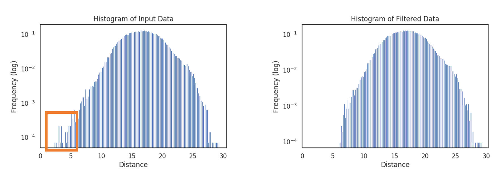

.. _docker-first-steps:

First Steps
===================================

The Lightly worker follows a train, embed, select workflow:

.. code-block:: console

    +--------+      +---------+      +--------+
    | Train  +----->+  Embed  +----->+ Select |
    +--------+      +---------+      +--------+

#. You can either use a pre-trained model from the model zoo or fine-tune
   a model on your unlabeled dataset using self-supervised learning. The output
   of the train step is a model checkpoint.

#. The embed step creates embeddings of the input dataset. Each sample gets
   represented using a low-dimensional vector. The output of the embed step is
   a .csv file.

#. Finally, based on the embeddings and additional information, such as predictions or
   metadata, we can use  one of the selection strategies to pick the relevant data for you.
   The output of the selection is a list of selected input samples as well as analytics in
   the form of a pdf report with plots.

The Lightly worker can be easily triggered from your Python code. There are various parameters you can
configure and we also expose the full configuration of the lightly self-supervised learning framework.
You can use the Lightly worker to train a self-supervised model instead of using the Lightly Python framework.

Using Docker
-------------

We use docker containers to ship the Lightly Worker. Docker allows us to run the
same worker on various operating systems with different setups.

`To learn more about docker please head over to the official docs! <https://docs.docker.com/>`_

Here, we quickly explain the most important parts of the typical **docker run** command.

.. code-block:: console

    docker run --shm-size="1024m" --gpus all --rm -it lightly/worker:latest

- :code:`docker run` this is the command to run/start a container
- :code:`--shm-size="1024m"` because we do lots of parallel computations we
  want to give our container some extra shared memory for inter process communication
- :code:`--gpus all` passes all the host GPUs to the container and makes them accessible
- :code:`--rm` makes sure we remove the container after running
- :code:`-it` enables interactive mode (user input gets passed to container).
  This allows you to use `ctrl-c` to stop the container
- :code:`lightly/worker:latest` is the docker image we want to run

Start the Lightly Worker Docker
--------------------------------

Before we jump into the details of how to submit jobs, we need to start the Lightly image in
worker mode (as outlined in :ref:`docker-setup`).

**This is how you start your Lightly Worker:**

.. code-block:: console

    docker run --shm-size="1024m" --gpus all --rm -it \
        lightly/worker:latest \
        token=MY_AWESOME_TOKEN \
        worker.worker_id=MY_WORKER_ID

.. note:: Learn how to obtain your :ref:`ref-authentication-token`.

Now, let's see how this will look in action!

.. _worker-creating-a-dataset:

Creating a Dataset
------------------

To set up inputs and outputs for your job you will need a `dataset_id`. You can either create
a new dataset from Python or re-use an existing one (see :ref:`datapool`).

.. code-block:: python
    :caption: Creating a new dataset from Python

    from lightly.api import ApiWorkflowClient
    from lightly.openapi_generated.swagger_client.models.dataset_type import DatasetType

    # Create the Lightly client to connect to the API.
    client = ApiWorkflowClient(token="MY_AWESOME_TOKEN")

    # Create a new dataset on the Lightly Platform.
    client.create_dataset(
        'dataset-name',
        DatasetType.IMAGES  # can be DatasetType.VIDEOS when working with videos
    )
    dataset_id = client.dataset_id

You can see the dataset under https://app.lightly.ai/datasets

.. _worker-setting-datasource-configs:

Setting the datasource configs
------------------------------

The Lightly worker reads input data from a cloud storage folder and will upload selection results
to cloud storage as well. You therefore need to define an `INPUT` and `LIGHTLY` bucket.
You can re-use the `client` from the previous step. If you create a new `ApiWorkflowClient`
make sure to specify the `dataset_id` in the constructor.

INPUT bucket
^^^^^^^^^^^^

The `INPUT` bucket is where Lightly reads your input data from. You must specify it and you must provide Lightly `LIST` and `READ` access to it.

LIGHTLY bucket
^^^^^^^^^^^^^^

The `LIGHTLY` bucket must be specified as well and you must provide Lightly `LIST`, `READ` and `WRITE` access to it.
You can have separate credentials for it or use the same as for the `INPUT` bucket.
The `LIGHTLY` bucket can point to a different directory in the same bucket or a different bucket (even located at a different cloud storage provider).
Its `resource_path` must point to an existing directory. This directory must exist, but can be empty.
The `LIGHTLY` bucket is used for many purposes:

- Saving thumbnails of images for a more responsive Lightly Platform.
- Saving images of cropped out objects, if you use the object-level workflow. See also :ref:`docker-object-level`.
- Saving frames of videos, if your input consists of videos.
- Providing the relevant filenames file if you want to to run the lightly worker only on a subset of input files: See also :ref:`specifying_relevant_files`.
- Providing predictions for running the object level workflow or as additional information for the selection process. See also :ref:`docker-datasource-predictions`.
- Providing metadata as additional information for the selection process. See also :ref:`docker-datasource-metadata`.

.. tabs::

    .. tab:: S3

        .. code-block:: python
            :caption: Giving access to storage buckets from Python

            from lightly.openapi_generated.swagger_client.models.datasource_purpose import DatasourcePurpose

            ## AWS S3
            # Input bucket
            client.set_s3_config(
                resource_path="s3://bucket/input/",
                region='eu-central-1',
                access_key='S3-ACCESS-KEY',
                secret_access_key='S3-SECRET-ACCESS-KEY',
                purpose=DatasourcePurpose.INPUT
            )
            # Lightly bucket
            client.set_s3_config(
                resource_path="s3://bucket/lightly/",
                region='eu-central-1',
                access_key='S3-ACCESS-KEY',
                secret_access_key='S3-SECRET-ACCESS-KEY',
                purpose=DatasourcePurpose.LIGHTLY
            )

    .. tab:: S3 Delegated Access

        .. code-block:: python
            :caption: Giving access to storage buckets from Python

            from lightly.openapi_generated.swagger_client.models.datasource_purpose import DatasourcePurpose

            ## AWS S3
            # Input bucket
            client.set_s3_delegated_access_config(
                resource_path="s3://bucket/input/",
                region='eu-central-1',
                role_arn='S3-ROLE-ARN',
                external_id='S3-EXTERNAL-ID',
                purpose=DatasourcePurpose.INPUT
            )
            # Lightly bucket
            client.set_s3_delegated_access_config(
                resource_path="s3://bucket/lightly/",
                region='eu-central-1',
                role_arn='S3-ROLE-ARN',
                external_id='S3-EXTERNAL-ID',
                purpose=DatasourcePurpose.LIGHTLY
            )

    .. tab:: GCS

        .. code-block:: python
            :caption: Giving access to storage buckets from Python

            import json
            from lightly.openapi_generated.swagger_client.models.datasource_purpose import DatasourcePurpose

            ## Google Cloud Storage
            # Input bucket
            client.set_gcs_config(
                resource_path="gs://bucket/input/",
                project_id="PROJECT-ID",
                credentials=json.dumps(json.load(open('credentials_read.json'))),
                purpose=DatasourcePurpose.INPUT
            )
            # Lightly bucket
            client.set_gcs_config(
                resource_path="gs://bucket/lightly/",
                project_id="PROJECT-ID",
                credentials=json.dumps(json.load(open('credentials_write.json'))),
                purpose=DatasourcePurpose.LIGHTLY
            )

    .. tab:: Azure

        .. code-block:: python
            :caption: Giving access to storage buckets from Python

            from lightly.openapi_generated.swagger_client.models.datasource_purpose import DatasourcePurpose

            ## Azure
            # Input bucket
            client.set_azure_config(
                container_name='my-container/input/',
                account_name='ACCOUNT-NAME',
                sas_token='SAS-TOKEN',
                purpose=DatasourcePurpose.INPUT
            )
            # Lightly bucket
            client.set_azure_config(
                container_name='my-container/lightly/',
                account_name='ACCOUNT-NAME',
                sas_token='SAS-TOKEN',
                purpose=DatasourcePurpose.LIGHTLY
            )

.. warning::
    The credentials passed above need to provide Lightly with `LIST` and `READ` access to the `INPUT` bucket and
    with `LIST`, `READ`, and `WRITE` access to the `LIGHTLY` bucket. See :ref:`dataset-creation-gcloud-bucket`,
    :ref:`dataset-creation-aws-bucket`, and :ref:`dataset-creation-azure-storage` for help
    with configuring the different roles.

.. _worker-scheduling-a-job:

Scheduling a Simple Job
-----------------------

Now that everything is in place, let's configure and run a simple job.

.. code-block:: python
    :caption: Scheduling a job from Python

    scheduled_run_id = client.schedule_compute_worker_run(
        worker_config={
            "enable_corruptness_check": True,
            "remove_exact_duplicates": True,
        },
        selection_config={
            "n_samples": 50,
            "strategies": [
                {
                    "input": {
                        "type": "EMBEDDINGS"
                    },
                    "strategy": {
                        "type": "DIVERSITY"
                    }
                }
            ]
        }
    )

The command schedules a job with the following configurations:

- :code:`enable_corruptness_check` Checks your dataset for corrupt images if **True**.

- :code:`remove_exact_duplicates` Removes exact duplicates if **True**.

- The :code:`selection_config` will make the Lightly Worker choose 50 samples
  from the initial dataset that are as diverse as possible. This is done using the
  embeddings which are automatically created during the run.

For more details and options regarding the worker config, head to :ref:`docker-configuration`.
For more details and options regarding the selection config, head to :ref:`worker-selection`.

Monitoring the Compute Worker Run
---------------------------------

The worker should pick up the job after a few seconds and start working on it. The
status of the current run and scheduled jobs can be seen under https://app.lightly.ai/compute/runs.
Alternatively, you can also monitor it from Python.

.. code-block:: python
    :caption: Monitoring the compute worker run from Python

    """
    You can use this code to track and print the state of the compute worker.
    The loop will end once the compute worker run has finished, was canceled or aborted/failed.
    """
    for run_info in client.compute_worker_run_info_generator(scheduled_run_id=scheduled_run_id):
        print(f"Compute worker run is now in state='{run_info.state}' with message='{run_info.message}'")

    if run_info.ended_successfully():
        print("SUCCESS")
    else:
        print("FAILURE")

After the job was processed, the selected data will be accessible in the configured dataset. The
report can be accessed from the compute worker runs page mentioned just above.

.. _training-a-self-supervised-model:

Training a Self-Supervised Model
--------------------------------

Sometimes it may be beneficial to finetune a self-supervised model on your
dataset before embedding the images. This may be the case when the dataset is
from a specific domain (e.g. for medical images).

The command below will **train a self-supervised model** for (default: 100)
epochs on the input images before embedding the images and selecting from them.

.. code-block:: python
    :emphasize-lines: 5
    :caption: Scheduling a job with self-supervised training from Python

    scheduled_run_id = client.schedule_compute_worker_run(
        worker_config={
            "enable_corruptness_check": True,
            "remove_exact_duplicates": True,
            "enable_training": True
        },
        selection_config={
            "n_samples": 50,
            "strategies": [
                {
                    "input": {
                        "type": "EMBEDDINGS"
                    },
                    "strategy": {
                        "type": "DIVERSITY"
                    }
                }
            ]
        }
    )

You may not always want to train for exactly 100 epochs with the default settings.
The Lightly worker is a wrapper around the lightly Python package.
Hence, for training and embedding the user can access all the settings from the lightly command-line tool.

Here are some of the most common parameters for the **lightly_config**
you might want to change:

- :code:`loader.num_workers` specifies the number of background workers for data processing.
  -1 uses the number of available CPU cores.
- :code:`trainer.max_epochs` determines the number of epochs your SSL model should be trained for.

.. code-block:: python
    :emphasize-lines: 24, 35
    :caption: Accessing the lightly parameters from Python

    scheduled_run_id = client.schedule_compute_worker_run(
        worker_config={
            "enable_corruptness_check": True,
            "remove_exact_duplicates": True,
            "enable_training": True,
        },
        selection_config={
            "n_samples": 50,
            "strategies": [
                {
                    "input": {
                        "type": "EMBEDDINGS"
                    },
                    "strategy": {
                        "type": "DIVERSITY"
                    }
                }
            ]
        },
        lightly_config={
            'loader': {
                'batch_size': 16,
                'shuffle': True,
                'num_workers': -1,
                'drop_last': True
            },
            'model': {
                'name': 'resnet-18',
                'out_dim': 128,
                'num_ftrs': 32,
                'width': 1
            },
            'trainer': {
                'gpus': 1,
                'max_epochs': 100,
                'precision': 32
            },
            'criterion': {
                'temperature': 0.5
            },
            'optimizer': {
                'lr': 1,
                'weight_decay': 0.00001
            },
            'collate': {
                'input_size': 64,
                'cj_prob': 0.8,
                'cj_bright': 0.7,
                'cj_contrast': 0.7,
                'cj_sat': 0.7,
                'cj_hue': 0.2,
                'min_scale': 0.15,
                'random_gray_scale': 0.2,
                'gaussian_blur': 0.5,
                'kernel_size': 0.1,
                'vf_prob': 0,
                'hf_prob': 0.5,
                'rr_prob': 0
            }
        }
    )

**Checkpoints** from your training process will be stored in the Lightly API as artifacts.
You can use such a checkpoint in future worker runs by downloading the checkpoint to
a `shared directory` and then passing the checkpoint filename to the container.

.. code-block:: python
    :caption: Downloading the checkpoint 

    # wait until the job has finished
    for run_info in client.compute_worker_run_info_generator(scheduled_run_id=scheduled_run_id):
        pass

    # download the checkpoint file
    run = client.get_compute_worker_run_from_scheduled(scheduled_run_id=scheduled_run_id)
    client.download_compute_worker_run_checkpoint(run=run, output_path="{SHARED_DIR}/checkpoint.ckpt")

.. code-block:: console
    :emphasize-lines: 2
    :caption: Starting the worker with a `shared directory`

    docker run --shm-size="1024m" --gpus all --rm -it \
        -v {SHARED_DIR}:/home/shared_dir \
        lightly/worker:latest \
        token=MY_AWESOME_TOKEN \
        worker.worker_id=MY_WORKER_ID

.. code-block:: python
    :caption: Scheduling a job with a pre-trained checkpoint
    :emphasize-lines: 6

    client.schedule_compute_worker_run(
        worker_config={
            "enable_corruptness_check": True,
            "remove_exact_duplicates": True,
            "enable_training": False, # set to True if you want to continue training
            "checkpoint": "checkpoint.ckpt"
        },
        selection_config={
            "n_samples": 50,
            "strategies": [
                {
                    "input": {
                        "type": "EMBEDDINGS"
                    },
                    "strategy": {
                        "type": "DIVERSITY"
                    }
                }
            ]
        }
    )

.. _specifying_relevant_files:

Specifying Relevant Files
-------------------------
Oftentimes not all files in a bucket are relevant. In that case, it's possible
to pass a list of filenames to the worker using the `relevant_filenames_file` configuration option.
It will then only consider the listed filenames and ignore all others. To do so, you can create a text file which
contains one relevant filename per line and then pass the path to the text file when scheduling the job. This works for videos and images.

.. warning:: The `relevant_filenames_file` is expected to be in the **lightly bucket** as specified above (see :ref:`worker-setting-datasource-configs`). And must always be
    located in a subdirectory called `.lightly`.

For example, let's say you're working with the following file structure in an S3 bucket where
you are only interested in `image_1.png` and `subdir/image_3.png`

.. code-block:: console

    s3://my-input-bucket/
        L image_1.png
        L subdir/
            L image_2.png
            L image_3.png

Then you can add a file called `relevant_filenames.txt` to your Lightly bucket with the following content (note: only file paths relative to the bucket are supported! And relative paths cannot include dot notations `./` or `../`)

.. code-block:: text
    :caption: relevant_filenames.txt

    image_1.png
    subdir/image_3.png

The Lightly bucket should then look like this:

.. code-block:: console

    s3://my-Lightly-bucket/
        L .lightly/
            L relevant_filenames.txt

The corresponding Python command to submit a job would then be as follows:

.. code-block:: python
    :emphasize-lines: 3
    :caption: Scheduling a job with relevant filenames from Python

    client.schedule_compute_worker_run(
        worker_config={
            "relevant_filenames_file": ".lightly/relevant_filenames.txt",
            "enable_corruptness_check": True,
            "remove_exact_duplicates": True
        },
        selection_config={
            "n_samples": 50,
            "strategies": [
                {
                    "input": {
                        "type": "EMBEDDINGS"
                    },
                    "strategy": {
                        "type": "DIVERSITY"
                    }
                }
            ]
        }
    )

Artifacts
---------
Each scheduled job creates a number of artifacts upon execution. These artifacts
are uploaded to the Lightly API and can be accessed with the help of the Python client.

Here's a list of the artifacts generated by the Lightly Worker:

- :ref:`report`
- :ref:`log_file`
- :ref:`memory_log_file`
- :ref:`checkpoint`

The following code shows how to download the artifacts of a Lightly Worker run.

.. code-block:: python
    :caption: Download all artifacts

    scheduled_run_id = client.schedule_compute_worker_run(
        worker_config={
            "enable_corruptness_check": True,
            "remove_exact_duplicates": True,
        },
        selection_config={
            "n_samples": 50,
            "strategies": [
                {
                    "input": {
                        "type": "EMBEDDINGS"
                    },
                    "strategy": {
                        "type": "DIVERSITY"
                    }
                }
            ]
        }
    )
        
    # wait until the run is finished
    for run_info in client.compute_worker_run_info_generator(scheduled_run_id=scheduled_run_id):
        pass

    # download all artifacts to "my_run/artifacts"
    run = client.get_compute_worker_run_from_scheduled(scheduled_run_id=scheduled_run_id)
    client.download_compute_worker_run_artifacts(run=run, output_dir="my_run/artifacts")

It's also possible to get the artifacts by only knowing the dataset id:

.. code-block:: python
    :caption: Download all artifacts by dataset id

    # get all runs for a given dataset sorted from old to new
    runs = client.get_compute_worker_runs(dataset_id=client.dataset_id)
    run = runs[-1] # get the latest run

    # download all artifacts to "my_run/artifacts"
    run = client.get_compute_worker_run_from_scheduled(scheduled_run_id=scheduled_run_id)
    client.download_compute_worker_run_artifacts(run=run, output_dir="my_run/artifacts")

.. note::
    The above examples show how to download all artifacts at once. It's also possible to
    download each artifact on its own. To see how, please refer to the individual sections
    below.

.. _report:

Report
^^^^^^

To facilitate sustainability and reproducibility in ML, the Lightly worker
has an integrated reporting component. For every dataset, you run through the container
an output directory gets created with the exact configuration used for the experiment.
Additionally, plots, statistics, and more information collected
during the various processing steps are provided.
E.g. there is information about the corruptness check, embedding process and selection process.

To make it easier for you to understand and discuss the dataset we put the essential information into
an automatically generated PDF report.
Sample reports can be found on the `Lightly website <https://lightly.ai/analytics>`_.

The report is also available as a report.json file. Any value from the pdf report can be easily be accessed.

.. code-block:: python
    :caption: Download the report

    # download the report as .pdf
    run = client.get_compute_worker_run_from_scheduled(scheduled_run_id=scheduled_run_id)
    client.download_compute_worker_run_report_pdf(run=run, output_path="my_run/artifacts/report.pdf")

    # download the report as .json
    run = client.get_compute_worker_run_from_scheduled(scheduled_run_id=scheduled_run_id)
    client.download_compute_worker_run_report_json(run=run, output_path="my_run/artifacts/report.json")

**Histograms and Plots**

The report contains histograms of the pairwise distance between images before and after the selection process.

An example of such a histogram before and after filtering for the CamVid dataset consisting of 367
samples is shown below. We marked the region which is of special interest with an orange rectangle.
Our goal is to make this histogram more symmetric by removing samples of short distances from each other.

If we remove 25 samples (7%) out of the 367 samples of the CamVid dataset the histogram looks more symmetric
as shown below. In our experiments, removing 7% of the dataset results in a model with higher validation set accuracy.

.. note::

    Why symmetric histograms are preferred: An asymmetric histogram can be the result of either a dataset with outliers or inliers.
    A heavy tail for low distances means that there is at least one high-density region with many samples very close to each other within the main cluster.
    Having such a high-density region can lead to biased models trained on this particular dataset. A heavy tail towards high distances shows that there is
    at least one high-density region outside the main cluster of samples.

.. _log_file:

Log File
^^^^^^^^
A file containing useful log messages for debugging. In case your job does not get 
processed properly and an error occured this file contains more detailed information
about what went wrong.

.. code-block:: python
    :caption: Download the log file

    # download the log file
    run = client.get_compute_worker_run_from_scheduled(scheduled_run_id=scheduled_run_id)
    client.download_compute_worker_run_log(run=run, output_path="my_run/artifacts/log.txt")

.. _memory_log_file:

Memory Log File
^^^^^^^^^^^^^^^
This file contains relevant information about the memory consumption of the Lightly Worker.

.. code-block:: python
    :caption: Download the memory log file

    # download the log file
    run = client.get_compute_worker_run_from_scheduled(scheduled_run_id=scheduled_run_id)
    client.download_compute_worker_run_memory_log(run=run, output_path="my_run/artifacts/memlog.txt")

.. _checkpoint:

Checkpoint
^^^^^^^^^^
Checkpoint with the trained model weights (exists only if `enable_training=True`).
See :ref:`load-model-from-checkpoint` on how to use the checkpoint file.

.. note::
    The checkpoint file is only available if the Lightly Worker was run in training mode!
    For details, see :ref:`training-a-self-supervised-model`

.. code-block:: python
    :caption: Download the checkpoint

    # download the checkpoint file
    run = client.get_compute_worker_run_from_scheduled(scheduled_run_id=scheduled_run_id)
    client.download_compute_worker_run_checkpoint(run=run, output_path="my_run/artifacts/checkpoint.ckpt")

Downloading
-----------

After a job has successfully run, a dataset with the selected samples
and a tag with the name `initial-tag` are created. From there you can easily
export and download the filenames for further processing:

.. code-block:: python
    :caption: Download the filenames for further processing

    from lightly.api.api_workflow_client import ApiWorkflowClient

    client = ApiWorkflowClient(token='MY_AWESOME_TOKEN', dataset_id='xyz') # replace this with your token
    filenames = client.export_filenames_by_tag_name(
        'initial-tag' # name of the datasets tag
    )
    with open('filenames-of-initial-tag.txt', 'w') as f:
        f.write(filenames)

We also support multiple `additional export formats <https://docs.lightly.ai/lightly.api.html#module-lightly.api.api_workflow_client>`_
with which you can e.g. export to Label Studio or Label Box.

It is also possible to directly download the actual files themselves as follows:

.. code-block:: python
    :caption: Directly download the files

    from lightly.api.api_workflow_client import ApiWorkflowClient

    client = ApiWorkflowClient(token='MY_AWESOME_TOKEN', dataset_id='xyz') # replace this with your token
    client.download_dataset(
        './my/output/path/', # path to where the files should be saved
        'initial-tag'        # name of the datasets tag
    )

Sharing Datasets
----------------

Once a dataset has been created we can also make it accessible to other users by
sharing it. Sharing works through e-mail addresses.

.. code-block:: python
    :caption: Share a dataset

    # we first need to have an api client (create a new or use an existing one)
    client = ApiWorkflowClient(token="MY_AWESOME_TOKEN")

    # share a dataset with a user
    client.share_dataset_only_with(dataset_id="MY_DATASET_ID", user_emails=["user@something.com"])

    # share dataset with a user while keep sharing it with previous users
    user_emails = client.get_shared_users(dataset_id="MY_DATASET_ID")
    user_emails.append("additional_user2@something.com")
    client.share_dataset_only_with(dataset_id="MY_DATASET_ID", user_emails=user_emails)

    # revoke access to all users
    client.share_dataset_only_with(dataset_id="MY_DATASET_ID", user_emails=[])

If you want to get a list of users that have access to a given dataset we can do
this using the following code:

.. code-block:: python
    :caption: Share a dataset

    # we first need to have an api client (create a new or use an existing one)
    client = ApiWorkflowClient(token="MY_AWESOME_TOKEN")

    # get a list of users that have access to a given dataset
    client.get_shared_users(dataset_id="MY_DATASET_ID")
    print(users)
    # ["user@something.com"]

.. note::

    You can share a dataset immediately after creating the dataset. You don't have
    to wait for a Lightly Worker run to complete!
