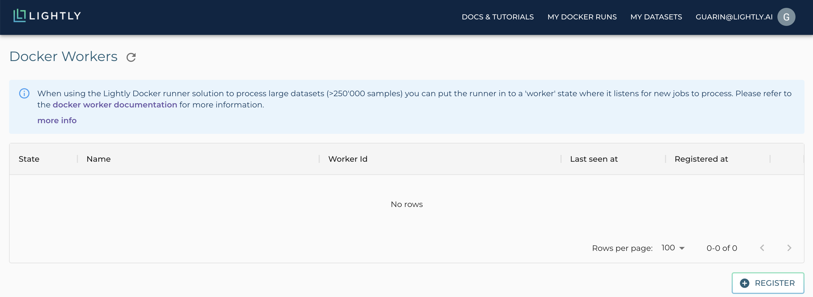
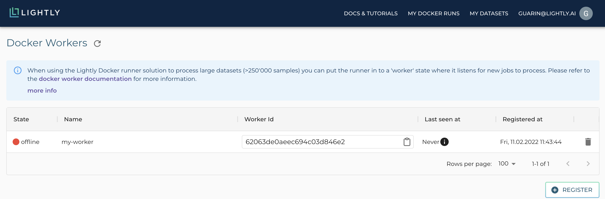
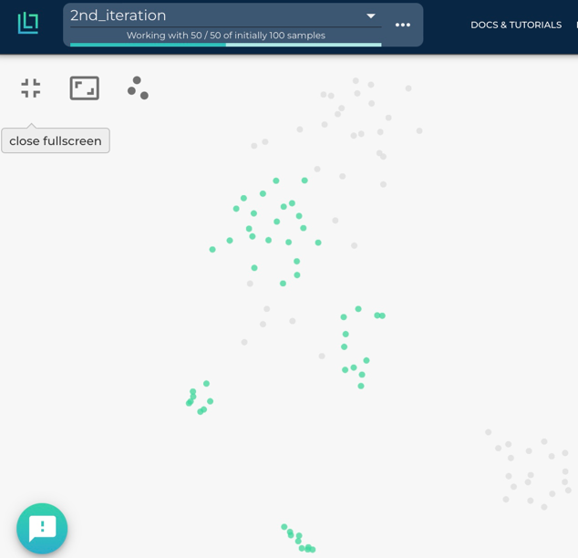

.. _integration-docker-trigger-from-api:

Trigger a Docker Job from from the Platform or code
===========================================================

Introduction
------------
The Lightly workflow can be completely automated by using the Lightly Docker as
a background worker. In this mode, the Lightly Docker waits for incoming jobs
through the API. After receiving a job, it will download, embed, and subsample
the provided dataset. The results are immediately available in the webapp for
visualization and the selected samples are sent back to your 
:ref:`cloud bucket <platform-create-dataset>`.

Advantages
----------

- You can submit jobs through the API, fully automating the Lightly workflow.
- You can automatically trigger a new job when data is added to your dataset.
- Use Lightly docker a background worker and processes new jobs automatically.

Download the Lightly Docker
---------------------------
Please follow the instructions for the :ref:`ref-docker-setup`.

Register the Lightly Docker as a Worker
---------------------------------------
To control the Lightly Docker from the API you have to register it as a worker.
You can simply go to the Lightly web app and click on My Docker Runs --> My Compute Workers.
Or just click on the direct link here: `Docker Workers <https://app.lightly.ai/docker/workers>`__

Click on "Register" in the bottom right corner and enter a name for your worker.
After confirmation the worker should show up in the worker list.

Copy the *worker id* and head over to your terminal. You can now start the docker
with the worker id and it will connect to the API and wait for jobs. To start
the docker execute the following command: 

.. code-block:: console

    docker run --gpus all --rm -it \
        -v ${OUTPUT_DIR}:/home/output_dir \
        lightly/sampling:latest \
        token=${YOUR_LIGHTLY_PLATFORM_TOKEN} \
        worker_id=${YOUR_WORKER_ID}

The state of the worker on the `Docker Workers <https://app.lightly.ai/docker/workers>`__
page should now indicate that the worker is in an idle state.

Create a Dataset and Trigger a Job
-----------------------------------

There are two ways to trigger a new job. You can either use the user interface
provided through our Web App or you can use our Python package and build a script.

.. tabs::

    .. tab:: Web App

      **Create a Dataset**

      This recipe requires that you already have a dataset in the Lightly Platform
      configured to use the data in your AWS S3 bucket. Create such a dataset in 2 steps:

      1. `Create a new dataset <https://app.lightly.ai/dataset/create>`_ in Lightly.
         Make sure that you choose the input type `Images` or `Videos` correctly, depending on the type of files in your cloud storage bucket.
      2. Edit your dataset, select the storage source as your datasource and fill out the form.
         In our example we use an S3 bucket.

          .. figure:: ../../getting_started/resources/LightlyEdit2.png
              :align: center
              :alt: Lightly S3 connection config
              :width: 60%

              Lightly S3 connection config

      If you don`t know how to fill out the form, follow the full tutorial to
      `create a Lightly dataset connected to your S3 bucket <https://docs.lightly.ai/getting_started/dataset_creation/dataset_creation_aws_bucket.html>`_.
        

    .. tab:: Python Code

      .. literalinclude:: examples/create_dataset.py

And now we can schedule a new job.

.. tabs::

    .. tab:: Web App

      **Trigger the Job**

      To trigger a new job you can click on the schedule run button on the dataset
      overview as shown in the screenshot below:

      .. image:: images/schedule-compute-run.png

      After clicking on the button you will see a wizard to configure the the parameters
      for the job.

      .. image:: images/schedule-compute-run-config.png

      In our example we use the following parameters.

      .. code-block:: javascript
        :caption: Docker Config

        {
          enable_corruptness_check: true,
          remove_exact_duplicates: true,
          enable_training: false,
          pretagging: false,
          pretagging_debug: false,
          method: 'coreset',
          stopping_condition: {
            n_samples: 0.1,
            min_distance: -1
          },
          scorer: 'object-frequency',
          scorer_config: {
            frequency_penalty: 0.25,
            min_score: 0.9
          }
        }

      .. code-block:: javascript
        :caption: Lightly Config

        {
          loader: {
            batch_size: 16,
            shuffle: true,
            num_workers: -1,
            drop_last: true
          },
          model: {
            name: 'resnet-18',
            out_dim: 128,
            num_ftrs: 32,
            width: 1
          },
          trainer: {
            gpus: 1,
            max_epochs: 100,
            precision: 32
          },
          criterion: {
            temperature: 0.5
          },
          optimizer: {
            lr: 1,
            weight_decay: 0.00001
          },
          collate: {
            input_size: 64,
            cj_prob: 0.8,
            cj_bright: 0.7,
            cj_contrast: 0.7,
            cj_sat: 0.7,
            cj_hue: 0.2,
            min_scale: 0.15,
            random_gray_scale: 0.2,
            gaussian_blur: 0.5,
            kernel_size: 0.1,
            vf_prob: 0,
            hf_prob: 0.5,
            rr_prob: 0
          }
        }

      Once the parameters are set you can schedule the run using a click on **schedule**.

    .. tab:: Python Code

      .. literalinclude:: examples/trigger_job_s3.py

View the progress of the Lightly Docker
---------------------------------------

To see the progress of your docker run, go to the Lightly Platform and head to 
`My Docker Runs <https://app.lightly.ai/docker/runs>`_

.. image:: ../getting_started/images/docker_runs_overview.png

Use your subsampled dataset
---------------------------

Once the docker run has finished, you can see your subsampled dataset in the 
Lightly Platform:

.. image:: ./images/webapp-explore-after-docker.jpg

In our case, we had 4 short street videos with about 1000 frames each in the S3 
bucket and subsampled it to 50 frames. Now you can analyze your dataset in the 
embedding and metadata view of the Lightly Platform, subsample it further, or 
export it for labeling. In our case we come to the conclusion that the raw data 
we have does not cover enough cases and thus decide that we want to first 
collect more street videos.

.. _ref-docker-with-datasource-datapool:

Process new data in your S3 bucket using a datapool
------------------------------------------------------
You probably get new raw data from time to time added to your S3 bucket. In our 
case we added 4 more street videos to the S3 bucket. The new raw data might 
include samples which should be added to your dataset in the Lightly Platform, 
so you want to add a subset of them to your dataset.

This workflow is supported by the Lightly Platform using a datapool. It
remembers which raw data in your S3 bucket has already been processed and will
ignore it in future docker runs. Thus you can send the same job again to the 
worker. It will find your new raw data in the S3 bucket, stream, embed
and subsample it and then add it to your existing dataset. The samplers will
take the existing data in your dataset into account when sampling new data to be
added to your dataset.

After the docker run we can go to the embedding view of the Lightly Platform to 
see the newly added samples there in a new tag. We see that the new samples
(in green) fill some gaps left by the images in the first iteration (in grey).
However, there are still some gaps left, which could be filled by adding more 
videos to the S3 bucket and running the docker again.

This workflow of iteratively growing your dataset with the Lightly Docker has
the following advantages:

- You can learn from your findings after each iteration
  to know which raw data you need to collect next.
- Only your new data is processed, saving you time and compute cost.
- You don't need to configure anything, just run the same job again.
- Only samples which are different to the existing ones are added to the dataset.
