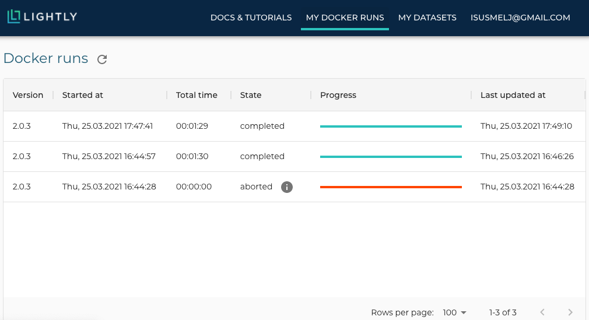

.. _ref-docker-with-datasource:

Using the docker with an S3 bucket as remote datasource.
========================================================

Introduction
------------
The Lightly Docker can be used with the Lightly Platform to do
the following workloads in one single run:

- stream your files directly from your AWS S3 bucket to your local machine without
  needing to sync or download them
- embed all images or video frames
- sample a subset, e.g. using CORESET
- compute the metadata of the images
- create a dataset in the Lightly Platform from the sampled subset

Advantages
----------

- You can run the whole Lightly workflow with one single command.
- You can process videos directly without needing to extract frames.
- Your data is streamed from your S3 bucket on the go instead of being first downloaded
  to you local disk and then read from there. Thus you save both a lot of time and
  disk space and can process much larger datasets.
- You can :ref:`ref-docker-with-datasource-datapool`
  to continuously update and improve your subsampled dataset
  everytime new data comes into your S3 bucket.

Requirements
------------

This recipe requires that you already have a dataset in the Lightly Platform
configured to use the data in your AWS S3 bucket.

Follow the steps on how to `create a Lightly dataset connected to your S3 bucket <https://docs.lightly.ai/getting_started/dataset_creation/dataset_creation_aws_bucket.html>`_.

Furthermore, you should have access to a machine running docker.
Ideally, it also has a CUDA-GPU.
A fast GPU will speed up the process significantly,
especially for large datasets.

Download the Lightly Docker
---------------------------------------------
Next, the Lightly Docker should be installed.
Please follow the instructions for the :ref:`ref-docker-setup`.

Run the Lightly Docker with the datasource
------------------------------------------
Head to the :ref:`rst-docker-first-steps` to get a general idea of what the docker
can do.

For running the docker with a remote datasouce,
use the parameter `datasource.dataset_id=YOUR_DATASET_ID`.
You find the dataset id in the Lightly Platform.
E.g. run the docker with

.. code-block:: console

    docker run --gpus all --rm -it \
        -v OUTPUT_DIR:/home/output_dir \
        lightly/sampling:latest \
        token=YOUR_LIGHTLY_PLATFORM_TOKEN \
        datasource.dataset_id=YOUR_DATASET_ID

View the progress of the Lightly Docker
---------------------------------------

To see the progress of your docker run, go to the Lightly Platform and
head to `My Docker Runs <https://app.lightly.ai/docker/runs>`_

Use your subsampled dataset
---------------------------

Once the docker run has finished, you can use your subsampled dataset as you like:
E.g. you can analyze it in the embedding and metadata view of the Lightly Platform,
subsample it further, or export it for labeling.

.. _ref-docker-with-datasource-datapool:
Process new data in your S3 bucket using a datapool
------------------------------------------------------
You probably get new raw data from time to time added to your S3 bucket.
The new raw data might include samples which should be added to your dataset
in the Lightly Platform, so you want to add a subset of them to your dataset.

This workflow is supported by the Lightly Platform using a datapool.
It remembers which raw data in your S3 bucket has already been processed
and will ignore it in future docker runs.
Thus you can run the docker with the same command again. It will find
your new raw data in the S3 bucket, stream, embed and subsample it and then add it to
your existing dataset. The samplers will take the existing data in your dataset
into account when sampling new data to be added to your dataset.

If you want to start from scratch again and process all data in you S3 bucket instead,
then set `datasource.process_all=True` in your docker run command.