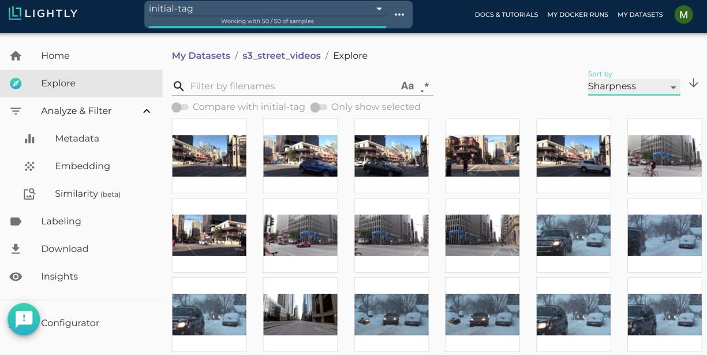

.. _ref-docker-with-datasource:

Using the docker with an S3 bucket as remote datasource.
========================================================

Introduction
------------
The Lightly Docker can be used with the Lightly Platform to do
the following workloads in one single run:

- stream your files directly from your AWS S3 bucket to your local machine without
  needing to sync or download them
- embed all images or video frames
- sample a subset, e.g. using CORESET
- compute the metadata of the images
- create a dataset in the Lightly Platform from the sampled subset

Support for the following is planned but not implemented yet:

- Training an embedding model is currently too slow and thus deactivated.
- Streaming from a google cloud storage or azure storage is planned to be implemented.

If you need any of these, write us so that we prioritize implementing it.

Advantages
----------

- You can run the whole Lightly workflow with one single command.
- You can process videos directly without needing to extract frames.
- Your data is streamed from your S3 bucket on the go instead of being first downloaded
  to your local disk and then read from there. Thus you save both a lot of time and
  disk space and can process much larger datasets.
- You can :ref:`ref-docker-with-datasource-datapool`
  to continuously update and improve your subsampled dataset
  everytime new data comes into your S3 bucket.
- Your images and videos are never saved anywhere but in your S3 bucket,
  maintaining your privacy and security.

Requirements
------------

This recipe requires that you already have a dataset in the Lightly Platform
configured to use the data in your AWS S3 bucket. Create such a dataset in 2 steps:

1. `Create a new dataset <https://app.lightly.ai/dataset/create>`_ in Lightly.
   Make sure that you choose the input type `Images` or `Videos` correctly,
   depending on the type of files in your S3 bucket.
2. Edit your dataset, select S3 as your datasource and fill out the form.

    .. figure:: ../../getting_started/resources/LightlyEdit2.png
        :align: center
        :alt: Lightly S3 connection config
        :width: 60%

        Lightly S3 connection config

If you don`t know how to fill out the form, follow the full tutorial to
`create a Lightly dataset connected to your S3 bucket <https://docs.lightly.ai/getting_started/dataset_creation/dataset_creation_aws_bucket.html>`_.

Furthermore, you should have access to a machine running docker.
Ideally, it also has a CUDA-GPU.
A fast GPU will speed up the process significantly,
especially for large datasets.

Download the Lightly Docker
---------------------------------------------
Next, the Lightly Docker should be installed.
Please follow the instructions for the :ref:`ref-docker-setup`.

Run the Lightly Docker with the datasource
------------------------------------------
Head to the :ref:`rst-docker-first-steps` to get a general idea of what the docker
can do.

For running the docker with a remote datasouce,
use the parameter `datasource.dataset_id=YOUR_DATASET_ID`.
You find the dataset id in the Lightly Platform.
E.g. run the docker with

.. code-block:: console

    docker run --gpus all --rm -it \
        -v {OUTPUT_DIR}:/home/output_dir \
        lightly/sampling:latest \
        token=YOUR_LIGHTLY_PLATFORM_TOKEN \
        datasource.dataset_id=YOUR_DATASET_ID \
        stopping_condition.n_samples=50 \
        upload_dataset=True

View the progress of the Lightly Docker
---------------------------------------

To see the progress of your docker run, go to the Lightly Platform and
head to `My Docker Runs <https://app.lightly.ai/docker/runs>`_

.. image:: ../getting_started/images/docker_runs_overview.png

Use your subsampled dataset
---------------------------

Once the docker run has finished, you can see your subsampled dataset in the Lightly platform:

In our case, we had 4 short street videos with about 1000 frames each in the S3 bucket
and subsampled it to 50 frames.
Now you can analyze your dataset in the embedding and metadata view of the Lightly Platform,
subsample it further, or export it for labeling.
In our case we come to the conclusion that the raw data we have
does not cover enough cases and thus
decide that we want to first collect more street videos.

.. _ref-docker-with-datasource-datapool:
Process new data in your S3 bucket using a datapool
------------------------------------------------------
You probably get new raw data from time to time added to your S3 bucket.
In our case we added 4 more street videos to the S3 bucket.
The new raw data might include samples which should be added to your dataset
in the Lightly Platform, so you want to add a subset of them to your dataset.

This workflow is supported by the Lightly Platform using a datapool.
It remembers which raw data in your S3 bucket has already been processed
and will ignore it in future docker runs.
Thus you can run the docker with the same command again. It will find
your new raw data in the S3 bucket, stream, embed and subsample it and then add it to
your existing dataset. The samplers will take the existing data in your dataset
into account when sampling new data to be added to your dataset.

.. image:: ./images/webapp-embedding-after-2nd-docker.png

After the docker run we can go to the embedding view of the Lightly Platform
to see the newly added samples there in a new tag. We see that the new samples
(in green) fill some gaps left by the images in the first iteration (in grey).
However, there are still some gaps left, which could be filled by adding more videos
to the S3 bucket and running the docker again.

This workflow of iteratively growing your dataset with the Lightly Docker
has the following advantages:

- You can learn from your findings after each iteration
  to know which raw data you need to collect next.
- Only your new data is processed, saving you time and compute cost.
- You don't need to configure anything, just run the same command again.
- Only samples which are different to the existing ones are added to the dataset.

If you want to search all data in your S3 bucket for new samples
instead of only newly added data,
then set `datasource.process_all=True` in your docker run command.