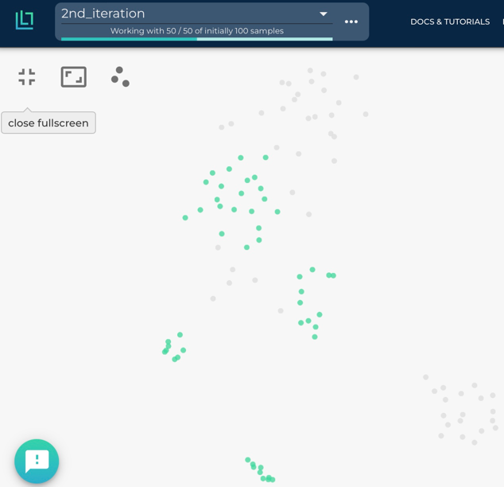

.. _ref-docker-with-datasource:

Using the Docker with a Cloud Bucket as Remote Datasource
=========================================================

Introduction
------------
The Lightly Docker can be used with the Lightly Platform to do
the following workloads in one single run:

- stream your files directly from your cloud bucket to your local machine without
  needing to sync or download them
- embed all images or video frames
- sample a subset, e.g. using coreset
- compute the metadata of the images
- create a dataset in the Lightly Platform from the selected subset

Lightly supports the following cloud storage solutions:

- `AWS Secure Storage Solution (S3) <https://aws.amazon.com/s3/>`_
- `Google Cloud Storage (GCP) <https://cloud.google.com/storage>`_
- `Azure Blob Storage (Azure) <https://azure.microsoft.com/services/storage/blobs/>`_

Advantages
----------

- You can run the whole Lightly workflow with one single command.
- You can process videos directly without needing to extract frames.
- Your data is streamed from your bucket on the go instead of being first downloaded
  to your local disk and then read from there. You save both a lot of time and
  disk space and can process much larger datasets.
- You can :ref:`process new data in your bucket using a datapool <ref-docker-with-datasource-datapool>`
  to continuously update and improve your selected dataset
  everytime new data comes into your bucket.
- Your images and videos are never saved anywhere but in your bucket,
  maintaining your privacy and security.

.. note:: 
  
  Please ensure that the bucket and the instance running the Lightly Docker are
  in the same cloud region (S3, Azure) or zone (GCP). E.g. if you are using S3, 
  have the instance running in `eu-central-1` and the bucket also in 
  `eu-central-1`. If the region or zone are note the same there can be 
  **additional transfer costs** and **degraded transfer speeds**. Please consult
  the pricing page of your cloud provider for more details
  (`S3 <https://aws.amazon.com/s3/pricing/>`_,
  `GCP <https://cloud.google.com/storage/pricing>`_, 
  `Azure <https://azure.microsoft.com/pricing/details/storage/blobs/>`_).

Requirements
------------

This recipe requires that you already have a dataset in the Lightly Platform
configured to use the data in your bucket. You can create such a dataset in two 
steps:

1. `Create a new dataset <https://app.lightly.ai/dataset/create>`_ in Lightly.
   Make sure that you choose the input type `Images` or `Videos` correctly,
   depending on the type of files in your bucket.
2. Edit your dataset, select your datasource and fill out the form.

    .. figure:: ../../getting_started/resources/LightlyEdit2.png
        :align: center
        :alt: Lightly S3 connection config
        :width: 60%

        Lightly S3 connection config

If you don't know how to fill out the form, follow the full tutorial to create
a Lightly dataset connected to your bucket: :ref:`S3 <dataset-creation-aws-bucket>`, 
:ref:`GCP <dataset-creation-gcloud-bucket>`, 
:ref:`Azure <dataset-creation-azure-storage>`.

Furthermore, you should have access to a machine running docker. Ideally, it 
also has a CUDA-GPU. A GPU will speed up the process significantly, especially 
for large datasets.

Download the Lightly Docker
---------------------------
Next, the Lightly Docker should be installed.
Please follow the instructions for the :ref:`ref-docker-setup`.

Run the Lightly Docker with the datasource
------------------------------------------
Head to the :ref:`rst-docker-first-steps` to get a general idea of what the docker
can do.

For running the docker with a remote datasouce,
use the parameter `datasource.dataset_id=YOUR_DATASET_ID`.
You find the dataset id in the Lightly Platform.
E.g. run the docker with

.. code-block:: console

    docker run --gpus all --rm -it \
        -v {OUTPUT_DIR}:/home/output_dir \
        lightly/worker:latest \
        token=YOUR_LIGHTLY_PLATFORM_TOKEN \
        datasource.dataset_id=YOUR_DATASET_ID \
        stopping_condition.n_samples=50

View the progress of the Lightly Docker
---------------------------------------

To see the progress of your docker run, go to the Lightly Platform and
head to `My Docker Runs <https://app.lightly.ai/docker/runs>`_

.. image:: ../getting_started/images/docker_runs_overview.png

Use your selected dataset
-------------------------

Once the docker run has finished, you can see your selected dataset in the Lightly Platform:

.. image:: ./images/webapp-explore-after-docker.jpg

In our case, we had 4 short street videos with about 1000 frames each in the bucket
and selected 50 frames from it.
Now you can analyze your dataset in the embedding and metadata view of the Lightly Platform,
subsample it further, or export it for labeling.
In our case we come to the conclusion that the raw data we have
does not cover enough cases and thus
decide that we want to first collect more street videos.

.. _ref-docker-with-datasource-datapool:

Process new data in your bucket using a datapool
------------------------------------------------

You probably get new raw data from time to time added to your bucket.
In our case we added 4 more street videos to the bucket.
The new raw data might include samples which should be added to your dataset
in the Lightly Platform, so you want to add a subset of them to your dataset.

This workflow is supported by the Lightly Platform using a datapool.
It remembers which raw data in your bucket has already been processed
and will ignore it in future docker runs.
Thus you can run the docker with the same command again. It will find
your new raw data in the bucket, stream, embed and subsample it and then add it to
your existing dataset. The selection strategy will take the existing data in your dataset
into account when selecting new data to be added to your dataset.

After the docker run we can go to the embedding view of the Lightly Platform
to see the newly added samples there in a new tag. We see that the new samples
(in green) fill some gaps left by the images in the first iteration (in grey).
However, there are still some gaps left, which could be filled by adding more videos
to the bucket and running the docker again.

This workflow of iteratively growing your dataset with the Lightly Docker
has the following advantages:

- You can learn from your findings after each iteration
  to know which raw data you need to collect next.
- Only your new data is processed, saving you time and compute cost.
- You don't need to configure anything, just run the same command again.
- Only samples which are different to the existing ones are added to the dataset.

If you want to search all data in your bucket for new samples
instead of only newly added data,
then set `datasource.process_all=True` in your docker run command.

Network traffic
---------------

Please ensure that the bucket and the instance running the Lightly Docker are
in the same cloud region (S3, Azure) or zone (GCP). E.g. if you are using S3, 
have the instance running in `eu-central-1` and the bucket also in 
`eu-central-1`. If the region or zone are note the same there can be 
**additional transfer costs** and **degraded transfer speeds**. Please consult
the pricing page of your cloud provider for more details
(`S3 <https://aws.amazon.com/s3/pricing/>`_,
`GCP <https://cloud.google.com/storage/pricing>`_, 
`Azure <https://azure.microsoft.com/pricing/details/storage/blobs/>`_).

The worker causes significant network traffic at the following steps:

For image datasets:
^^^^^^^^^^^^^^^^^^^

- The corruptness check downloads the complete dataset.
- Training the embedding model downloads the complete dataset once each epoch.
- Embedding downloads the non-corrupt dataset.
- Pretagging downloads the non-corrupt dataset.
- Dumping the selected dataset downloads it.
- Updating the selected dataset in the Lightly platform
  will first download all newly selected images to compute their metadata.

As an example: If you have a dataset with 10GB size
and run Lightly with training an embedding model for 10 epochs, you will face
at most (10 + 5) * 10GB = 150GB of download traffic.

For video datasets:
^^^^^^^^^^^^^^^^^^^

.. note::
    Depending on the video format, downloading a single frame might require downloading the entire video.
    Thus downloading X frames from Y different videos might download all Y videos in worst case.

- Initializing the dataset to find out the number of frames per video downloads the complete dataset.
- The corruptness check downloads the complete dataset.
- Training the embedding model downloads the complete dataset once each epoch.
- Embedding downloads the non-corrupt dataset.
- Pretagging downloads the non-corrupt dataset.
- Dumping the selected dataset will download each frame in it.
  This might download the full dataset, if at least one frame was selected from each video.
- Updating the selected dataset in the Lightly platform
  will first download all newly selected images to compute their metadata.
  Similar to dumping the dataset, this might download the complete dataset in worst case.

As an example: If you have a dataset with 10GB size
and run Lightly with training an embedding model for 10 epochs, you will face
at most (10 + 6) * 10GB = 160GB of download traffic.
