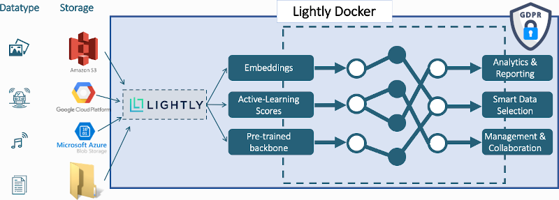

Docker
===================================

We all know that sometimes when working with ML data we deal with really BIG datasets. The cloud solution is great for exploration, prototyping
and an easy way to work with lightly. But there is more!

With the introduction of our on-premise solution, you can **process larger datasets completely on your end without data leaving your infrastructure**.
We worked hard to make this happen and are very proud to present you with the following specs:

* **NEW** :ref:`ref-docker-with-datasource`

* :ref:`ref-docker-active-learning` using Lightly Docker

* Automatically upload the sampled dataset to the Lightly Platform (see :ref:`ref-docker-upload-to-platform`)

* See your docker runs live in the Lightly Platform (see :ref:`ref-docker-runs`)

* Lightly Docker has built-in pretagging models (see :ref:`ref-docker-pretagging`)

  * Use this feature to pre-label your dataset or to only select images which contain certain objects

  * Supported object categories are: bicycle, bus, car, motorcycle, person, train, truck

* Sample more than 1 Million samples within a few hours!

* Runs directly with videos without prior extraction of the frames!

* Wrapped in a docker container (no setup required if your system supports docker)

* Configurable

  * Use stopping conditions for sampling such as minimum distance between
    two samples

  * Use various sampling methods

  * Check for corrupt files and report them

  * Check for exact duplicates and report them

  * We expose the full lightly framework config

* Automated reporting of the datasets for each run

  * PDF report with histograms, plots, statistics, and much more ...

* Hand-optimized code (to instruction-level)

  * Multithreaded

  * SIMD instructions

* Minimal hardware requirements:

  * 1 CPU core

  * 4 GB free RAM

* Recommended hardware:
  
  * 8 CPU cores or more

  * 16GB free RAM (>64GB for datasets above 10m samples)
 
  * 1 Nvidia Tesla P100, T4, V100 or A100 GPU with CUDA 10.0+

.. toctree::
   :maxdepth: 1

   getting_started/setup.rst
   getting_started/first_steps.rst
   advanced/overview.rst
   integration/overview.rst
   configuration/configuration.rst
   examples/overview.rst
   known_issues_faq.rst

