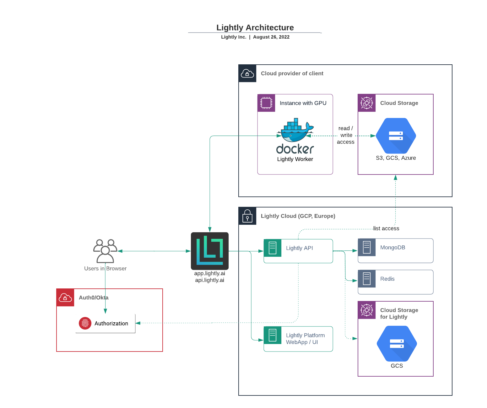

Security
==========

Security and data privacy is very important to us. In this section
you find all security related information. 
Legal documents such as Privay Notice, T&C, DPA are available under
`https://lightly.ai/legal <https://lightly.ai/legal>`_.

.. note:: These documents apply to all personal, team and custom account plans.

Architecture Overview
----------------------

Here you find an overview of the cloud architecture. 

**A few important things to note:**

- Data storage and processing occurs within the clients own cloud infrastructure
- Lightly only needs permission to list files within your cloud storage 
  (S3, GCS, Azure) and to create signed URLs
- Lightly assets such as images, videos, sequences, frames, objects or thumbnails are
  always stored within the clients storage. Any additional data such as metadata, predictions or
  any other non-sensitive data used to manage the datasets is stored in secured
  databases within Lightly's own infrastructure
- Authentication is provided through our partner Auth0. Additional services such 
  as 2FA/MFA, SAML can be added upon request.

How does your data flow around?
-------------------------------

We differentiate between usage data and the actual samples stored in 
your cloud storage. Samples can be images 
or videos and their subtypes such as sequences, frames or object crops. 
Samples typically contain sensitive information (PII) and setup
the whole architecture in a way that you can fully restrict sensitive data from 
leaving your cloud environment.

**Whenever you process a new dataset using Lightly the following steps happen:**

1. You create a new job using the Lightly Python API. The job contains 
   information about the location of the data (bucket path to S3, GCP or Azure)
   as well as the parameters of how the data should be processed.
2. After the job has been created, it can be processed by the Lightly Worker. The 
   Lightly Worker typically runs on a GPU instance within your cloud environment.
   It uses the job information to load the data directly from the cloud bucket using
   signed URLs created by the Lightly API. 
3. At the end of the job, the Lightly Worker pushes part of the results from the selection
   to the Lightly cloud. The Lightly Cloud gets data such as which filenames have been
   selected, the embeddings, the metadata and predictions.
   The other parts of the results such as thumbnails and frames that could contain
   sensitive information are stored in your bucket within your cloud infrastructure.

**This setup has several advantages:**

- The large amount of input data that could contain thousands of videos or millions of frames
  is only moved around within your cloud infrastructure. If the data is in the same region,
  there is no egress traffic cost and the latency is very low. 
- Lightly never stores sensitive data such as samples and therefore you don't have to worry
  about this
- This setup allows for additional hardening of the access rules as the Lightly Cloud does not 
  need to read the actual data in your bucket

What data is stored where?
--------------------------

**Data stored on Lightly Cloud:**

- Embeddings - contain the filenames of the sample and a vector representation
  describing it
- Metadata - any metadata provided to the data selection workflow is cached
  for faster access and visualization in the user interface
- Predictions - similar to metadata, predictions are cached as well

**Data stored on your Cloud:**

- Samples - the actual images and videos
- extracted crops, frames or thumbnails

.. note:: Lightly does caching of the predictions and metadata for faster retrieval.
          However, the input images as well as thumbnails or frames from videos are
          always fetched from your connected cloud bucket directly. They are never
          cached on Lightly infrastructure!