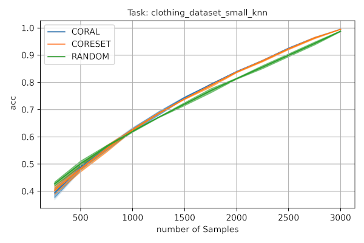

.. _lightly-active-learning:

Active learning
===================
Lightly enables active learning with only a few lines of additional code. Learn 
here, how to get the most out of your data by maximizing the available information
in your annotated dataset.

   Plot showing the different samples and how they perform on the clothing dataset.

We designed Lightly Active Learning to give you the best performance while
being very easy to use. Check out our tutorials to learn more:

- :ref:`lightly-tutorial-active-learning-classification` 
- :ref:`lightly-tutorial-active-learning-detectron2` 

Preparations
-----------------
Before you read on, make sure you have read the section on the :ref:`lightly-platform`. 
In particular, you should know how to create a dataset in the `web-app <https://app.lightly.ai>`_.
and how to upload images and embeddings to it. To do active learning, you will 
need such a dataset with embeddings (don't worry, it's free!).

Concepts
-----------------
Lightly makes use of the following concepts for active learning:

* **ApiWorkflowClient:** :py:class:`lightly.api.api_workflow_client.ApiWorkflowClient`
   The `ApiWorkflowClient` is used to connect to our API. The API handles the 
   selection of the images based on embeddings and active learning scores. To initialize
   the `ApiWorkflowClient`, you will need the `datasetId` and the `token` from the 
   :ref:`lightly-platform`.
   
* **ActiveLearningAgent:** :py:class:`lightly.active_learning.agents.agent.ActiveLearningAgent`
   The `ActiveLearningAgent` builds the client interface of our active learning 
   framework. It allows to indicate which images are preselected and which ones
   to sample from. Furthermore, one can query it to get a new batch of images.
   To initialize an `ActiveLearningAgent` you need an `ApiWorkflowClient`.
   
* **SamplerConfig:** :py:class:`lightly.active_learning.config.sampler_config.SamplerConfig`
   The `SamplerConfig` allows the configuration of a sampling request. In particular,
   you can set number of samples, the name of the resulting selection, and the `SamplingMethod`.
   Currently, you can set the `SamplingMethod` to one of the following:

   * Random: Selects samples uniformly at random.
   * Coreset: Greedily selects samples which are diverse.
   * Coral: Combines Coreset with scores to do active learning.
   
* **Scorer:** :py:class:`lightly.active_learning.scorers.scorer.Scorer`
   The `Scorer` takes as input the predictions of a pre-trained model on the set
   of unlabeled images. It offers a `calculate_scores()` method, which evaluates
   different scores based on how certain the model is about the images. When
   performing a sampling, the scores are passed to the API so the sampler can use
   them with Coral.
   

Continue reading to see how these components interact and how active learning is
done with Lightly.

Initial Selection
-----------------
The goal of making an initial selection is to get a subdataset on which you can train
an initial model. The output of the model can then be used to select new samples. That way,
the model can be iteratively improved.

To make an initial selection, start off by adding your raw, *unlabeled* data and the according
image embeddings to a dataset in the Lightly `web-app <https://app.lightly.ai>`_. A simple way to do so
is to use `lightly-magic` from the command-line. Don't forget adapt the arguments input_dir,
dataset_id and token.

.. code-block:: bash

   # use trainer.max_epochs=0 to skip training
   lightly-magic input_dir='path/to/your/raw/dataset' dataset_id='xyz' token='123' trainer.max_epochs=0

Then, in your Python script, you will need to initialize the `ApiWorkflowClient` and the `ActiveLearningAgent`

.. code-block:: Python

    import lightly
    from lightly.api import ApiWorkflowClient
    from lightly.active_learning.agents import ActiveLearningAgent

    api_client = ApiWorkflowClient(dataset_id='xyz', token='123')
    al_agent = ActiveLearningAgent(api_client) 

.. note::

   It may not always be a good idea to sample from the full dataset. For example,
   it could be that a large portion of the images is blurry. In that case, it's 
   possible to create a tag in the web-app which only contains the sharp images
   and tell the `ActiveLearningAgent` to only sample from this tag. To do so, set
   the `query_tag_name` argument in the constructor of the agent.

Let's configure the sampling request and request an initial selection next:

.. code-block:: Python

   from lightly.active_learning.config import SamplerConfig
   from lightly.openapi_generated.swagger_client import SamplingMethod

   # we want an initial pool of 150 images
   config = SamplerConfig(n_samples=150, method=SamplingMethod.CORESET, name='initial-selection')
   al_agent.query(config)
   initial_selection = al_agent.labeled_set
   
   # initial_selection now contains 150 filenames
   assert len(initial_selection) == 150

The result of the query is a tag in the web-app under the name "initial-selection". The tag contains
the images which were selected by the sampling algorithm. Head there to scroll through the samples and
download the selected images before annotating them. Alternatively, you can access the filenames
of the selected images via the attribute `labeled_set` as shown above.

Active Learning Step
----------------------

After you have annotated your initial selection of images, you can train a model
on them. The trained model can then be used to figure out which images pose problems.
This section will show you how these images can be added to the labeled dataset.

To continue with active learning with Lightly, you will need the `ApiWorkflowClient` and `ActiveLearningAgent` from before.
If you perform the next selection step in a new file you have to initialize the client and agent again.
If you have to re-initialize them, make sure to set the `pre_selected_tag_name` to your
current selection (if this is the first iteration, this is the name you have passed 
to the sampler config when doing the initial selection). Note, that if you don't 
have to re-initialize them, the tracking of the tags is taken care of for you.

.. code-block:: Python

   # re-initializing the ApiWorkflowClient and ActiveLearningAgent
   api_client = ApiWorkflowClient(dataset_id='xyz', token='123')
   al_agent = ActiveLearningAgent(api_client, preselected_tag_name='initial-selection')

The next part is what differentiates active learning from simple subsampling; the
trained model is used to get predictions on the data and the sampler then
decides based on these predictions. To get a list of all filenames for which 
predictions are required, you can use the `query_set`:

.. code-block:: Python

   # get all filenames in the query set
   query_set = al_agent.query_set

Use this list to get predictions on the unlabeled images.

**Important:** The predictions need to be in the same order as the filenames in the
list returned by the `ActiveLearningAgent`.

For classification, the predictions need to be in a numpy array and normalized,
such that the rows sum to one. Then, create a scorer object like so:

.. code-block:: Python

    from lightly.active_learning.scorers import ScorerClassification

    scorer = ScorerClassification(predictions)

Now you have everything to get the next batch of images. One important thing to mention
here is that the argument `n_samples` always refers to the total size of the labeled set.

.. code-block:: Python

   # we want a total of 200 images after the first iteration (50 new samples)
   # this time, we use the CORAL sampler and provide a scorer to the query
   config = SamplerConfig(n_samples=200, method=SamplingMethod.CORAL, name='al-iteration-1')
   al_agent.query(sampler_config, scorer)

   labeled_set_iteration_1 = al_agent.labeled_set
   added_set_iteration_1 = al_agent.added_set

   assert len(labeled_set_iteration_1) == 200
   assert len(added_set_iteration_1) == 50

As before, there will be a new tag named `al-iteration-1` visible in the web-app. Additionally, 
you can access the filenames of all the images in the labeled set and the filenames which were
added by this query via the attributes `labeled_set` and `added_set` respectively.
You can repeat the active learning step until the model achieves the required accuracy.

As the web-app allows viewing the active learning scores in the embedding view,
there are usecases where only active learning scores should be uploaded to the web-app,
but without performing a sampling. This is also easily possible:

.. code-block:: Python

   al_agent.upload_scores(scorer)

Scorers
-----------------
Lightly has so called scorers for the common computer vision tasks such as 
image classification, detection and others. Depending on the task you are working
on you can use a different scorer.

Image Classification
^^^^^^^^^^^^^^^^^^^^^
Use this scorer when working on a classification problem (binary or multiclass).

Currently we offer three uncertainty scorers,which are taken from
http://burrsettles.com/pub/settles.activelearning.pdf, Section 3.1, page 12f
and also explained in https://towardsdatascience.com/uncertainty-sampling-cheatsheet-ec57bc067c0b
They all have in common, that the score is highest if all classes have the
same confidence and are 0 if the model assigns 100% probability to a single class.
The differ in the number of class confidences they take into account.

- **uncertainty_least_confidence**:
    This score is 1 - the highest confidence prediction. It is high
    when the confidence about the most probable class is low.

- **uncertainty_margin**
    This score is 1 - the margin between the highest confidence
    and second highest confidence prediction. It is high when the model
    cannot decide between the two most probable classes.

- **uncertainty_entropy**
    This scorer computes the entropy of the prediction. The confidences
    for all classes are considered to compute the entropy of a sample.

For more information about how to use the classification scorer have a look here:
:py:class:`lightly.active_learning.scorers.classification.ScorerClassification`

Object Detection
^^^^^^^^^^^^^^^^^^^^^
Use this scorer when working on an object detection problem using bounding
boxes. The object detection scorers require the input to be in 
the `ObjectDetectionOutput` format.

We expect the model predictions to contain

- bounding boxes of shape (x0, y0, x1, y1)
- objectness_probability for each bounding box
- classification_probabilities for each bounding box

You can find more about the format here: 
:py:class:`lightly.active_learning.utils.object_detection_output.ObjectDetectionOutput`

We also provide a helper method to work with the model output format consisting 
of only a probability per bounding box and the associated label.
:py:class:`lightly.active_learning.utils.object_detection_output.ObjectDetectionOutput.from_scores`

Currently, the following scorers are available:

- **object_frequency**
  This score measures the number of objects in the image. Use this scorer if
  you want scenes with lots of objects in them. This is suited for computer vision
  tasks such as perception in autonomous driving.

- **objectness_least_confidence**
  This score is 1 - the mean of the highest confidence prediction. Use this scorer
  to select images where the model is insecure about both whether it found an object
  at all and the class of the object.

- **classification_scores**
  These scores are computed for each object detection per image out of
  the class probability prediction for this detection. Then, they are reduced
  to one score per image by taking the maximum. In particular we support:
  - **uncertainty_least_confidence**
  - **uncertainty_margin**
  - **uncertainty_entropy**
  The scores are computed using the scorer for classification.

For more information about how to use the object detection scorer have a look here:

:py:class:`lightly.active_learning.scorers.detection.ScorerObjectDetection`

Image Segmentation
^^^^^^^^^^^^^^^^^^^^^

Use this scorer when you're training a model for semantic segmentation.
The semantic segmentation scorer expects a list or generator of pixelwise label
predictions.

We expect the model predictions to be of shape W x H x C, where

- W is the width of the image
- H is the height of the image
- C is the number of segmentation classes (e.g. 2 for background vs foreground)

Currently, the following scorers are available:

- **classification_scores**
  These scores treat segmentation as a pixelwise classification task. The 
  classification uncertainty scores are computed per pixel and then reduced to
  a single score per image by taking the mean. In particular, we support:
  - **uncertainty_least_confidence**
  - **uncertainty_margin**
  - **uncertainty_entropy**
  The scores are computed using the scorer for classification.

For more information about how to use the semantic segmentation scorer have a look here:

:py:class:`lightly.active_learning.scorers.semantic_segmentation.ScorerSemanticSegmentation`

Keypoint Detection
^^^^^^^^^^^^^^^^^^^^^
Coming soon...

Next Steps
-----------

Check out our tutorial about how to use Lightly Active Learning:

- :ref:`lightly-tutorial-active-learning-classification` 
- :ref:`lightly-tutorial-active-learning-detectron2` 