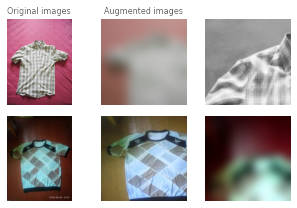
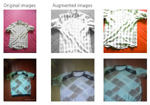
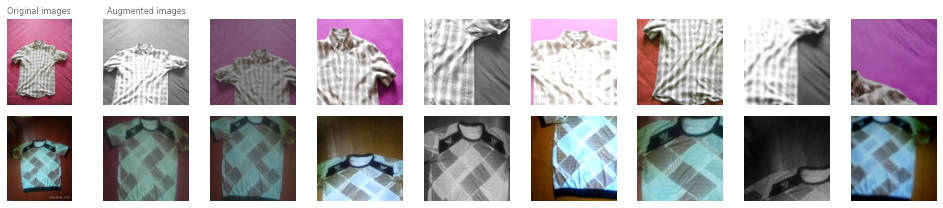

.. _lightly-advanced:

Advanced Concepts in Self-Supervised Learning
=============================================

In this section, we will have a look at some more advanced topics around lightly. 
For the moment lightly focuses mostly on contrastive learning methods. 
In contrastive learning, we create multiple views of each sample and during 
the training of the model force similar views (originating from the 
same sample) to be close to each other respective different views 
(originating from different samples to be far away. Views are typically 
obtained using augmentation methods.

Through this procedure, we train invariances towards certain augmentations 
when training models using contrastive learning methods. 

Different augmentations result in different invariances. The invariances you 
want to learn heavily depend on the type of downstream task you want to solve. 
Here, we group the augmentations by the type of invariance they induce and 
show examples of when such invariances can be useful.

For example, if we use `color jittering` and `random grayscale` during the training of a
self-supervised model, we train the model to put the two augmented versions of the 
input image very close to each other in the feature space. We essentially train 
the model to ignore the color augmentations.

**Shape Invariances**

- **Random cropping** E.g. We don't care if an object is small or large 
  or only partially in the image.

- **Random Horizontal Flip** E.g. We don't care about "left and right" in 
  images.

- **Random Vertical Flip** E.g. We don't care about "up and down" in images.
  This can be useful for satellite images.

- **Random Rotation** E.g. We don't care about the orientation of the camera.
  This can be useful for satellite images.

**Texture Invariances**

- **Gaussian Blur** E.g. We don't care about the details of a person but the
  overall shape.

**Color Invariances**

- **Color Jittering** E.g. We don't care if a car is blue or red

- **Random Grayscale** E.g. We don't care about the color of a tree

- **Solarization** E.g. We don't care about color and brightness

Some interesting papers regarding invariances in self-supervised learning:

- `Demystifying Contrastive Self-Supervised Learning, S. Purushwalkam, 2020 <https://arxiv.org/abs/2007.13916>`_
- `What Should Not Be Contrastive in Contrastive Learning, T. Xiao, 2020 <https://arxiv.org/abs/2008.05659>`_

.. note:: Picking the right augmentation method seems crucial for the outcome
          of training models using contrastive learning. For example, if we want
          to create a model classifying cats by color we should not use strong
          color augmentations such as color jittering or random grayscale.

Augmentations
-------------------

Lightly uses the collate operation to apply augmentations when loading a batch 
of samples using the 
`PyTorch dataloader <https://pytorch.org/docs/stable/data.html>`_.

The built-in collate class  
:py:class:`lightly.data.collate.ImageCollateFunction` provides a set of 
common augmentations used in SimCLR and MoCo. Instead of a single batch of images,
it returns a tuple of two batches of randomly transformed images.

If you use the :ref:`lightly-command-line-tool` you have access to all the SimCLR
collate augmentations. 
You find the default parameters here: :ref:`ref-cli-config-default`. 

Since **gaussian blur**, **solarization** and **random rotations** by 90 degrees 
are not supported in torchvision, we added them to lightly 
:py:class:`lightly.transforms`

You can build your own collate function by inheriting from 
:py:class:`lightly.data.collate.BaseCollateFunction`

.. code-block:: python

  # create a dataset using SimCLR augmentations
  collate_fn = lightly.data.SimCLRCollateFunction()
  dataloader_train_simclr = torch.utils.data.DataLoader(
    dataset_train_simclr, 
    collate_fn=collate_fn,
  )
  
  # same augmentation but without blur and resize images to 128x128
  collate_fn = lightly.data.SimCLRCollateFunction(
    input_size=128,
    gaussian_blur=0.
  )
  dataloader_train_simclr = torch.utils.data.DataLoader(
    dataset_train_simclr, 
    collate_fn=collate_fn,
  )

.. note:: You can disable the augmentations by either setting the probability to `0.0`
    or making sure the augmentation has no effect. For example, random cropping 
    can be disabled by setting `min_scale=1.0`.

Previewing Augmentations
------------------------

It often can be very useful to understand how the image augmentations we pick affect
the input dataset. We provide a few helper methods that make it very easy to 
preview augmentations using lightly.

.. literalinclude:: code_examples/plot_image_augmentations.py

You can run the code in a Jupyter Notebook to quickly explore the augmentations.
Once you run `plot_augmented_images` you should see the original images as 
well as their augmentations next to them.

    Example augmentations of the `SimCLRCollateFunction` function on images
    from the clothing dataset.

The images seem rather blurry! However, we don't want our model to ignore small
details. Let's disable Gaussian Blur and check again:

    Example augmentations of the `SimCLRCollateFunction` function on images
    from the clothing dataset.

We can also repeat the experiment for the `DINOCollateFunction` to see what 
our DINO model would see during training.

    Example augmentations of the `DINOCollateFunction` function on images
    from the clothing dataset.

Models
-------------------

Lightly supports at the moment the following models for self-supervised
learning:

- `SimCLR: A Simple Framework for Contrastive Learning of Visual Representations, T. Chen, 2020 <https://arxiv.org/abs/2002.05709>`_
  
  - Check the tutorial: :ref:`lightly-simclr-tutorial-3`. 

- `MoCo: Momentum Contrast for Unsupervised Visual Representation Learning, K. He, 2019 <https://arxiv.org/abs/1911.05722>`_
  
  - Check the tutorial: :ref:`lightly-moco-tutorial-2`

- `SimSiam: Exploring Simple Siamese Representation Learning, K. He, 2020 <https://arxiv.org/abs/2011.10566>`_

  - Check the tutorial: :ref:`lightly-simsiam-tutorial-4`

- `Barlow Twins: Self-Supervised Learning via Redundancy Reduction, S. Deny, 2021 <https://arxiv.org/abs/2103.03230v1>`_

- `NNCLR: With a Little Help from My Friends: Nearest-Neighbor Contrastive Learning of Visual Representations, D. Dwibedi, 2021 <https://arxiv.org/abs/2104.14548>`_

- `BYOL: Bootstrap your own latent: A new approach to self-supervised Learning, J. Grill, 2020 <https://arxiv.org/abs/2006.07733>`_

- `SwAV: Unsupervised Learning of Visual Features by Contrasting Cluster Assignments, M. Caron, 2020 <https://arxiv.org/abs/2006.09882>`_

Do you know a model that should be on this list? Please add an issue on GitHub :)

All models have a backbone component. This could be a ResNet.
When creating a self-supervised learning model you pass it a backbone. You need
to make sure the backbone output dimension matches the input dimension of the
head component for the respective self-supervised model.

Lightly has a built-in generator for ResNets. However, the model architecture slightly differs from the official ResNet implementatation.
The difference is in the first few layers. Whereas the official ResNet starts 
with a 7x7 convolution the one from lightly has a 3x3 convolution. 

* The 3x3 convolution variant is more efficient (less parameters and faster 
  processing) and is better suited for small input images (32x32 pixels or 64x64 pixels). 
  We recommend to use the lighlty variant for cifar10 or running the model on a microcontroller 
  (see https://github.com/ARM-software/EndpointAI/tree/master/ProofOfConcepts/Vision/OpenMvMaskDefaults)
* However, the 7x7 convolution variant is better suited for larger images 
  since the number of features is smaller due to the stride and additional 
  `MaxPool2d` layer. For benchmarking against other academic papers on 
  datasets such as ImageNet, Pascal VOC, MOCO, etc. use the torchvision variant.

.. code-block:: python

        # create a lightly ResNet
        resnet = lightly.models.ResNetGenerator('resnet-18')

        # alternatively create a torchvision ResNet backbone
        resnet_torchvision = torchvision.models.resnet18()

        # remove the last linear layer and add an adaptive average pooling layer
        backbone = nn.Sequential(
            *list(resnet.children())[:-1],
            nn.AdaptiveAvgPool2d(1),
        )
        
        # create a simclr model based on ResNet
        class SimCLR(torch.nn.Module):
            def __init__(self, backbone, hidden_dim, out_dim):
                super().__init__()
                self.backbone = backbone
                self.projection_head = SimCLRProjectionHead(hidden_dim, hidden_dim, out_dim)

            def forward(self, x):
                h = self.backbone(x).flatten(start_dim=1)
                z = self.projection_head(h)
                return z
        
        resnet_simclr = SimCLR(backbone, hidden_dim=512, out_dim=128)

You can also use **custom backbones** with lightly. We provide a 
`colab notebook to show how you can use torchvision or timm models
<https://colab.research.google.com/drive/1ubepXnpANiWOSmq80e-mqAxjLx53m-zu?usp=sharing>`_.

Losses 
-------------------

We provide the most common loss function for contrastive learning and a symmetric negative cosine similarity 
loss for non-contrastive methods.

- `NTXentLoss: Normalized Temperature-scaled Cross Entropy Loss <https://paperswithcode.com/method/nt-xent>`_

  - Check the documentation: :py:class:`lightly.loss.ntx_ent_loss.NTXentLoss`
  - This loss can be combined with a :ref:`lightly-advanced-memory-bank` 

- `Negative Cosine Similarity <https://arxiv.org/abs/2011.10566>`_

  - Check the documentation: :py:class:`lightly.loss.negative_cosine_similarity.NegativeCosineSimilarity`

- `Barlow Twin Loss <https://arxiv.org/abs/2103.03230v1>`_

  - Check the documentation: :py:class:`lightly.loss.barlow_twins_loss.BarlowTwinsLoss`

- `CO2 regularization Loss <https://arxiv.org/abs/2010.02217>`_

  - Check the documentation: :py:class:`lightly.loss.regularizer.co2.CO2Regularizer`

- `Hypersphere Loss <https://arxiv.org/abs/2005.10242>`_

  - Check the documentation: :py:class:`lightly.loss.hypersphere_loss.HypersphereLoss`

.. _lightly-advanced-memory-bank:

Memory Bank
^^^^^^^^^^^^^^^^^^^

Since contrastive learning methods benefit from many negative examples, larger
batch sizes are preferred. However, not everyone has a multi GPU cluster at 
hand. Therefore, alternative tricks and methods have been derived in research.
One of them is a memory bank keeping past examples as additional negatives.

For an example of the memory bank in action have a look at 
:ref:`lightly-moco-tutorial-2`. 

For more information check the documentation: 
:py:class:`lightly.loss.memory_bank.MemoryBankModule`.

.. code-block:: python

  # to create a NTXentLoss with a memory bank (like for MoCo) set the 
  # memory_bank_size parameter to a value > 0
  criterion = lightly.loss.NTXentLoss(memory_bank_size=4096)
  # the memory bank is used automatically for every forward pass
  y0, y1 = resnet_moco(x0, x1)
  loss = criterion(y0, y1)

Obtaining Good Embeddings
---------------------------

We optimize the workflow of selecting only important datapoints by using **low-dimensional embeddings**.
This has two benefits:

- Low-dimensional embeddings have more meaningful distance metrics. 
  We know that the data usually lies on a manifold in high-dimensional spaces 
  (see `curse of dimensionality <https://en.wikipedia.org/wiki/Curse_of_dimensionality>`_). 
  Even very similar samples might have a high L2-distance or low cosine similarity in high embeddings.
- Most algorithms to select a subset based on the embeddings scale with
  the dimensionality. Therefore low-dimensional embeddings can significantly 
  reduce computing time.

We leverage **self-supervised learning** to obtain good 
features/representations/embedddings of your unlabeled data. The quality of the 
representations depends heavily on the chosen augmentations. For example, 
imagine you want to train a classifier to detect healthy and unhealthy leaves. 
Training self-supervised models with color augmentation enabled would make the 
model and therefore the embeddings invariant towards different colors. However, 
the color might be a very important feature of the leave to determine whether 
it is healthy (green) or not (brown).

Monitoring Embedding Quality
^^^^^^^^^^^^^^^^^^^^^^^^^^^^

We provide several tools to assess the embedding quality during model training.
The :class:`Benchmark Module <lightly.utils.benchmarking.BenchmarkModule>` runs
a KNN benchmark on a validation set after every training epoch. Measuring KNN
accuracy during training is an efficient way to monitor model training and does
not require expensive finetuning.

We also provide a helper function to monitor representation collapse. 
Representation collapse can happen during  unstable training and results in the 
model predicting the same, or very similar,  representations for all images. 
This is of course disastrous for model training as we want to the 
representations to be as different as possible between images!
The :func:`std_of_l2_normalized <lightly.utils.debug.std_of_l2_normalized>` 
helper function can be used on any representations as follows:

.. code-block:: python

  from lightly.utils.debug import std_of_l2_normalized
  representations = model(images)
  std_of_l2_normalized(representations)

A value close to 0 indicates that the representations have collapsed. A value
close to `1/sqrt(dimensions)`, where `dimensions` are the number of representation
dimensions, indicates that the representations are stable. Below we show model
training outputs from a run where the representations collapse and one where
they don't collapse.

.. code-block::

  # run with collapse
  epoch: 00, loss: -0.78153, representation std: 0.02611
  epoch: 01, loss: -0.96428, representation std: 0.02477
  epoch: 02, loss: -0.97460, representation std: 0.01636
  epoch: 03, loss: -0.97894, representation std: 0.01936
  epoch: 04, loss: -0.97770, representation std: 0.01565
  epoch: 05, loss: -0.98308, representation std: 0.01192
  epoch: 06, loss: -0.98641, representation std: 0.01133
  epoch: 07, loss: -0.98673, representation std: 0.01583
  epoch: 08, loss: -0.98708, representation std: 0.01146
  epoch: 09, loss: -0.98654, representation std: 0.01656

  # run without collapse
  epoch: 00, loss: -0.35693, representation std: 0.06708
  epoch: 01, loss: -0.69948, representation std: 0.05853
  epoch: 02, loss: -0.74144, representation std: 0.05710
  epoch: 03, loss: -0.74297, representation std: 0.05804
  epoch: 04, loss: -0.71997, representation std: 0.06441
  epoch: 05, loss: -0.70027, representation std: 0.06738
  epoch: 06, loss: -0.70543, representation std: 0.06898
  epoch: 07, loss: -0.71539, representation std: 0.06875
  epoch: 08, loss: -0.72629, representation std: 0.06991
  epoch: 09, loss: -0.72912, representation std: 0.06945

We note that in both runs the loss decreases, indicating that the model is
making progress. The representation std shows, however, that the two runs are
very different. The std in the first run decreases towards zero which means that
the representations become more and more similar. The std in the second run
remains stable and close to the expected value of `1/sqrt(dimensions) = 0.088`
for this run (`dimensions = 128`). If we had only monitored the loss, we would
not have noticed the representation collapse in the first run and continued
training, using up valuable time and compute resources.

Extracting specific Video Frames
--------------------------------

When working with videos, it is preferred not to have to extract all 
the frames beforehand. With lightly we can not only subsample the video 
to find interesting frames for annotation but also extract only these frames.

Let's have a look at how this works:

.. code-block:: python

    import os
    import lightly

    # read the list of filenames (e.g. from the Lightly Docker output)
    with open('selected_filenames.txt', 'r') as f:
        filenames = [line.rstrip() for line in f]

    # let's have a look at the first 5 filenames
    print(filenames[:5])
    # >>> '068536-mp4.png'
    # >>> '138032-mp4.png'
    # >>> '151774-mp4.png'
    # >>> '074234-mp4.png'
    # >>> '264863-mp4.png'

    path_to_video_data = 'video/'
    dataset = lightly.data.LightlyDataset(from_folder=path_to_video_data)

    # let's get the total number of frames
    print(len(dataset))
    # >>> 341965

    # Now we have to extract the frame number from the filename.
    # Since the length of the filename should always be the same,
    # we can extract the substring simply using indexing.

    # we can experiment until we find the right match
    print(filenames[0][-14:-8])
    # >>> '068536'

    # let's get all the substrings
    frame_numbers = [fname[-14:-8] for fname in filenames]

    # let's check whether the first 5 frame numbers make sense
    print(frame_numbers[:5])
    # >>> ['068536', '138032', '151774', '074234', '264863']

    # now we convert the strings into integers so we can use them for indexing
    frame_numbers = [int(frame_number) for frame_number in frame_numbers]

    # let's get the first frame number
    img, label, fname = dataset[frame_numbers[0]]

    # a quick sanity check
    # fname should again be the filename from our list
    print(fname == filenames[0])
    # >>> True

    # before saving the images make sure an output folder exists
    out_dir = 'save_here_my_images'
    if not os.path.exists(out_dir):
        os.mkdir(out_dir)

    # let's get all the frames and dump them into a new folder
    for frame_number in frame_numbers:
        img, label, fname = dataset[frame_number]
        dst_fname = os.path.join(out_dir, fname)
        img.save(dst_fname)

    # want to save the images as jpgs instead of pngs?
    # we can simply replace the file engine .png with .jpg

    #for frame_number in frame_numbers:
    #    img, label, fname = dataset[frame_number]
    #    dst_fname = os.path.join(out_dir, fname)
    #    dst_fname = dst_fname.replace('.png', '.jpg')
    #    img.save(dst_fname)

The example has been tested on a system running Python 3.7 and lightly 1.0.6
