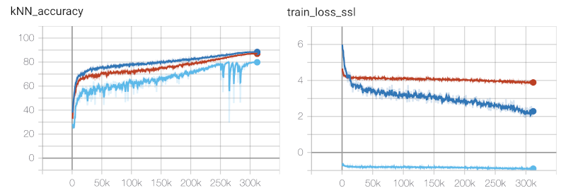

Benchmarks 
===================================
We show benchmarks of the different models for self-supervised learning
and their performance on public datasets.

We have benchmarks we regularly update for these datasets:
- CIFAR10 `CIFAR10`_
- ImageNette `ImageNette`_

ImageNette
-----------------------------------

We use the ImageNette dataset provided here: https://github.com/fastai/imagenette

For our benchmarks we use the 160px version. Training for 800 epochs on a V100
GPU takes around 4 hours.

The current benchmark contains the followin models:

- MoCo
- SimCLR
- SimSiam
- BarlowTwins
- BYOL

.. csv-table:: ImageNette benchmark results 
   :header: "Model", "Epochs", "Batch Size", "kNN test Accuracy", "Peak GPU consumption"
   :widths: 20, 20, 20, 20, 20

   "MoCo", 800, 256, 0.827, "-"
   "SimCLR", 800, 256, 0.847, "-"
   "SimSiam", 800, 256, 0.827, "-"
   "BarlowTwins", 800, 256, 0.801, "-"
   "BYOL", 800, 256, 0.851, "-"

CIFAR10
-----------------------------------

Cifar10 consists of 50k training images and 10k testing images. We train the
self-supervised models from scratch on the training data. At the end of every
epoch we embed all training images and use the features for a kNN classifier 
with k=200 on the test set. The reported kNN test accuracy is the max accuracy
over all epochs the model reached.
All experiments use the same augmentations (SimCLR augmentations without gaussian
blur) and the same ResNet-18 backbone.

.. note:: The ResNet-18 backbone in this benchmark is slightly different from 
          the torchvision variant as it starts with a 3x3 convolution and has no
          stride and no `MaxPool2d`. This is a typical variation used for cifar10
          benchmarks of SSL methods.

The current benchmark contains the followin models:

- MoCo (with symmetric loss and memory bank with 4096 entries)
- SimCLR
- SimSiam (with 2 MLP layers)
- BarlowTwins
- BYOL

.. csv-table:: Cifar10 benchmark results 
   :header: "Model", "Epochs", "Batch Size", "kNN test Accuracy", "Peak GPU consumption"
   :widths: 20, 20, 20, 20, 20

   "MoCo", 200, 128, 0.83, "2.1 GBytes"
   "SimCLR", 200, 128, 0.78, "2.0 GBytes"
   "SimSiam", 200, 128, 0.73, "3.0 GBytes"
   "BarlowTwins", 200, 128, 0.84 "2.1 GBytes"                                                                                               
   "BYOL", 200, 128, 0.85, "2.2 GBytes"
   "MoCo", 200, 512, 0.85, "7.4 GBytes"
   "SimCLR", 200, 512, 0.83, "7.8 GBytes"
   "SimSiam", 200, 512, 0.81, "7.0 GBytes"
   "BarlowTwins", 200, 512, 0.78, "7.1 GBytes"
   "BYOL", 200, 128, 0.84, "7.5 GBytes"
   "MoCo", 800, 128, 0.89, "2.1 GBytes"
   "SimCLR", 800, 128, 0.87, "1.9 GBytes"
   "SimSiam", 800, 128, 0.80, "2.0 GBytes"
   "MoCo", 800, 512, 0.90, "7.2 GBytes"
   "SimCLR", 800, 512, 0.89, "7.7 GBytes"
   "SimSiam", 800, 512, 0.91, "6.9 GBytes"

You can reproduce the benchmarks using the following script:
:download:`cifar10_benchmark.py <benchmarks/cifar10_benchmark.py>` 

.. figure:: images/bench_knn-cifar10-200epochs.png
    :align: center
    :alt: kNN accuracy on test set for training the models for 200 epochs

    Plot with the kNN accuracy on test set for training the models for 200 epochs. The shorter
    runs (fewer steps) are the ones with batch size of 512. Green: MoCo, Gray: SimCLR, 
    Orange: SimSiam, Red: MoCo, Light Blue: SimCLR, Pink: SimSiam.

We make the following observations running the benchmark:

- SimCLR and SimSiam benefit from larger batch sizes. MoCo (which uses a
  memorybank) performs very well also for smaller batch sizes.
- All models need around 3h (on a V100 GPU) to complete the 200 epoch benchmark 
  and use roughly the same amount of GPU memory.

Furthermore, we conducted experiments training the models for 800 epochs.

We can train the models longer and will note an increase in test accuracy. 
Self-Supervised models benefit from long training times.

.. figure:: images/bench_knn_accuracy_cifar10_800epochs.png
    :align: center
    :alt: kNN accuracy after 800 epochs and batch size 512

    kNN accuracy after 800 epochs. Red: SimSiam, Orange: MoCo, Blue: SimCLR 

Noticeably, the methods which use a contrastive loss (MoCo and SimCLR) behave 
similar, making quick accuracy improvements in the beginning but then slowing down. 
In contrast, SimSiam with the negative cosine similarity loss takes longer to 
warm up but then catches up quickly to the others.

.. figure:: images/bench_train_loss_cifra10_800_epochs.png
    :align: center
    :alt: Training loss for 800 epochs and batch size 512

    Training loss for 800 epochs. Red: SimSiam, Orange: MoCo, Blue: SimCLR

Furthermore, we also add results for the same 800 epochs benchmark of the models
but with a batch size of 128.

    kNN test accuracy and train loss for 800 epochs and batch size 128
    Blue: MoCo Red: SimCLR, Light Blue: SimSiam

Next Steps
-----------------

Now that you understand the performance of the different lightly methods how about
looking into a tutorial to implement your favorite model?

- :ref:`input-structure-label`
- :ref:`lightly-moco-tutorial-2`
- :ref:`lightly-simclr-tutorial-3`  
- :ref:`lightly-simsiam-tutorial-4`
- :ref:`lightly-custom-augmentation-5`