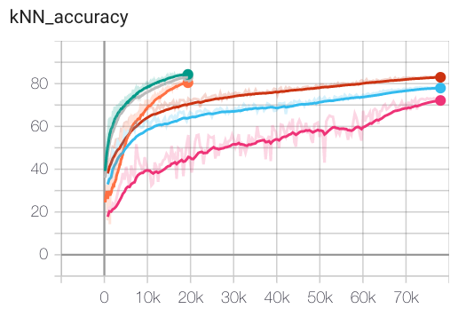
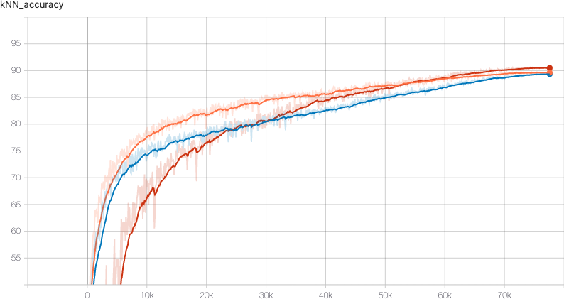
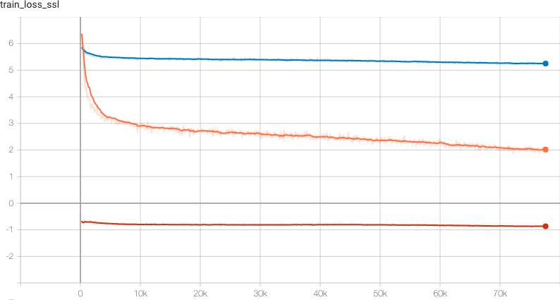

Benchmarks 
===================================
We show benchmarks of the different models for self-supervised learning
and their performance on public datasets.

CIFAR10
-----------------------------------

Cifar10 consists of 50k training images and 10k testing images. We train the
self-supervised models from scratch on the training data. At the end of every
epoch we embed all training images and use the features for a kNN classifier 
with k=200 on the test set. The reported kNN test accuracy is the max accuracy
over all epochs the model reached.
All experiments use the same augmentations (SimCLR augmentations without gaussian
blur) and the same ResNet-18 backbone.

The current benchmark contains the followin models:

- MoCo (with symmetric loss and memory bank with 4096 entries)
- SimCLR
- SimSiam (with 2 MLP layers)

.. csv-table:: Cifar10 benchmark results 
   :header: "Model", "Epochs", "Batch Size", "kNN test Accuracy", "Peak GPU consumption"
   :widths: 20, 20, 20, 20, 20

   "MoCo", 200, 128, 0.83, "2.1 GBytes"
   "SimCLR", 200, 128, 0.78, "2.0 GBytes"
   "SimSiam", 200, 128, 0.73, "3.0 GBytes"
   "MoCo", 200, 512, 0.85, "7.4 GBytes"
   "SimCLR", 200, 512, 0.83, "7.8 GBytes"
   "SimSiam", 200, 512, 0.81, "7.0 GBytes"
   "MoCo", 800, 512, 0.90, "7.2 GBytes"
   "SimCLR", 800, 512, 0.89, "7.7 GBytes"
   "SimSiam", 800, 512, 0.91, "6.9 GBytes"

You can reproduce the benchmarks using the following script:
:download:`cifar10_benchmark.py <benchmarks/cifar10_benchmark.py>` 

    kNN accuracy on test set for training the models for 200 epochs. The shorter
    runs (less steps) are the ones with batch size of 512.

We make the following observations running the benchmark:

- SimCLR and SimSiam benefit from larger batch sizes. MoCo (which uses a
  memorybank) performs very well also for smaller batch sizes.
- All models need roughly 3h to complete the 200 epoch benchmark and use roughly
  the same amount of GPU memory.

Furthermore, we conducted experiments training the models for 800 epochs.

We can train the models longer and will note an increase in test accuracy. 
Self-Supervised models benefit from long training times.

    kNN accuracy after 800 epochs. Red: SimSiam, Orange: MoCo, Blue: SimCLR 

The loss behaves differently for the various models. Whereas MoCo and SimCLR use
a contrastive loss SimSiam uses negative cosing similarity.

    Training loss for 800 epochs
    