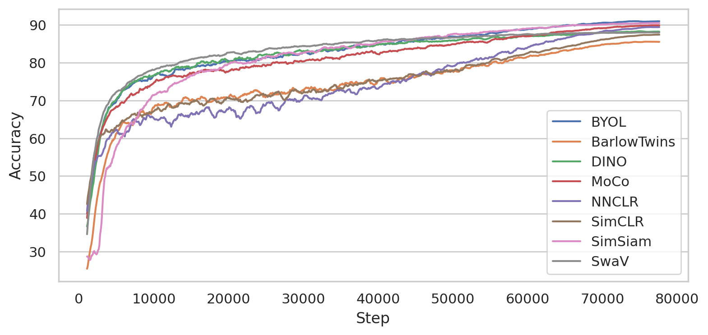

Benchmarks 
===================================
We show benchmarks of the different models for self-supervised learning
and their performance on public datasets.

We have benchmarks we regularly update for these datasets:

- CIFAR10 `CIFAR10`_
- ImageNette `ImageNette`_

ImageNette
-----------------------------------

We use the ImageNette dataset provided here: https://github.com/fastai/imagenette

For our benchmarks we use the 160px version and resize the input images to 128 pixels. 
Training a single model for 800 epochs on a V100 GPU takes around 5 hours.

The current benchmark contains the following models:

- :ref:`BarlowTwins <barlowtwins>`
- :ref:`BYOL <byol>`
- :ref:`DCL <dcl>`
- :ref:`DCLW <dcl>`
- :ref:`DINO <dino>`
- :ref:`MSN <msn>`
- :ref:`MoCo <moco>`
- :ref:`NNCLR <nnclr>`
- :ref:`SimCLR <simclr>`
- :ref:`SimSiam <simsiam>`
- :ref:`SwAV <swav>`

.. csv-table:: ImageNette benchmark results using kNN evaluation on the test set using 128x128 input resolution.
   :header: "Model", "Epochs", "Batch Size", "Accuracy", "Runtime", "GPU Memory"
   :widths: 20, 20, 20, 20, 20, 20

   "BarlowTwins", 800, 256, 0.789, "330.9 Min", "4.0 GByte"
   "BYOL", 800, 256, 0.851, "332.7 Min", "4.3 GByte"
   "DCL (*)", 800, 256, 0.816, "213.1 Min", "4.3 GByte"
   "DCLW (*)", 800, 256, 0.827, "213.1 Min", "4.3 GByte"
   "DINO (ResNet 18)", 800, 256, 0.881, "613.9 Min", "6.7 GByte"
   "MSN (ViT-S)", 800, 256, 0.834, "376.1 Min", "16.3 GByte"
   "MoCo", 800, 256, 0.832, "322.8 Min", "4.2 GByte"
   "NNCLR", 800, 256, 0.848, "341.4 Min", "4.2 GByte"
   "SimCLR", 800, 256, 0.858, "324.8 Min", "3.9 GByte"
   "SimSiam", 800, 256, 0.852, "316.0 Min", "3.9 GByte"
   "SwaV", 800, 256, 0.899, "554.7 Min", "6.6 GByte"

(*): Different runtime and memory requirements due to different hardware settings
and pytorch version. Runtime and memory requirements are comparable to SimCLR
with the default settings.

You can reproduce the benchmarks using the following script:
:download:`imagenette_benchmark.py <benchmarks/imagenette_benchmark.py>` 

CIFAR10
-----------------------------------

Cifar10 consists of 50k training images and 10k testing images. We train the
self-supervised models from scratch on the training data. At the end of every
epoch we embed all training images and use the features for a kNN classifier 
with k=200 on the test set. The reported kNN test accuracy is the max accuracy
over all epochs the model reached.
All experiments use the same ResNet-18 backbone and we disable the gaussian blur
augmentation due to the small image sizes.

.. note:: The ResNet-18 backbone in this benchmark is slightly different from 
          the torchvision variant as it starts with a 3x3 convolution and has no
          stride and no `MaxPool2d`. This is a typical variation used for cifar10
          benchmarks of SSL methods.

.. role:: raw-html(raw)
   :format: html

.. csv-table:: Cifar10 benchmark results showing kNN test accuracy, runtime and peak GPU memory consumption for different training setups.
  :header: "Model", "Epochs", "Batch Size", "Accuracy", "Runtime", "GPU Memory"
  :widths: 20, 20, 20, 20, 20, 20

  "BarlowTwins", 200, 128, 0.835, "193.4 Min", "2.2 GByte"
  "BYOL", 200, 128, 0.872, "217.0 Min", "2.3 GByte"
  "DCL (*)", 200, 128, 0.842, "126.9 Min", "1.7 GByte"
  "DCLW (*)", 200, 128, 0.833, "127.5 Min", "1.8 GByte"
  "DINO", 200, 128, 0.868, "220.7 Min", "2.3 GByte"
  "Moco", 200, 128, 0.838, "229.5 Min", "2.3 GByte"
  "NNCLR", 200, 128, 0.838, "198.7 Min", "2.2 GByte"
  "SimCLR", 200, 128, 0.822, "182.7 Min", "2.2 GByte"
  "SimSiam", 200, 128, 0.779, "182.6 Min", "2.3 GByte"
  "SwaV", 200, 128, 0.806, "182.4 Min", "2.2 GByte"
  "BarlowTwins", 200, 512, 0.827, "160.7 Min", "7.5 GByte"
  "BYOL", 200, 512, 0.872, "188.5 Min", "7.7 GByte"
  "DCL (*)", 200, 512, 0.834, "113.6 Min", 6.1 GByte"
  "DCLW (*)", 200, 512, 0.830, "113.8 Min", 6.2 GByte"
  "DINO", 200, 512, 0.862, "191.1 Min", "7.5 GByte"
  "Moco (**)", 200, 512, 0.850, "196.8 Min", "7.8 GByte"
  "NNCLR (**)", 200, 512, 0.836, "164.7 Min", "7.6 GByte"
  "SimCLR", 200, 512, 0.828, "158.2 Min", "7.5 GByte"
  "SimSiam", 200, 512, 0.814, "159.0 Min", "7.6 GByte"
  "SwaV", 200, 512, 0.833, "158.4 Min", "7.5 GByte"
  "BarlowTwins", 800, 512, 0.857, "641.5 Min", "7.5 GByte"
  "BYOL", 800, 512, 0.911, "754.2 Min", "7.8 GByte"
  "DCL (*)", 800, 512, 0.873, "459.6 Min", "6.1 GByte"
  "DCLW (*)", 800, 512, 0.873, "455.8 Min", "6.1 GByte"
  "DINO", 800, 512, 0.884, "765.5 Min", "7.6 GByte"
  "Moco (**)", 800, 512, 0.900, "787.7 Min", "7.8 GByte"
  "NNCLR (**)", 800, 512, 0.896, "659.2 Min", "7.6 GByte"
  "SimCLR", 800, 512, 0.875, "632.5 Min", "7.5 GByte"
  "SimSiam", 800, 512, 0.906, "636.5 Min", "7.6 GByte"
  "SwaV", 800, 512, 0.881, "634.9 Min", "7.5 GByte"

(*): Smaller runtime and memory requirements due to different hardware settings
and pytorch version. Runtime and memory requirements are comparable to SimCLR
with the default settings.
(**): Increased size of memory bank from 4096 to 8192 to avoid too quickly 
changing memory bank due to larger batch size.

We make the following observations running the benchmark:

- Self-Supervised models benefit from larger batch sizes and longer training.
- All models need around 3-4h to complete the 200 epoch benchmark and 11-13h
  for the 800 epoch benchmark.
- Memory consumption is roughly the same for all models.
- Some models, like MoCo or SwaV, learn quickly in the beginning and then 
  plateau. Other models, like SimSiam or NNCLR, take longer to warm up but then
  catch up when training for 800 epochs. This can also be seen in the 
  figure below.
  

    kNN accuracy on test set of models trained for 800 epochs with batch size 
    512.

Interactive plots of the 800 epoch accuracy and training loss are hosted on
`tensorboard <https://tensorboard.dev/experiment/2XsJe3Y4TWCQSzHyDFaPQA>`__.

You can reproduce the benchmarks using the following script:
:download:`cifar10_benchmark.py <benchmarks/cifar10_benchmark.py>` 

Next Steps
----------

Now that you understand the performance of the different lightly methods how about
looking into a tutorial to implement your favorite model?

- :ref:`input-structure-label`
- :ref:`lightly-moco-tutorial-2`
- :ref:`lightly-simclr-tutorial-3`  
- :ref:`lightly-simsiam-tutorial-4`
- :ref:`lightly-custom-augmentation-5`