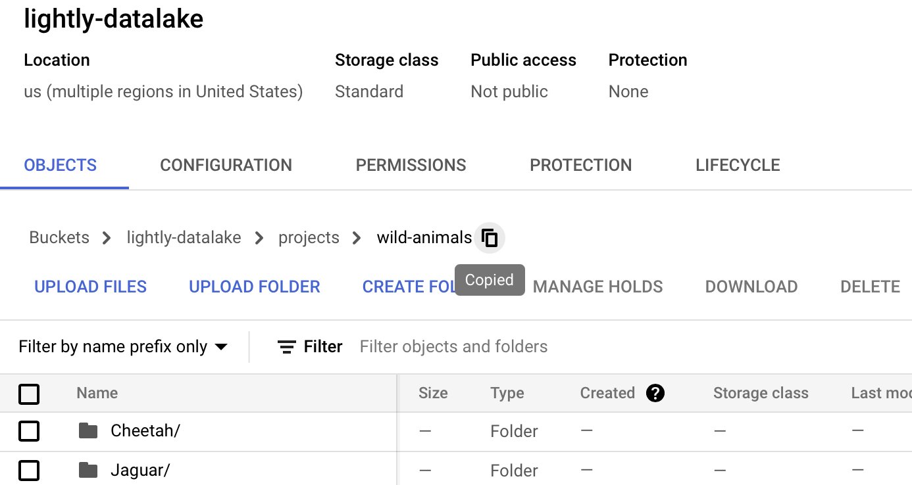
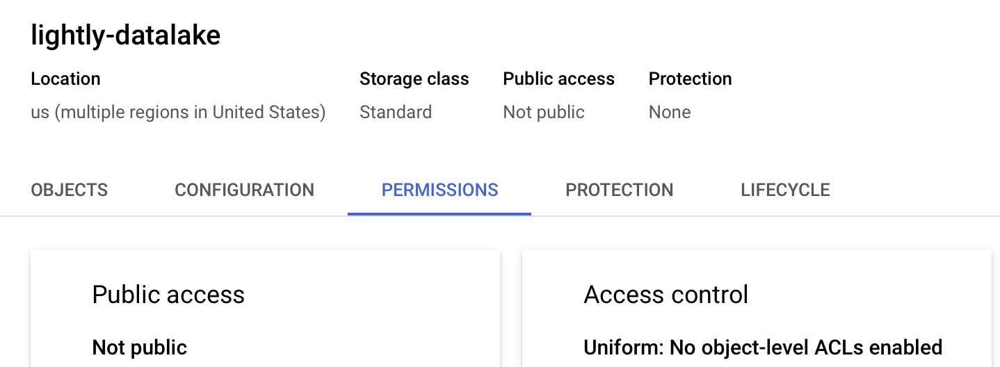
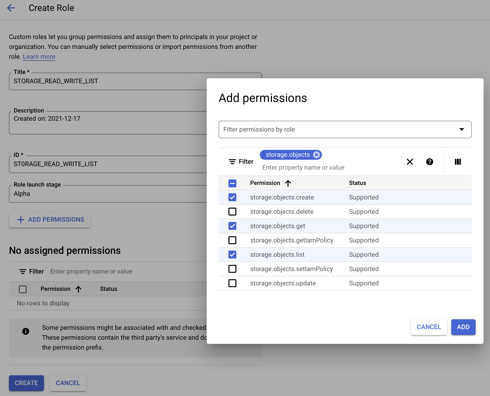
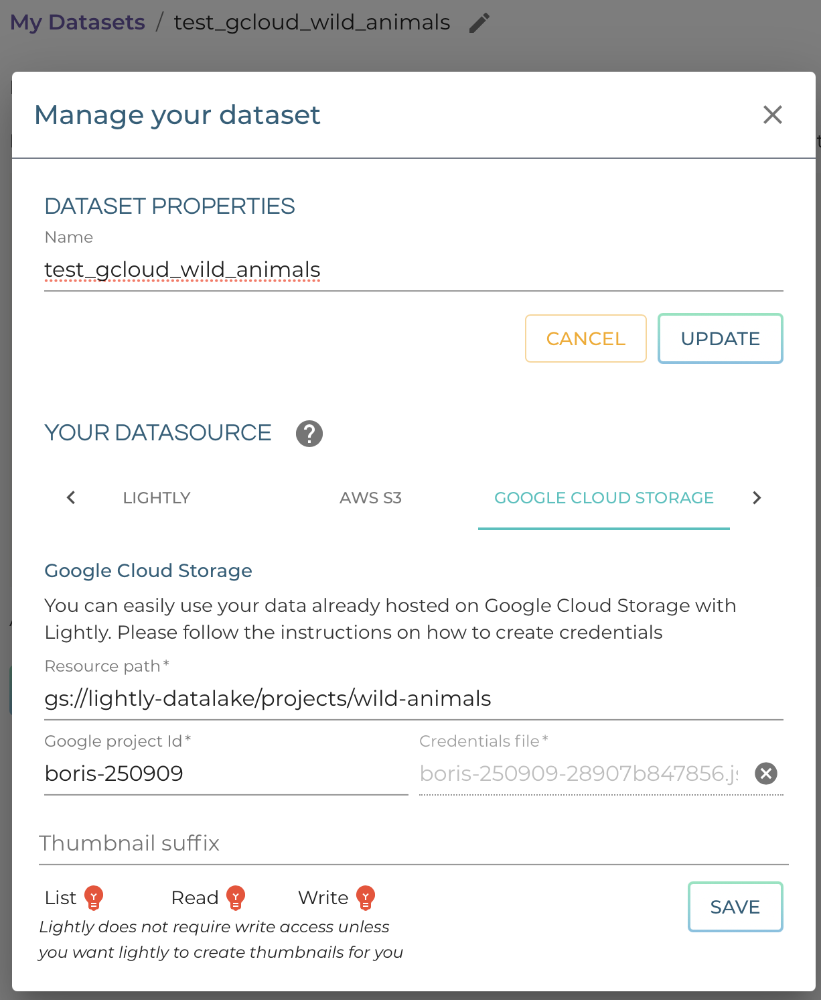

.. _dataset-creation-gcloud-bucket:

Create dataset from Google cloud bucket
---------------------------------------

Lightly allows you to configure a remote datasource like Google cloud bucket.
In this guide, we will show you how to setup your Google cloud bucket,
configure your dataset to use said bucket, and only upload metadata to Lightly.

Setting up Google cloud bucket
^^^^^^^^^^^^^^^^^^^^^^^^^^^^^^
For Lightly to be able to create so-called `presigned URLs/read URLs <https://cloud.google.com/storage/docs/access-control/signed-urls>`_
to be used for displaying your data in your browser.
Lightly needs at minimum to be able to read and list permissions on your bucket.
If you want Lightly to create optimal thumbnails for you
while uploading the metadata of your images, write permissions are also needed.

Let us assume the bucket is called `lightly-datalake`.
And let us assume the folder you want to use with Lightly is located at `projects/wild-animals/`

**Setting Up a Service Account in IAM**

1. Write down your project ID.
You find it in the `gcloud console <console.cloud.google.com/home/dashboard>`_ under `Project Info`.

2. Navigate to your bucket in the `google cloud storage browser <https://console.cloud.google.com/storage/browser>`_
and from there to `projects/wild-animals/`. Copy the path somewhere, in this case
`lightly-datalake/projects/wild-animals`.

3. Navigate to the tab `Permissions`.
Make sure that your Access control is Uniform.
If it is not, change it to Uniform.

4. Navigate to `IAM & Admin -> Roles <https://console.cloud.google.com/iam-admin/roles>`_.
There create a new role, with the title and ID `STORAGE_READ_WRITE_LIST`.
The click ond `Add Permissions`, search for `storage.objects`
and add the permissions `storage.objects.get`, `storage.objects.list`, and `storage.objects.create`.
The create permissions are needed so that Lightly can create thumbnails in you bucket.
After adding the permissions, create the role.

5. Navigate to `APIs -> Credentials <https://console.cloud.google.com/apis/credentials>`_.
Then click on `Create Credentials`, choose `Service Account` and insert the name
`LIGHTLY_USER_WILD_ANIMALS`.
The description can be `service account for the Lightly API to access the wild animals dataset`.
Then click on `Create and Continue`. Choose the Role you just created, i.e. `STORAGE_READ_WRITE_LIST`.
Then add a condition with the title `BUCKET_PROJECTS_WILD_ANIMALS`
and insert the path in the Condition editor. Remember to change the path to the
one you copied in the first step and use your Project ID.

.. code::

    (
        resource.type == 'storage.googleapis.com/Object' &&
        resource.name.startsWith("projects/_/buckets/lightly-datalake/projects/wild-animals")
    )
Continue to the next step `Grant users access to this service account`.
There add yourself (in form of your mail address) to both service account roles.
Otherwise you won't be able to change this service account.
Then click on `Done` to create the service account.
You can change the roles of the service account in the
`IAM <https://console.cloud.google.com/iam-admin/iam>`.

6. After creation, you can find it in the list of all service accounts.
Click on it, then change to the tab `keys`. Click on `Add key` and create a new
private key in JSON Format. It will download the corresponding key file.

    .. figure:: images_gcloud_bucket/screenshot_gcloud_service_account_key_creation.png
        :align: center
        :alt: Google Cloud Service Account Key Creation
        :width: 60%

For Lightly to be able to create embeddings and extract metadata from your data,
`lightly-magic` needs to be able to access your data.
You can either download/sync your data from S3 or you can mount S3 as a drive.
We recommend downloading your data from S3 as it makes the overall process faster.

TODO: describe how to do it

Uploading your data
^^^^^^^^^^^^^^^^^^^^

Create and configure a dataset

1. `Create a new dataset <https://app.lightly.ai/dataset/create>`_ in Lightly
2. Edit your dataset and select `Google Cloud Storage` as your datasource

3. As the resource path, enter the full URI to your resource eg. `gs://lightly-datalake/projects/wild-animals`
4. Enter the Google Project ID you just wrote down.
5. Click on `Select Credentials File` to add the key file you downloaded in the previous step.
5. The thumbnail suffix allows you to configure

    - where your thumbnails are stored when you already have generated thumbnails in your S3 bucket
    - where your thumbnails will be stored when you want Lightly to create thumbnails for you. For this to work, the user policy you have created must possess write permissions.
    - when the thumbnail suffix is not defined/empty, we will load the full image even when requesting the thumbnail.

6. Press save and ensure that at least the lights for List and Read turn green.
If you added permissions for writing, this lights should also turn green.

Use Lightly
Use `lightly-magic` and `lightly-upload` just as you always would with the following considerations;

- If you have already generated thumbnails, don't want to see thumbnails or just want to use the full image for a thumbnail (by setting the thumbnail suffix to empty), add `upload=metadata` to the `lightly-magic` command.
- If you want Lightly to create thumbnails for you, you can add `upload=thumbnails` to the `lightly-magic` command.