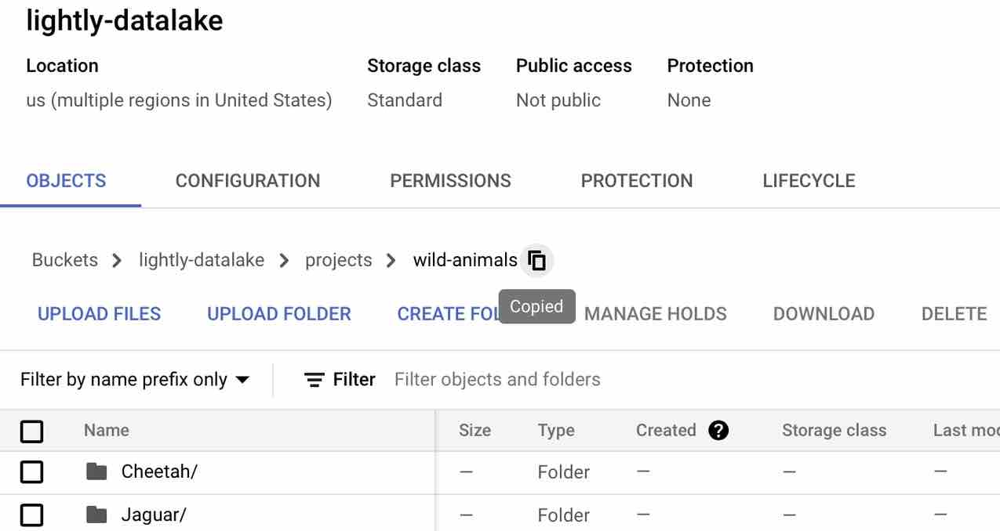
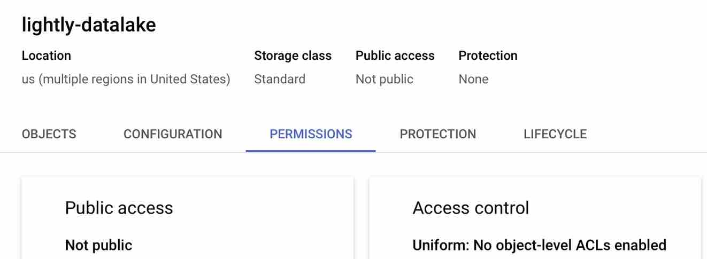
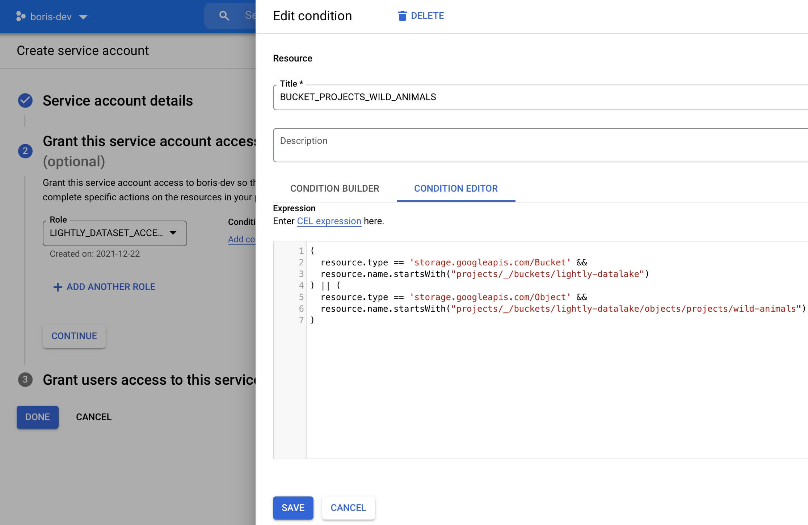
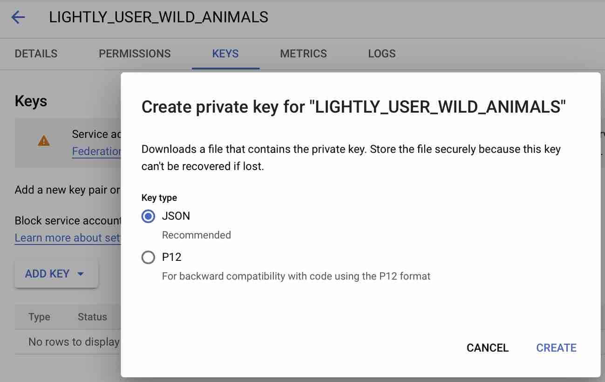

.. _dataset-creation-gcloud-bucket:

Create a dataset from Google Cloud Storage
===========================================

Lightly allows you to configure a remote datasource like
`Google Cloud Storage <https://cloud.google.com/storage>`_ .
In this guide, we will show you how to setup your Google Cloud Storage,
configure your dataset to use said bucket, and only upload metadata to Lightly
while keeping your data private.

One decision you need to make first is whether you want to use thumbnails.
Using thumbnails makes the Lightly Platform more responsive, as not always
the full images will be loaded.
However, the thumbnails will be stored in you bucket and thus need storage.

.. note::
  
    If you want to use thumbnails you need to give
    Lightly write access to your bucket to create the thumbnails there for you.
    The write access can be configured not to allow overwriting and
    deleting, thus existing data cannot get lost.

Setting up Google Cloud Storage
--------------------------------

Lightly needs to be able to create so-called
`presigned URLs/read URLs <https://cloud.google.com/storage/docs/access-control/signed-urls>`_
for displaying your data in your browser.
Thus it needs at minimum read and list permissions on your bucket.

Let us assume the bucket is called `lightly-datalake`.
And let us assume the folder you want to use with Lightly is located at `projects/wild-animals/`

**Setting Up a Service Account in IAM**

1. Write down your project ID.
You find it in the `gcloud console <console.cloud.google.com/home/dashboard>`_ under `Project Info`.

2. Navigate to your bucket in the `google cloud storage browser <https://console.cloud.google.com/storage/browser>`_
and from there to `projects/wild-animals/`. Copy the path, in this case
`lightly-datalake/projects/wild-animals`.

3. Navigate to the tab `Permissions`.
Make sure that your access control is uniform.
If it is not, change it to uniform.

4. Navigate to `IAM & Admin -> Roles <https://console.cloud.google.com/iam-admin/roles>`_.

- Create a new role, with the same title and ID.
  E.g. call it `LIGHTLY_DATASET_ACCESS`.
- Click on **"Add Permissions"**, search for `storage.objects`
- Add the permissions `storage.objects.get`, `storage.objects.list`, and `storage.objects.create`.
  The create permissions are needed if you want Lightly to create thumbnails
  in your bucket . Otherwise you can leave them away.
- After adding the permissions, create the role.

.. figure:: ./images_gcloud_bucket/screenshot_gcloud_storage_role.jpg
    :align: center
    :alt: Creating a role for accessing google cloud storage.
    :width: 60%

5. Navigate to `APIs -> Credentials <https://console.cloud.google.com/apis/credentials>`_.

- Click on **"Create Credentials"**, choose `Service Account` and insert the name
  `LIGHTLY_USER_WILD_ANIMALS`.
- The description can be `service account for the Lightly API to access the wild animals dataset`.
- Click on **"Create and Continue"**.
- Choose the Role you just created, i.e. `LIGHTLY_DATASET_ACCESS`.
- Add a condition with the title `BUCKET_PROJECTS_WILD_ANIMALS`
  and insert the condition below in the Condition editor. Remember to change the bucket name
  and path to the folder. However, you must keep the "objects" in between.

.. code::

    (
        resource.type == 'storage.googleapis.com/Bucket' &&
        resource.name.startsWith("projects/_/buckets/lightly-datalake")
    ) || (
        resource.type == 'storage.googleapis.com/Object' &&
        resource.name.startsWith("projects/_/buckets/lightly-datalake/objects/projects/wild-animals")
    )

For more information, head to the `IAM conditions
<https://cloud.google.com/storage/docs/access-control/iam#conditions>`_.
The first part of the condition adds listing rights to the whole bucket,
as they can only be handled on the bucket level. The second part adds object-level
access rights (i.e. read and create) for all objects in the bucket `lightly-datalake`
whose name starts with `projects/wild-animals`.

- Click on **"Done"** to create the service account.
- You can change the roles of the service account later in the
  `IAM <https://console.cloud.google.com/iam-admin/iam>`_.

6. Navigate to `APIs -> Credentials <https://console.cloud.google.com/apis/credentials>`_
   again if you are not already there.

- Find the just created user in the list of all service accounts.
- Click on the user and navigate to the **"keys"** tab.
- Click on **"Add key"** and create a new private key in JSON Format.
  It will download the corresponding key file.

Preparing your data
^^^^^^^^^^^^^^^^^^^^^

For creating the dataset and uploading embeddings and metadata to it, you need
the :ref:`lightly-command-line-tool`.

Furthermore, you need to have your data locally on your machine.

1. Install the `gsutil tool <https://cloud.google.com/storage/docs/gsutil>`_
2. Use the rsync command <https://cloud.google.com/storage/docs/gsutil/commands/rsync>`_ to sync the files

    .. code::

        gsutil -m rsync -r /local/projects/wild-animals gs://datalake-lightly/projects/wild-animals

Uploading your data
--------------------

Create and configure a dataset

1. `Create a new dataset <https://app.lightly.ai/dataset/create>`_ in Lightly
2. Edit your dataset and select `Google Cloud Storage` as your datasource

.. figure:: ../resources/resources_datasource_configure/LightlyEditGCS.jpg
    :align: center
    :alt: Configure google cloud bucket datasource in Lightly Platform
    :width: 60%

3. As the resource path, enter the full URI to your resource eg. `gs://lightly-datalake/projects/wild-animals`
4. Enter the Google Project ID you wrote down in the first step.
5. Click on **"Select Credentials File"** to add the key file you downloaded in the previous step.
6. Toggle the **"Generate thumbnail"** switch if you want Lightly to generate thumbnails for you.
7. If you want to store outputs from Lightly (like thumbnails or extracted frames) in a different directory, you can toggle **"Use a different output datasource"** and enter a different path in your bucket. This allows you to keep your input directory clean as nothing gets ever written there.
  .. note:: 

    Lightly requires list, read, and write access to the `output datasource`. Make sure you have configured it accordingly in the steps before.
8. Press save and ensure that at least the lights for List and Read turn green. If you added permissions for writing, this light should also turn green.

9. After closing the pop-up by clicking the X, you should be on the dataset creation page again.

Use `lightly-magic` and `lightly-upload` with the following parameters:

- Use `input_dir=/local/projects/wild-animals`
- If you chose the option to generate thumbnails in your bucket,
  use `upload=thumbnails`
- Otherwise, use `upload=metadata` instead.