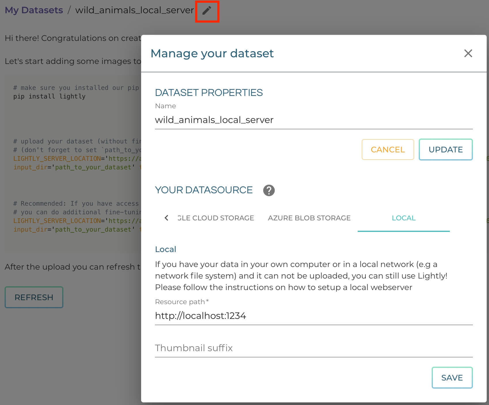

.. _dataset-creation-local-server:

Create a dataset with a local file server
-----------------------------------------

You can configure a dataset in the Lightly Platform that streams the images
from your local file system. This makes the creation of a dataset much faster,
as no upload of images and thumbnails is needed.
Let's assume that your dataset is locally at `/projects/animals`.

Setting up local file server
^^^^^^^^^^^^^^^^^^^^^^^^^^^^

Navigate to the directory your dataset lies.
From within this directory, create a local http server for the files:

.. code-block:: bash

    cd /projects/animals
    python -m http.server 1234

If the port 1234 is used, try another. You must keep the file server
open while using the Lightly Platform.

Configuring Lightly Dataset
^^^^^^^^^^^^^^^^^^^^^^^^^^^
Create and configure a dataset

1. `Create a new dataset <https://app.lightly.ai/dataset/create>`_ in Lightly
2. Edit your dataset and select the datasource `Local`.

Choose the resource path `http://localhost:1234` or adapt the port if needed.
Set the thumbnail suffix to empty to use the full images instead of thumbnails.

Create the dataset and upload embeddings and metadata.
^^^^^^^^^^^^^^^^^^^^^^^^^^^^^^^^^^^^^^^^^^^^^^^^^^^^^^

For creating the dataset and uploading embeddings and metadata to it, you need
to install the :ref:`lightly-command-line-tool`, e.g. via pip.
Then use one of the commands proposed in the dataset creation wizard.
Use a new terminal for this, so that your command for hosting the http
server can continue running.

.. code-block:: bash

    # install the lightly command line tool.
    pip install lightly

    # Compute embeddings, create the dataset and upload metadata
    lightly-magic token=LIGHTLY_TOKEN dataset_id=DATASET_ID input_dir=/projects/animals \
    trainer.max_epochs=0 upload='meta'

