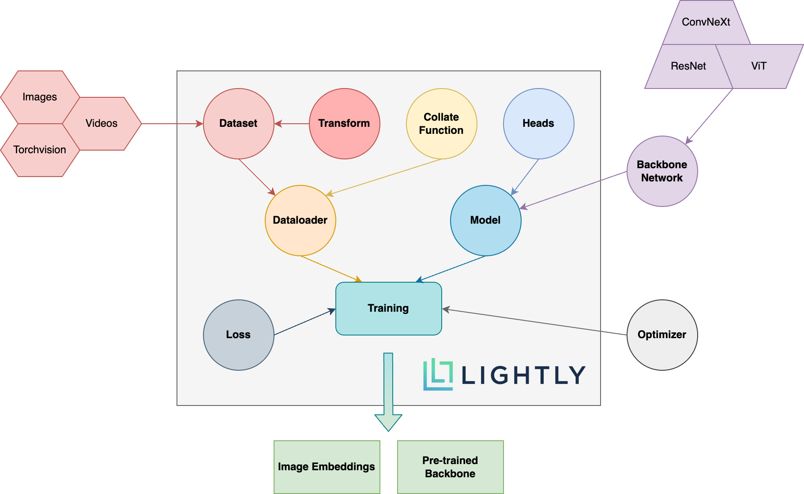

.. _lightly-main-concepts:

Main concepts
=============

Self-supervised Learning
------------------------

The figure below shows an overview of the different concepts used by the ligthly PIP package
and a schema of how they interact. The expressions in **bold** are explained further
below.

    Overview of the different concepts used by the lightly PIP package and
    how they interact.

* **Dataset**
   In lightly, datasets are accessed through :py:class:`lightly.data.dataset.LightlyDataset`.
   You can create a `LightlyDataset` from a folder of images, videos, or simply from
   a torchvision dataset. You can learn more about this here: 
   
   * :ref:`input-structure-label`
   
* **Collate Function**
   The collate function is the place where lightly applies augmentations which are crucial
   for self-supervised learning. You can use our pre-defined augmentations or write your own
   ones. For more information, check out :ref:`lightly-advanced` and :py:class:`lightly.data.collate.BaseCollateFunction`.
   You can add your own augmentations very easily as we show in this tutorial:

   * :ref:`lightly-custom-augmentation-5`

* **Dataloader**
   For the dataloader you can simply use the PyTorch dataloader. Be sure to pass it a `LightlyDataset` though!
* **Backbone Neural Network**
   One of the cool things about self-supervised learning is that you can pre-train
   your neural networks without the need for annotated data. You can plugin whatever
   backbone you want! If you don't know where to start, our tutorials show how you
   can get a backbone neural network from a :py:class:`lightly.models.resnet.ResNet`.
* **Model**
   The model combines your backbone neural network with one or multiple heads and, if
   required, a momentum encoder to provide an easy-to-use interface to the most
   popular self-supervised learning frameworks. Learn more in our tutorials:

   * :ref:`sphx_glr_tutorials_package_tutorial_moco_memory_bank.py`
   * :ref:`sphx_glr_tutorials_package_tutorial_simclr_clothing.py`
   * :ref:`sphx_glr_tutorials_package_tutorial_simsiam_esa.py`

* **Loss**
   The loss function plays a crucial role in self-supervised learning. Currently,
   lightly supports contrastive and similarity based loss functions.
* **Optimizer**
   With lightly, you can use any PyTorch optimizer to train your model.
* **Training**
   The model can either be trained using a plain PyTorch training loop or
   with a dedicated framework such as PyTorch Lightning. Lightly lets you
   choose what is best for you. Check out our `tutorials section <https://docs.lightly.ai/tutorials/package.html>`_ 
   for examples.
* **Image Embeddings**
   During the training process, the model learns to create compact embeddings from images.
   The embeddings, also often called representations, can then be used for tasks such as
   identifying similar images or creating a diverse subset from your data:

   * :ref:`lightly-tutorial-sunflowers`
   * :ref:`lightly-simsiam-tutorial-4`  

* **Pre-trained Backbone**
   The backbone can be reused after self-supervised training. We can transfer it
   to any other task that requires a similar network architecture, including 
   image classification, object detection and segmentation tasks. You can learn more in
   our object detection tutorial:

   * :ref:`lightly-detectron-tutorial-6`

Active Learning
-------------------
The image representations learned through self-supervised learning cannot only be used
for downstream task or nearest neighbor search. The similarity between representations
also serves as an excellent proxy for mutual information between images. This fact can
be exploited when doing active learning to get the most informative subset of images
during training. Check out our section on :ref:`lightly-active-learning` for more information.

.. note:: To use active learning you need a lightly version of **1.1.0** or newer!
          You can check the version of the installed package using `pip list`
          and check for the installed version of `lightly`.

