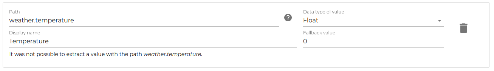
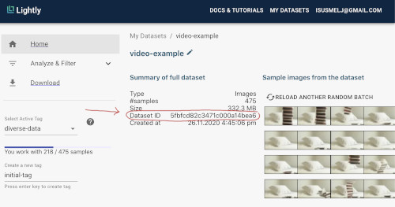
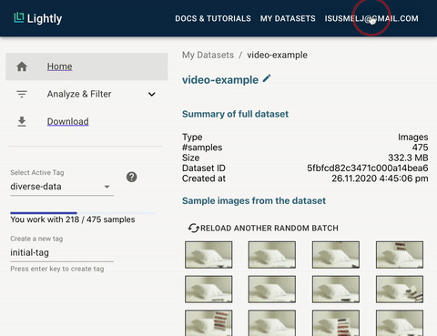

.. _lightly-platform:

The Lightly Platform
===================================

The lightly framework itself allows you to use self-supervised learning
in a very simple way and even create embeddings of your dataset.
However, we can do much more than just train and embed datasets. 
Once you have an embedding of an unlabeled dataset you might still require
some labels to train a model. But which samples do you pick for labeling and 
training a model?

This is exactly why we built the 
`Lightly Data Curation Platform <https://app.lightly.ai>`_. 
The platform helps you analyze your dataset and using various methods 
pick the relevant samples for your task.

The video below gives you a quick tour through the platform:

.. raw:: html

    

        <iframe width="560" height="315" 
            src="https://www.youtube.com/embed/38kwv0xEIz4" 
            frameborder="0" allow="accelerometer; autoplay; 
            clipboard-write; encrypted-media; gyroscope; picture-in-picture" 
            allowfullscreen>
        </iframe>
    

.. |br| raw:: html

     

|br|

.. note:: 

    Head to our :ref:`tutorials <platform-tutorials-label>` to see the many use-cases of the Lightly Platform.

Basic Concepts
--------------

The Lightly Platform is built around datasets, tags, embeddings, samples and their metadata.

Learn more about the different concepts in our `Glossary <https://app.lightly.ai/glossary>`_.

Create a Dataset
----------------

There are several different ways to create a dataset on the lightly platform.

The baseline way is to upload your local dataset including all images or
videos to the Lightly platform.

If you don't have your data locally, but rather stored at a cloud provider like
in an AWS S3 bucket, GCloud bucket or at Azure,
you can create a dataset directly referencing the images in your bucket.
It will keep all images and videos in your own bucket and only stream them from there if they are needed.
This has the advantage that you don't need to upload your data to Lightly and can preserve its privacy.

.. toctree::
    :maxdepth: 1

    dataset_creation/dataset_creation_local_upload.rst
    dataset_creation/dataset_creation_aws_bucket.rst
    dataset_creation/dataset_creation_local_server.rst

.. _platform-custom-metadata:

Custom Metadata
------------------------

With the custom metadata option, you can upload any information about your
images to the Lightly Platform and analyze it there. For example, in autonomous driving, companies
are often interested in different weather scenarios or the number of pedestrians in an image.
The Lightly Platform supports the upload of arbitrary custom metadata as long as it's correctly
formatted.

Upload
^^^^^^^^^^^

You can pass custom metadata when creating a dataset and later configure it for inspection in the web-app.
Simply add the argument `custom_metadata` to the :py:class:`lightly-magic <lightly.cli.lightly_cli>` command.

.. code-block:: bash

    lightly-magic trainer.max_epochs=0 token='YOUR_API_TOKEN' new_dataset_name='my-dataset' input_dir='/path/to/my/dataset' custom_metadata='my-custom-metadata.json'

As with images and embeddings before, it's also possible to upload custom metadata from your Python code:

.. code-block:: python

    import json
    from lightly.api.api_workflow_client import ApiWorkflowClient

    client = ApiWorkflowClient(token='123', dataset_id='xyz')
    with open('my-custom-metadata.json') as f:
        client.upload_custom_metadata(json.load(f))

.. note:: 

    To save the custom metadata in the correct format, use the helpers 
    :py:class:`format_custom_metadata <lightly.utils.io.format_custom_metadata>` and 
    :py:class:`save_custom_metadata <lightly.utils.io.save_custom_metadata>` or learn more
    about the custom metadata format below.

.. note::

    Check out :ref:`ref-webapp-dataset-id` to see how to get the dataset identifier.

Configuration
^^^^^^^^^^^^^^^

To use the custom metadata on the Lightly Platform, it must be configured first. For this,
follow these steps:

1. Go to your dataset and click on "Configurator" on the left side.
2. Click on "Add entry" to add a new configuration.
3. Click on "Path". Lightly should now propose different custom metadata keys.
4. Pick the key you are interested in, set the data type, display name, and fallback value.
5. Click on "Save changes" on the bottom.

Done! You can now use the custom metadata in the "Explore" and "Analyze & Filter" screens.

    Example of a custom metadata configuration for the key `weather.temperature`.

Format
^^^^^^^^^^^

To upload the custom metadata, you need to save it to a `.json` file in a COCO-like format.
The following things are important:

- Information about the images is stored under the key `images`.

- Each image must have a `file_name` and an `id`.

- Custom metadata must be accessed with the `metadata` key.

- Each custom metadata entry must have an `image_id` to match it with the corresponding image.

For the example of an autonomous driving company mentioned above, the custom metadata file would
need to look like this:

.. code-block:: json

    {
        "images": [
            {
                "file_name": "image0.jpg",
                "id": 0,
            },
            {
                "file_name": "image1.jpg",
                "id": 1,
            }
        ],
        "metadata": [
            {
                "image_id": 0,
                "number_of_pedestrians": 3,
                "weather": {
                    "scenario": "cloudy",
                    "temperature": 20.3
                }
            },
            {
                "image_id": 1,
                "number_of_pedestrians": 1,
                "weather": {
                    "scenario": "rainy",
                    "temperature": 15.0
                }
            }
        ]
    }

If you don't have your data in coco format yet, but e.g. as a pandas dataframe,
you can use a simple script to translate it to the coco format:

.. code-block:: python

    import pandas as pd

    from lightly.utils import save_custom_metadata

    # Define the pandas dataframe
    column_names = ["filename", "number_of_pedestrians", "scenario", "temperature"]
    rows = [
        ["image0.jpg", 3, "cloudy", 20.3],
        ["image1.jpg", 1, "rainy", 15.0]
    ]
    df = pd.DataFrame(rows, columns=column_names)

    # create a list of pairs of (filename, metadata)
    custom_metadata = []
    for index, row in df.iterrows():
        filename = row.filename
        metadata = {
            "number_of_pedestrians": int(row.number_of_pedestrians),
            "weather": {
                "scenario": str(row.scenario),
                "temperature": float(row.temperature),
            }
        }
        custom_metadata.append((filename, metadata))

    # save custom metadata in the correct json format
    output_file = "custom_metadata.json"
    save_custom_metadata(output_file, custom_metadata)

.. note:: Make sure that the custom metadata is present for every image. The metadata
          must not necessarily include the same keys for all images but it is strongly
          recommended.

.. note:: Lightly supports integers, floats, strings, booleans, and even nested objects for
          custom metadata. Every metadata item must be a valid JSON object.
          Thus numpy datatypes are not supported and must be cast to `float`
          or `int` before saving. Otherwise there will be an error similar to
          `TypeError: Object of type ndarray is not JSON serializable`.

Sampling
----------------

Before you start sampling make sure you have created a dataset 
and uploaded images and embeddings. See `Create a Dataset`_.

Now, let's get started with sampling!

Follow these steps to sample the most representative images from your dataset:

#. Choose the dataset you want to work on from the *"My Datasets"* 
section by clicking on it.

#. Navigate to *"Analyze & Filter"* → *"Sampling"* through the menu on the left.

#. Choose the embedding and sampling strategy to use for this sampling run.

#. Give a name to your subsampling so that you can later compare 
   the different samplings.

#. Hit "Process" to start sampling the data. Each sample is now assigned an 
   "importance score". The exact meaning of the score depends on the sampler.

    .. figure:: images/webapp_create_sampling.gif
        :align: center
        :alt: Alt text
        :figclass: align-center
        :scale: 150%

        You can create a sampling once you uploaded a dataset and an embedding. 
        Since sampling requires more compute resources it can take a while

#. Move the slider to select the number of images you want to keep and save 
   your selection by creating a new tag, for example like this:

    .. figure:: images/webapp_sampling_new_tag.gif
        :align: center
        :alt: Alt text
        :figclass: align-center
        :scale: 120%

        You can move the slider to change the number of selected samples.

.. _ref-webapp-dataset-id:

Dataset Identifier
-------------------------

Every dataset has a unique identifier called 'Dataset ID'. You find it on the dataset overview page.

    The Dataset ID is a unique identifier.

.. _ref-authentication-token:

Authentication API Token
-----------------------------------

To authenticate yourself on the platform when using the pip package
we provide you with an authentication token. You can retrieve
it when creating a new dataset or when clicking on your 
account (top right)-> preferences on the 
`web application <https://app.lightly.ai>`_.

    With the API token you can authenticate yourself.

.. warning:: Keep the token for yourself and don't share it. Anyone with the
          token could access your datasets!

