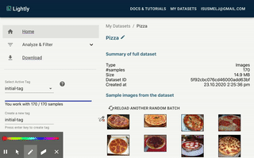

The Lightly Platform
===================================

The lightly framework itself allows you to use self-supervised learning
in a very simple way and even create embeddings of your dataset.
However, we can do much more than just train and embed datasets. 
Once you have an embedding of an unlabeled dataset you might still require
some labels to train a model. But which samples do you pick for labeling and 
training a model?

This is exactly why we built the 
`Lightly Data Curation Platform <https://app.lightly.ai>`_. 
The platform helps you analyze your dataset and using various methods 
pick the relevant samples for your task.

You can learn more about how to use the platform using our tutorials:
:ref:`platform-tutorials-label`

Basic Concepts
-----------------------------------

Dataset
^^^^^^^^^^^
As the name suggests, a dataset is a collection of samples. Think of it as a 
project. When you use the platform for the first time, you create a dataset. 

    Dataset overview on the web platform. Here you see general information
    such as the number of images or the size of the overall dataset.

    Dataset overview on the web platform. Here you see generalinformation such 
    as the number of images or the size of the overall dataset.

Upload Samples
"""""""""""""""

There are two ways to upload samples to a dataset. You can either use the web 
front-end of the platform or the Python pip package.

We recommend using the `front-end <https://app.lightly.ai>`_ for simple projects 
consisting of less than 1'000 samples or 1 GByte in size. Once you create a new 
dataset you should see an upload field. You can either click on it to open the 
file browser or drag and drop a list of files or a folder. To upload the 
selected files you simply click on upload. The upload process typically 
takes a few minutes.

If you work with larger datasets we recommend 
you to use the `Python pip package <https://github.com/lightly-ai/lightly>`_.

Tag
^^^^^^^^^^^

If you're familiar with git think of tags as commits. Every tag represents 
a set of images from your dataset. Initially, a new dataset consists of 
all images. During the filtering process, you reduce the dataset to the 
relevant fraction for your work. Tags allow you to keep track of the 
changes and go back in time. Similar to branches in git you can have 
multiple child tags from the same tag.

    The marked area on the left side in the web app shows the tag interface. 
    You can use it to select and create new tags.

You can interact with your tags by using the left-hand menu of the application. 
You can only create new tags once you modified your dataset. Once a 
modification is done you can "freeze" the state by creating a tag by 
giving it a name (text field at bottom) and pressing enter.

There is a linear bar indicating the current number of 
active samples you work with. 

Embedding
^^^^^^^^^^^

Use our pip package to create embeddings of your dataset using 
self-supervised learning. Embeddings can be used together with sampling methods 
to select the most important samples out of your dataset.

    You can visualize the embedding for a dataset by switching to the sampling 
    mode (click sampling on the left menu). You will see a 2-dimensional plot 
    of your embedding. The colors indicate the currently active samples. If you 
    switch to another tag, you will see immediate effect on the plot.

Obtaining Good Embeddings
"""""""""""""""""""""""""""

We optimized the workflow of sampling only important datapoints by using **low-dimensional embeddings**. 
This has two benefits:

- Low-dimensional embeddings have more meaningful distance metrics. 
  We know that the data usually lies on a manifold in high-dimensional spaces 
  (see `curse of dimensionality <https://en.wikipedia.org/wiki/Curse_of_dimensionality>`_). 
  Even very similar samples might have a high L2-distance or low cosine similarity in high embeddings.
- Most algorithms to sample a subset based on the embeddings scale with 
  the dimensionality. Therefore low-dimensional embeddings can significantly 
  reduce computing time.

We leverage **self-supervised learning** to obtain good 
features/representations/embedddings of your unlabeled data. The quality of the 
representations depends heavily on the chosen augmentations. For example, 
imagine you want to train a classifier to detect healthy and unhealthy leaves. 
Training self-supervised models with color augmentation enabled would make the 
model and therefore the embeddings invariant towards different colors. However, 
the color might be a very important feature of the leave to determine whether 
it is healthy (green) or not (brown).

Create a Dataset
-------------------------

To create a new dataset follow these steps:

#. Login to your Lightly account 
   on the `web application <https://app.lightly.ai>`_.

#. Click on *"My Datasets"* in the top right.

#. Click *"Create a new Dataset"*.

#. Enter a name for your dataset and click *"Create"*.

Upload Images
----------------------------

Once you have created a dataset you can upload images using drag and drop or by
clicking to the marked area in the web application. Upload images through 
drag-and-drop or using the Python Package according to:
:ref:`ref-upload-data-lightly` 

    You can upload up to 1'000 images using the frontend.

Upload Embeddings
-------------------------

Embeddings can be uploaded using the Python Package.
You can not upload embedding through the web interface. Instead
:ref:`ref-upload-embedding-lightly`

Sampling
^^^^^^^^^^^

Before you start sampling make sure you have

#. Created a dataset --> `Create a Dataset`_

#. Uploaded images and embeddings --> `Upload Images`_ & `Upload Embeddings`_

Now, let's get started with sampling!

Follow these steps to sample the most representative images from your dataset:

#. Choose the dataset you want to work on from the *"My Datasets"* 
section by clicking on it.

#. Navigate to *"Analyze & Filter"* → *"Sampling"* through the menu on the left.

#. Choose the embedding and sampling strategy to use for this sampling run.

#. Give a name to your subsampling so that you can later compare 
   the different samplings.

#. Hit "Process" to start sampling the data. Each sample is now assigned an 
   "importance score". The exact meaning of the score depends on the sampler.

    .. figure:: images/webapp_create_sampling.gif
        :align: center
        :alt: Alt text
        :figclass: align-center
        :scale: 150%

        You can create a sampling once you uploaded a dataset and an embedding. 
        Since sampling requires more compute resources it can take a while

#. Move the slider to select the number of images you want to keep and save 
   your selection by creating a new tag, for example like this:

    .. figure:: images/webapp_sampling_new_tag.gif
        :align: center
        :alt: Alt text
        :figclass: align-center
        :scale: 120%

        You can move the slider to change the number of selected samples.

.. _ref-webapp-dataset-id:

Dataset Identifier
-------------------------

Every dataset has a unique identifier called 'Dataset ID'. You find it in the dataset overview page.

.. figure:: images/webapp_dataset_id.jpg
    :align: center
    :alt: Alt text
    :figclass: align-center

    The Dataset ID is a unique identifier.

.. _ref-authentication-token:

Authentication API Token
-----------------------------------

To authenticate yourself on the platform when using the pip package
we provide you with an authentication token. You can retrieve
it when creating a new dataset or when clicking on your 
account (top right)-> preferences on the 
`web application <https://app.lightly.ai>`_.

.. figure:: images/webapp_token.gif
    :align: center
    :alt: Alt text
    :figclass: align-center

    With the API token you can authenticate yourself.

.. warning:: Keep the token for yourself and don't share it. Anyone with the
          token could access your datasets!

