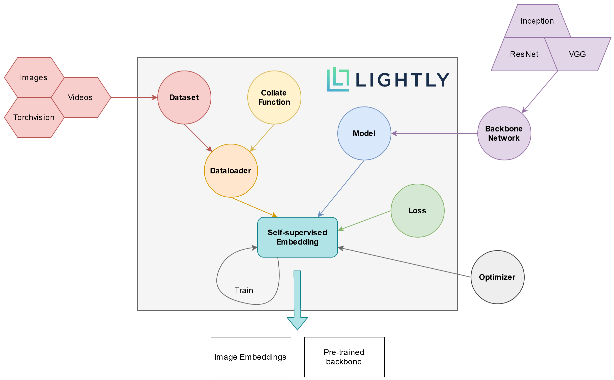

.. lightly documentation master file, created by
   sphinx-quickstart on Tue Oct  6 10:38:42 2020.
   You can adapt this file completely to your liking, but it should at least
   contain the root `toctree` directive.

.. image:: ../logos/lightly_logo_crop.png
  :width: 600
  :alt: Lightly

Documentation
===================================

Lightly is a computer vision framework for self-supervised learning.

With Lightly you can train deep learning models using self-supervision. 
This means, that you don’t require any labels to train a model. 
Lightly has been built to help you understand and work with large unlabeled 
datasets. It is built on top of PyTorch and therefore fully compatible with 
other frameworks such as Fast.ai.

**NEW** Lightly now has integrated support for active learning in combination 
with the Lightly platform. Use the open-source framework to create embeddings 
of your unlabeled data and combine them with model predictions to select 
the most valueable samples for labeling.
Check it out here: :ref:`lightly-tutorial-active-learning-detectron2` 

Self-supervised Learning
--------------------------

The figure below shows an overview of the different used by the ligthly PIP package 
and a schema of how they interact. The expressions in **bold** are explained further 
below.

    Overview of the different concepts used by the lightly PIP package and
    how they interact.

* **Dataset**
   In lightly, datasets are accessed through the :py:class:`lightly.data.dataset.LightlyDataset`. 
   You can create a `LightlyDataset` from a folder of images, videos, or simply from
   a torchvision dataset. You can learn more about this here: :ref:`input-structure-label`.
* **Collate Function**
   The collate function is the place where lightly applies augmentations which are crucial
   for self-supervised learning. You can use our pre-defined augmentations or write your own
   ones. For more information, check out :ref:`lightly-advanced` and :py:class:`lightly.data.collate.BaseCollateFunction`.
   You can add your own augmentations very easily as we show in this tutorial:

   * :ref:`lightly-custom-augmentation-5` 

* **Dataloader**
   For the dataloader you can simply use the PyTorch dataloader. Be sure to pass it a `LightlyDataset` though!
* **Backbone Neural Network**
   One of the cool things about self-supervised learning is that you can pre-train 
   your neural networks without the need for annotated data. You can plugin whatever
   backbone you want! If you don't know where to start, our tutorials show how you 
   can get a backbone neural network from a :py:class:`lightly.models.resnet.ResNet`.
* **Model**
   The model combines your backbone neural network with a projection head and, if 
   required, a momentum encoder to provide an easy-to-use interface to the most 
   popular self-supervised learning frameworks. Learn more in our tutorials:

   * :ref:`sphx_glr_tutorials_package_tutorial_moco_memory_bank.py`
   * :ref:`sphx_glr_tutorials_package_tutorial_simclr_clothing.py`
   * :ref:`sphx_glr_tutorials_package_tutorial_simsiam_esa.py`

* **Loss**
   The loss function plays a crucial role in self-supervised learning. Currently,
   lightly supports a contrastive and a similarity based loss function.
* **Optimizer**
   With lightly, you can use any PyTorch optimizer to train your model.
* **Self-supervised Embedding**
   The :py:class:`lightly.embedding.embedding.SelfSupervisedEmbedding` connects the concepts 
   from above in an easy-to-use `PyTorch-Lightning <https://www.pytorchlightning.ai/>`_ module.
   After creating a `SelfSupervisedEmbedding`, it can be trained with a single line:
   
   .. code-block:: Python

      # build a self-supervised embedding and train it
      encoder = lightly.embedding.SelfSupervisedEmbedding(model, loss, optimizer, dataloader)
      encoder.train(gpus=1, max_epochs=10)
   
   However, you can still write the training loop in plain PyTorch code. 
   See :ref:`sphx_glr_tutorials_package_tutorial_simsiam_esa.py` for an example

Active Learning
-------------------
The image representations learned through self-supervised learning cannot only be used
for downstream task or nearest neighbor search. The similarity between representations
also serves as an excellent proxy for mutual information between images. This fact can
be exploited when doing active learning to get the most informative subset of images
during training. Check out our section on :ref:`lightly-active-learning` for more information.

.. note:: To use active learning you need a lightly version of **1.1.0** or newer!
          You can check the version of the installed package using `pip list`
          and check for the installed version of `lightly`.

.. toctree::
   :maxdepth: 1
   :caption: First Steps

   getting_started/lightly_at_a_glance.rst
   getting_started/benchmarks.rst
   getting_started/install.rst
   getting_started/command_line_tool.rst
   getting_started/advanced.rst
   getting_started/platform.rst
   getting_started/active_learning.rst

.. toctree::
   :maxdepth: 1
   :caption: Tutorials

   tutorials/package.rst
   tutorials/platform.rst

.. toctree::
   :maxdepth: 1
   :caption: Python API

   lightly
   lightly.active_learning
   lightly.api
   lightly.cli
   lightly.core
   lightly.data
   lightly.embedding
   lightly.loss
   lightly.models
   lightly.transforms
   lightly.utils

.. toctree::
   :maxdepth: 1
   :caption: On-Premise

   docker/overview.rst

Indices and tables
==================

* :ref:`genindex`
* :ref:`modindex`
* :ref:`search`
